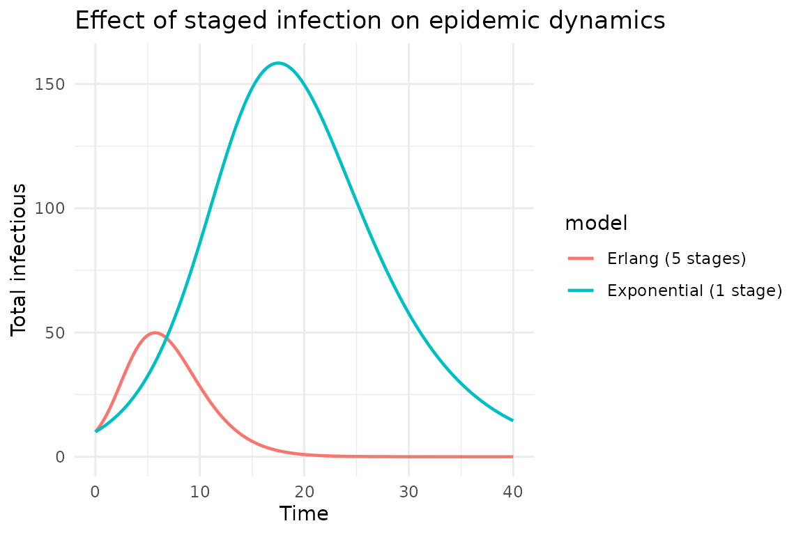
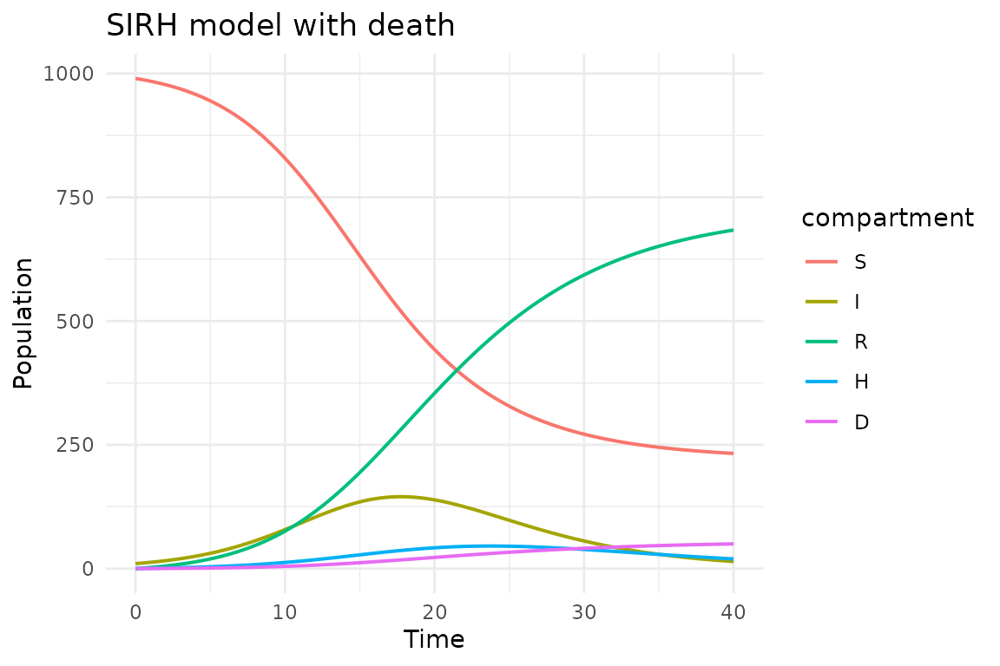

# Advanced topics: morphisms and complex models

## Introduction

This vignette covers advanced features of algebraicodin:

- **Morphisms** between Petri nets (typed nets as structure-preserving
  maps)
- **Schema migration** for transforming models
- **Complex compositions** combining composition and stratification
- **Staged infections** (linear chain trick)
- **Multi-component models** (SIRH with hospitalization and death)

These features demonstrate how category theory provides a principled
framework for building and transforming epidemiological models.

``` r
library(algebraicodin)
#> 
#> Attaching package: 'algebraicodin'
#> The following objects are masked from 'package:base':
#> 
#>     %o%, %x%
```

## Morphisms of Petri nets

A **morphism** $\left. \phi:P_{1}\rightarrow P_{2} \right.$ between
Petri nets maps species to species and transitions to transitions in a
structure-preserving way. In algebraicodin, this is exactly what
[`typed_petri()`](https://catrgory.github.io/algebraicodin/reference/typed_petri.md)
creates—a morphism from a concrete model to a type system.

The morphism must preserve the incidence structure: if species $s$ is an
input to transition $t$ in $P_{1}$, then $\phi(s)$ must be an input to
$\phi(t)$ in $P_{2}$.

``` r
ont <- infectious_ontology()

sir <- labelled_petri_net(
  c("S", "I", "R"),
  inf = c("S", "I") %=>% c("I", "I"),
  rec = "I" %=>% "R"
)
phi <- typed_petri(sir, ont,
  species_types    = c(S = "Pop", I = "Pop", R = "Pop"),
  transition_types = c(inf = "infect", rec = "disease")
)
```

The morphism $\phi$ encodes:

| Component   | SIR (domain)        | Ontology (codomain)                 |
|-------------|---------------------|-------------------------------------|
| Species     | S, I, R             | Pop, Pop, Pop                       |
| Transitions | inf, rec            | infect, disease                     |
| Input arcs  | S→inf, I→inf, I→rec | Pop→infect, Pop→infect, Pop→disease |
| Output arcs | I→inf, I→inf, R→rec | Pop→infect, Pop→infect, Pop→disease |

``` r
cat("Species map:", phi@species_map, "\n")
#> Species map: 1 1 1
cat("Transition map:", phi@transition_map, "\n")
#> Transition map: 1 2
cat("Input arc map:", phi@input_map, "\n")
#> Input arc map: 1 2 3
cat("Output arc map:", phi@output_map, "\n")
#> Output arc map: 1 2 3
```

``` r
plot_petri(phi)
```

## Schema migration via catlab

The catlab package provides `delta_migrate()` for pullback migration
along schema functors. This can transform data between different
representations of the same mathematical structure.

``` r
# Two schemas for the same data, related by a functor
SchA <- acsets::BasicSchema(
  obs = c("Person", "City"),
  homs = list(acsets::hom("lives_in", "Person", "City"))
)
SchB <- acsets::BasicSchema(
  obs = c("Individual", "Location"),
  homs = list(acsets::hom("residence", "Individual", "Location"))
)

# Functor F: SchA → SchB
F <- catlab::FinFunctor(
  ob_map  = list(Person = "Individual", City = "Location"),
  hom_map = list(lives_in = "residence"),
  dom = catlab::FinCat(schema = SchA),
  codom = catlab::FinCat(schema = SchB)
)

# Data on SchB
DataB <- acsets::acset_type(SchB)
db <- DataB()
acsets::add_part(db, "Individual")
#> [1] 1
acsets::add_part(db, "Individual")
#> [1] 2
acsets::add_part(db, "Location")
#> [1] 1
acsets::set_subpart(db, 1L, "residence", 1L)
acsets::set_subpart(db, 2L, "residence", 1L)

# Migrate to SchA
DataA <- acsets::acset_type(SchA)
da <- catlab::delta_migrate(F, db, DataA)
cat("Persons:", acsets::nparts(da, "Person"), "\n")
#> Persons: 2
cat("Cities:", acsets::nparts(da, "City"), "\n")
#> Cities: 1
cat("Person 1 lives_in:", acsets::subpart(da, 1L, "lives_in"), "\n")
#> Person 1 lives_in: 1
```

This migration preserves the relational structure while renaming the
components—analogous to renaming compartments in an epidemiological
model.

## Staged infection (linear chain trick)

The linear chain trick models non-exponential residence times by
splitting a compartment into multiple stages. An infectious period with
Erlang-distributed duration uses $k$ sequential I-stages.

``` r
# SIR with 3 infectious stages
sir_stages <- labelled_petri_net(
  c("S", "I1", "I2", "I3", "R"),
  inf1 = c("S", "I1") %=>% c("I1", "I1"),
  inf2 = c("S", "I2") %=>% c("I2", "I2"),
  inf3 = c("S", "I3") %=>% c("I3", "I3"),
  prog12 = "I1" %=>% "I2",
  prog23 = "I2" %=>% "I3",
  rec    = "I3" %=>% "R"
)
species_names(sir_stages)
#> [1] "S"  "I1" "I2" "I3" "R"
transition_names(sir_stages)
#> [1] "inf1"   "inf2"   "inf3"   "prog12" "prog23" "rec"
```

``` r
plot_petri(sir_stages)
```

``` r
cat(pn_to_odin(sir_stages, "ode"))
#> ## Auto-generated by algebraicodin
#> 
#> ## Parameters
#> inf1 <- parameter()
#> inf2 <- parameter()
#> inf3 <- parameter()
#> prog12 <- parameter()
#> prog23 <- parameter()
#> rec <- parameter()
#> 
#> ## Initial conditions
#> S0 <- parameter()
#> I10 <- parameter()
#> I20 <- parameter()
#> I30 <- parameter()
#> R0 <- parameter()
#> 
#> initial(S) <- S0
#> initial(I1) <- I10
#> initial(I2) <- I20
#> initial(I3) <- I30
#> initial(R) <- R0
#> 
#> ## Transition rates
#> rate_inf1 <- inf1 * S * I1
#> rate_inf2 <- inf2 * S * I2
#> rate_inf3 <- inf3 * S * I3
#> rate_prog12 <- prog12 * I1
#> rate_prog23 <- prog23 * I2
#> rate_rec <- rec * I3
#> 
#> ## Derivatives
#> deriv(S) <- -rate_inf1 - rate_inf2 - rate_inf3
#> deriv(I1) <- rate_inf1 - rate_prog12
#> deriv(I2) <- rate_inf2 + rate_prog12 - rate_prog23
#> deriv(I3) <- rate_inf3 + rate_prog23 - rate_rec
#> deriv(R) <- rate_rec
```

### Programmatic stage generation

For arbitrary numbers of stages, build the Petri net programmatically:

``` r
make_staged_sir <- function(n_stages) {
  snames <- c("S", paste0("I", seq_len(n_stages)), "R")
  pn <- LabelledPetriNet()
  sids <- setNames(
    vapply(snames, function(s) acsets::add_part(pn, "S", sname = s), integer(1)),
    snames
  )

  # Infection from each stage

  for (k in seq_len(n_stages)) {
    ik <- paste0("I", k)
    tname <- paste0("inf", k)
    tid <- acsets::add_part(pn, "T", tname = tname)
    acsets::add_part(pn, "I", is = sids[["S"]], it = tid)
    acsets::add_part(pn, "I", is = sids[[ik]], it = tid)
    acsets::add_part(pn, "O", os = sids[[ik]], ot = tid)
    acsets::add_part(pn, "O", os = sids[[ik]], ot = tid)
  }

  # Progression between stages
  for (k in seq_len(n_stages - 1L)) {
    from <- paste0("I", k)
    to <- paste0("I", k + 1L)
    tname <- paste0("prog", k, k + 1)
    tid <- acsets::add_part(pn, "T", tname = tname)
    acsets::add_part(pn, "I", is = sids[[from]], it = tid)
    acsets::add_part(pn, "O", os = sids[[to]], ot = tid)
  }

  # Recovery from last stage
  tid <- acsets::add_part(pn, "T", tname = "rec")
  acsets::add_part(pn, "I", is = sids[[paste0("I", n_stages)]], it = tid)
  acsets::add_part(pn, "O", os = sids[["R"]], ot = tid)

  pn
}

sir5 <- make_staged_sir(5)
cat("5-stage SIR: ", acsets::nparts(sir5, "S"), "species,",
    acsets::nparts(sir5, "T"), "transitions\n")
#> 5-stage SIR:  7 species, 10 transitions
```

``` r
code5 <- pn_to_odin(sir5, "ode")
gen5 <- odin2::odin(code5)
#> ✔ Wrote 'DESCRIPTION'
#> ✔ Wrote 'NAMESPACE'
#> ✔ Wrote 'R/dust.R'
#> ✔ Wrote 'src/dust.cpp'
#> ✔ Wrote 'src/Makevars'
#> ℹ 13 functions decorated with [[cpp11::register]]
#> ✔ generated file cpp11.R
#> ✔ generated file cpp11.cpp
#> ℹ Re-compiling odin.systemc4fca27f
#> ── R CMD INSTALL ───────────────────────────────────────────────────────────────
#> * installing *source* package ‘odin.systemc4fca27f’ ...
#> ** this is package ‘odin.systemc4fca27f’ version ‘0.0.1’
#> ** using staged installation
#> ** libs
#> using C++ compiler: ‘g++ (Ubuntu 13.3.0-6ubuntu2~24.04.1) 13.3.0’
#> g++ -std=gnu++17 -I"/opt/R/4.5.3/lib/R/include" -DNDEBUG  -I'/home/runner/work/_temp/Library/cpp11/include' -I'/home/runner/work/_temp/Library/dust2/include' -I'/home/runner/work/_temp/Library/monty/include' -I/usr/local/include   -DHAVE_INLINE -fopenmp  -fpic  -g -O2  -Wall -pedantic -fdiagnostics-color=always  -c cpp11.cpp -o cpp11.o
#> g++ -std=gnu++17 -I"/opt/R/4.5.3/lib/R/include" -DNDEBUG  -I'/home/runner/work/_temp/Library/cpp11/include' -I'/home/runner/work/_temp/Library/dust2/include' -I'/home/runner/work/_temp/Library/monty/include' -I/usr/local/include   -DHAVE_INLINE -fopenmp  -fpic  -g -O2  -Wall -pedantic -fdiagnostics-color=always  -c dust.cpp -o dust.o
#> g++ -std=gnu++17 -shared -L/opt/R/4.5.3/lib/R/lib -L/usr/local/lib -o odin.systemc4fca27f.so cpp11.o dust.o -fopenmp -L/opt/R/4.5.3/lib/R/lib -lR
#> installing to /tmp/RtmpGsRuUT/devtools_install_24b66dcb9dde/00LOCK-dust_24b66476ef3b/00new/odin.systemc4fca27f/libs
#> ** checking absolute paths in shared objects and dynamic libraries
#> * DONE (odin.systemc4fca27f)
#> ℹ Loading odin.systemc4fca27f
pars5 <- c(
  setNames(as.list(rep(0.0005, 5)), paste0("inf", 1:5)),
  setNames(as.list(rep(1.0, 4)), paste0("prog", 1:4, 2:5)),
  list(rec = 1.0, S0 = 990, I10 = 10),
  setNames(as.list(rep(0, 4)), paste0("I", 2:5, "0")),
  list(R0 = 0)
)
sys5 <- dust2::dust_system_create(gen5, pars5, n_particles = 1)
dust2::dust_system_set_state_initial(sys5)
t <- seq(0, 40, by = 0.1)
y5 <- dust2::dust_system_simulate(sys5, t)

# Compare 1-stage vs 5-stage
gen1 <- odin2::odin(pn_to_odin(sir, "ode"))
#> ✔ Wrote 'DESCRIPTION'
#> ✔ Wrote 'NAMESPACE'
#> ✔ Wrote 'R/dust.R'
#> ✔ Wrote 'src/dust.cpp'
#> ✔ Wrote 'src/Makevars'
#> ℹ 13 functions decorated with [[cpp11::register]]
#> ✔ generated file cpp11.R
#> ✔ generated file cpp11.cpp
#> ℹ Re-compiling odin.system840d9d16
#> ── R CMD INSTALL ───────────────────────────────────────────────────────────────
#> * installing *source* package ‘odin.system840d9d16’ ...
#> ** this is package ‘odin.system840d9d16’ version ‘0.0.1’
#> ** using staged installation
#> ** libs
#> using C++ compiler: ‘g++ (Ubuntu 13.3.0-6ubuntu2~24.04.1) 13.3.0’
#> g++ -std=gnu++17 -I"/opt/R/4.5.3/lib/R/include" -DNDEBUG  -I'/home/runner/work/_temp/Library/cpp11/include' -I'/home/runner/work/_temp/Library/dust2/include' -I'/home/runner/work/_temp/Library/monty/include' -I/usr/local/include   -DHAVE_INLINE -fopenmp  -fpic  -g -O2  -Wall -pedantic -fdiagnostics-color=always  -c cpp11.cpp -o cpp11.o
#> g++ -std=gnu++17 -I"/opt/R/4.5.3/lib/R/include" -DNDEBUG  -I'/home/runner/work/_temp/Library/cpp11/include' -I'/home/runner/work/_temp/Library/dust2/include' -I'/home/runner/work/_temp/Library/monty/include' -I/usr/local/include   -DHAVE_INLINE -fopenmp  -fpic  -g -O2  -Wall -pedantic -fdiagnostics-color=always  -c dust.cpp -o dust.o
#> g++ -std=gnu++17 -shared -L/opt/R/4.5.3/lib/R/lib -L/usr/local/lib -o odin.system840d9d16.so cpp11.o dust.o -fopenmp -L/opt/R/4.5.3/lib/R/lib -lR
#> installing to /tmp/RtmpGsRuUT/devtools_install_24b64aa8df39/00LOCK-dust_24b64ae57d4b/00new/odin.system840d9d16/libs
#> ** checking absolute paths in shared objects and dynamic libraries
#> * DONE (odin.system840d9d16)
#> ℹ Loading odin.system840d9d16
sys1 <- dust2::dust_system_create(gen1,
  list(inf = 0.0005, rec = 0.25, S0 = 990, I0 = 10, R0 = 0),
  n_particles = 1)
dust2::dust_system_set_state_initial(sys1)
y1 <- dust2::dust_system_simulate(sys1, t)

library(ggplot2)
df <- data.frame(
  time = rep(t, 2),
  I = c(y1[2, ], rowSums(t(y5[2:6, , drop = FALSE]))),
  model = rep(c("Exponential (1 stage)", "Erlang (5 stages)"), each = length(t))
)
ggplot(df, aes(time, I, colour = model)) +
  geom_line(linewidth = 0.8) +
  labs(title = "Effect of staged infection on epidemic dynamics",
       x = "Time", y = "Total infectious") +
  theme_minimal()
```



The 5-stage model produces a sharper, later epidemic peak because the
Erlang distribution has less variance than the exponential.

## SIRH: hospitalization and death

Complex models combine multiple transition types. Here we build SIRH
(with hospitalization and death) compositionally:

``` r
infection   <- exposure_petri("S", "I", "I", "inf")
recovery    <- spontaneous_petri("I", "R", "rec")
hosp        <- spontaneous_petri("I", "H", "hosp")
hosp_rec    <- spontaneous_petri("H", "R", "hosp_rec")
death_inf   <- spontaneous_petri("I", "D", "death_I")
death_hosp  <- spontaneous_petri("H", "D", "death_H")

w <- catlab::uwd(
  outer      = c("S", "I", "R", "H", "D"),
  infection  = c("S", "I"),
  recovery   = c("I", "R"),
  hosp       = c("I", "H"),
  hosp_rec   = c("H", "R"),
  death_inf  = c("I", "D"),
  death_hosp = c("H", "D")
)
sirh <- oapply(w, list(infection, recovery, hosp, hosp_rec, death_inf, death_hosp))
cat(pn_to_odin(apex(sirh), "ode"))
#> ## Auto-generated by algebraicodin
#> 
#> ## Parameters
#> inf <- parameter()
#> rec <- parameter()
#> hosp <- parameter()
#> hosp_rec <- parameter()
#> death_I <- parameter()
#> death_H <- parameter()
#> 
#> ## Initial conditions
#> S0 <- parameter()
#> I0 <- parameter()
#> R0 <- parameter()
#> H0 <- parameter()
#> D0 <- parameter()
#> 
#> initial(S) <- S0
#> initial(I) <- I0
#> initial(R) <- R0
#> initial(H) <- H0
#> initial(D) <- D0
#> 
#> ## Transition rates
#> rate_inf <- inf * S * I
#> rate_rec <- rec * I
#> rate_hosp <- hosp * I
#> rate_hosp_rec <- hosp_rec * H
#> rate_death_I <- death_I * I
#> rate_death_H <- death_H * H
#> 
#> ## Derivatives
#> deriv(S) <- -rate_inf
#> deriv(I) <- rate_inf - rate_rec - rate_hosp - rate_death_I
#> deriv(R) <- rate_rec + rate_hosp_rec
#> deriv(H) <- rate_hosp - rate_hosp_rec - rate_death_H
#> deriv(D) <- rate_death_I + rate_death_H
```

``` r
plot_uwd(w)
```

``` r
plot_petri(sirh)
```

``` r
gen <- odin2::odin(pn_to_odin(apex(sirh), "ode"))
#> ✔ Wrote 'DESCRIPTION'
#> ✔ Wrote 'NAMESPACE'
#> ✔ Wrote 'R/dust.R'
#> ✔ Wrote 'src/dust.cpp'
#> ✔ Wrote 'src/Makevars'
#> ℹ 13 functions decorated with [[cpp11::register]]
#> ✔ generated file cpp11.R
#> ✔ generated file cpp11.cpp
#> ℹ Re-compiling odin.system5a1eb956
#> ── R CMD INSTALL ───────────────────────────────────────────────────────────────
#> * installing *source* package ‘odin.system5a1eb956’ ...
#> ** this is package ‘odin.system5a1eb956’ version ‘0.0.1’
#> ** using staged installation
#> ** libs
#> using C++ compiler: ‘g++ (Ubuntu 13.3.0-6ubuntu2~24.04.1) 13.3.0’
#> g++ -std=gnu++17 -I"/opt/R/4.5.3/lib/R/include" -DNDEBUG  -I'/home/runner/work/_temp/Library/cpp11/include' -I'/home/runner/work/_temp/Library/dust2/include' -I'/home/runner/work/_temp/Library/monty/include' -I/usr/local/include   -DHAVE_INLINE -fopenmp  -fpic  -g -O2  -Wall -pedantic -fdiagnostics-color=always  -c cpp11.cpp -o cpp11.o
#> g++ -std=gnu++17 -I"/opt/R/4.5.3/lib/R/include" -DNDEBUG  -I'/home/runner/work/_temp/Library/cpp11/include' -I'/home/runner/work/_temp/Library/dust2/include' -I'/home/runner/work/_temp/Library/monty/include' -I/usr/local/include   -DHAVE_INLINE -fopenmp  -fpic  -g -O2  -Wall -pedantic -fdiagnostics-color=always  -c dust.cpp -o dust.o
#> g++ -std=gnu++17 -shared -L/opt/R/4.5.3/lib/R/lib -L/usr/local/lib -o odin.system5a1eb956.so cpp11.o dust.o -fopenmp -L/opt/R/4.5.3/lib/R/lib -lR
#> installing to /tmp/RtmpGsRuUT/devtools_install_24b61408f8f4/00LOCK-dust_24b64ad165d9/00new/odin.system5a1eb956/libs
#> ** checking absolute paths in shared objects and dynamic libraries
#> * DONE (odin.system5a1eb956)
#> ℹ Loading odin.system5a1eb956
pars <- list(
  inf = 0.0005, rec = 0.2, hosp = 0.05, hosp_rec = 0.1,
  death_I = 0.01, death_H = 0.02,
  S0 = 990, I0 = 10, R0 = 0, H0 = 0, D0 = 0
)
sys <- dust2::dust_system_create(gen, pars, n_particles = 1)
dust2::dust_system_set_state_initial(sys)
y <- dust2::dust_system_simulate(sys, t)

snames <- species_names(apex(sirh))
df <- data.frame(
  time = rep(t, length(snames)),
  value = as.vector(t(y)),
  compartment = factor(rep(snames, each = length(t)), levels = snames)
)
ggplot(df, aes(time, value, colour = compartment)) +
  geom_line(linewidth = 0.7) +
  labs(title = "SIRH model with death",
       x = "Time", y = "Population") +
  theme_minimal()
```



## Combining composition and stratification

The real power emerges when we combine composition and stratification.
Here we compose an SEIR model, then stratify it by age:

``` r
# 1. Build SEIR compositionally
exposure    <- exposure_petri("S", "I", "E", "exp")
progression <- spontaneous_petri("E", "I", "prog")
recovery    <- spontaneous_petri("I", "R", "rec")

w_seir <- catlab::uwd(
  outer       = c("S", "E", "I", "R"),
  exposure    = c("S", "I", "E"),
  progression = c("E", "I"),
  recovery    = c("I", "R")
)
seir <- oapply(w_seir, list(exposure, progression, recovery))
seir_pn <- apex(seir)

# 2. Type the SEIR model
ont <- infectious_ontology()
seir_typed <- typed_petri(seir_pn, ont,
  species_types    = c(S = "Pop", E = "Pop", I = "Pop", R = "Pop"),
  transition_types = c(exp = "infect", prog = "disease", rec = "disease")
)
seir_aug <- add_reflexives(seir_typed, list(
  S = "strata", E = "strata", I = "strata", R = "strata"
))

# 3. Define 3 age groups
age3 <- labelled_petri_net(
  c("Ch", "Ad", "El"),
  aging_CA = "Ch" %=>% "Ad",
  aging_AE = "Ad" %=>% "El"
)
age3_typed <- typed_petri(age3, ont,
  species_types    = c(Ch = "Pop", Ad = "Pop", El = "Pop"),
  transition_types = c(aging_CA = "strata", aging_AE = "strata")
)
age3_aug <- add_reflexives(age3_typed, list(
  Ch = c("infect", "disease"),
  Ad = c("infect", "disease"),
  El = c("infect", "disease")
))

# 4. Stratify
seir_age <- seir_aug %x% age3_aug
cat("Species:", length(species_names(seir_age)), "\n")
#> Species: 12
cat(paste(species_names(seir_age), collapse = ", "), "\n\n")
#> S_Ch, S_Ad, S_El, E_Ch, E_Ad, E_El, I_Ch, I_Ad, I_El, R_Ch, R_Ad, R_El
cat("Transitions:", length(transition_names(seir_age)), "\n")
#> Transitions: 17
cat(paste(transition_names(seir_age), collapse = ", "), "\n")
#> exp_Ch, exp_Ad, exp_El, prog_Ch, prog_Ad, prog_El, rec_Ch, rec_Ad, rec_El, aging_CA_S, aging_AE_S, aging_CA_E, aging_AE_E, aging_CA_I, aging_AE_I, aging_CA_R, aging_AE_R
```

``` r
plot_petri(seir_age)
```

This produces a 12-species, 17-transition model from a 3-line
composition and a 3-line stratification specification.

``` r
cat(pn_to_odin(seir_age, "ode"))
#> ## Auto-generated by algebraicodin
#> 
#> ## Parameters
#> exp_Ch <- parameter()
#> exp_Ad <- parameter()
#> exp_El <- parameter()
#> prog_Ch <- parameter()
#> prog_Ad <- parameter()
#> prog_El <- parameter()
#> rec_Ch <- parameter()
#> rec_Ad <- parameter()
#> rec_El <- parameter()
#> aging_CA_S <- parameter()
#> aging_AE_S <- parameter()
#> aging_CA_E <- parameter()
#> aging_AE_E <- parameter()
#> aging_CA_I <- parameter()
#> aging_AE_I <- parameter()
#> aging_CA_R <- parameter()
#> aging_AE_R <- parameter()
#> 
#> ## Initial conditions
#> S_Ch0 <- parameter()
#> S_Ad0 <- parameter()
#> S_El0 <- parameter()
#> E_Ch0 <- parameter()
#> E_Ad0 <- parameter()
#> E_El0 <- parameter()
#> I_Ch0 <- parameter()
#> I_Ad0 <- parameter()
#> I_El0 <- parameter()
#> R_Ch0 <- parameter()
#> R_Ad0 <- parameter()
#> R_El0 <- parameter()
#> 
#> initial(S_Ch) <- S_Ch0
#> initial(S_Ad) <- S_Ad0
#> initial(S_El) <- S_El0
#> initial(E_Ch) <- E_Ch0
#> initial(E_Ad) <- E_Ad0
#> initial(E_El) <- E_El0
#> initial(I_Ch) <- I_Ch0
#> initial(I_Ad) <- I_Ad0
#> initial(I_El) <- I_El0
#> initial(R_Ch) <- R_Ch0
#> initial(R_Ad) <- R_Ad0
#> initial(R_El) <- R_El0
#> 
#> ## Transition rates
#> rate_exp_Ch <- exp_Ch * S_Ch * I_Ch
#> rate_exp_Ad <- exp_Ad * S_Ad * I_Ad
#> rate_exp_El <- exp_El * S_El * I_El
#> rate_prog_Ch <- prog_Ch * E_Ch
#> rate_prog_Ad <- prog_Ad * E_Ad
#> rate_prog_El <- prog_El * E_El
#> rate_rec_Ch <- rec_Ch * I_Ch
#> rate_rec_Ad <- rec_Ad * I_Ad
#> rate_rec_El <- rec_El * I_El
#> rate_aging_CA_S <- aging_CA_S * S_Ch
#> rate_aging_AE_S <- aging_AE_S * S_Ad
#> rate_aging_CA_E <- aging_CA_E * E_Ch
#> rate_aging_AE_E <- aging_AE_E * E_Ad
#> rate_aging_CA_I <- aging_CA_I * I_Ch
#> rate_aging_AE_I <- aging_AE_I * I_Ad
#> rate_aging_CA_R <- aging_CA_R * R_Ch
#> rate_aging_AE_R <- aging_AE_R * R_Ad
#> 
#> ## Derivatives
#> deriv(S_Ch) <- -rate_exp_Ch - rate_aging_CA_S
#> deriv(S_Ad) <- -rate_exp_Ad + rate_aging_CA_S - rate_aging_AE_S
#> deriv(S_El) <- -rate_exp_El + rate_aging_AE_S
#> deriv(E_Ch) <- rate_exp_Ch - rate_prog_Ch - rate_aging_CA_E
#> deriv(E_Ad) <- rate_exp_Ad - rate_prog_Ad + rate_aging_CA_E - rate_aging_AE_E
#> deriv(E_El) <- rate_exp_El - rate_prog_El + rate_aging_AE_E
#> deriv(I_Ch) <- rate_prog_Ch - rate_rec_Ch - rate_aging_CA_I
#> deriv(I_Ad) <- rate_prog_Ad - rate_rec_Ad + rate_aging_CA_I - rate_aging_AE_I
#> deriv(I_El) <- rate_prog_El - rate_rec_El + rate_aging_AE_I
#> deriv(R_Ch) <- rate_rec_Ch - rate_aging_CA_R
#> deriv(R_Ad) <- rate_rec_Ad + rate_aging_CA_R - rate_aging_AE_R
#> deriv(R_El) <- rate_rec_El + rate_aging_AE_R
```

## Performance note

The algebraic overhead is purely at model construction time (R-level
manipulation of ACSet data structures). Once
[`pn_to_odin()`](https://catrgory.github.io/algebraicodin/reference/pn_to_odin.md)
generates the code and odin2 compiles it to C++, simulation performance
is identical to hand-written models.

For a 12-species model, construction takes \< 1 ms:

``` r
system.time({
  for (i in 1:100) {
    typed_product(seir_aug, age3_aug)
  }
})
#>    user  system elapsed 
#>   0.714   0.019   0.733
```

## Summary

| Technique                        | Use case                      | Functions                                                                                                                                                          |
|----------------------------------|-------------------------------|--------------------------------------------------------------------------------------------------------------------------------------------------------------------|
| **Morphisms**                    | Type systems, ontologies      | [`typed_petri()`](https://catrgory.github.io/algebraicodin/reference/typed_petri.md), [`flatten()`](https://catrgory.github.io/algebraicodin/reference/flatten.md) |
| **Migration**                    | Schema transformation         | [`catlab::delta_migrate()`](https://catrgory.github.io/catlab/reference/delta_migrate.html)                                                                        |
| **Staged infection**             | Non-exponential distributions | Programmatic PN construction                                                                                                                                       |
| **Multi-component**              | Complex disease models        | [`oapply()`](https://catrgory.github.io/algebraicodin/reference/oapply.md), [`compose()`](https://catrgory.github.io/algebraicodin/reference/compose.md)           |
| **Composition + stratification** | Modular, scaled models        | `%o%` + `%x%`                                                                                                                                                      |
