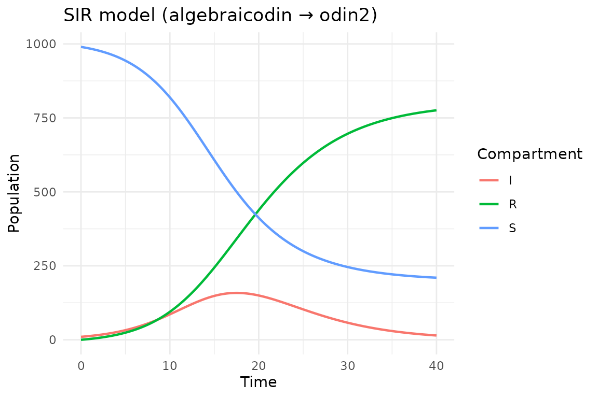

# Getting started with algebraicodin

## Introduction

**algebraicodin** uses applied category theory to build epidemiological
models compositionally, then generates
[odin2](https://mrc-ide.github.io/odin2/) code for high-performance
simulation via [dust2](https://mrc-ide.github.io/dust2/). Instead of
writing ODE equations by hand, you define a *Petri net*—a bipartite
graph of species (compartments) and transitions (processes)—and the
package derives the equations automatically.

This vignette walks through a basic SIR
(Susceptible–Infectious–Recovered) model, comparing the algebraic
approach with hand-written odin2 code.

``` r
library(algebraicodin)
#> 
#> Attaching package: 'algebraicodin'
#> The following objects are masked from 'package:base':
#> 
#>     %o%, %x%
```

## Defining a Petri net

A **labelled Petri net** describes a reaction network with named species
and named transitions. Each transition has input arcs (consumed species)
and output arcs (produced species).

For an SIR model, we have:

- **Species**: S (susceptible), I (infectious), R (recovered)
- **Transitions**:
  - `inf`: S + I → I + I (infection: one S and one I produce two I)
  - `rec`: I → R (recovery)

``` r
sir <- labelled_petri_net(
  c("S", "I", "R"),
  inf = c("S", "I") %=>% c("I", "I"),
  rec = "I" %=>% "R"
)
```

We can inspect the structure:

``` r
species_names(sir)
#> [1] "S" "I" "R"
transition_names(sir)
#> [1] "inf" "rec"
transition_matrices(sir)
#> $input
#>   inf rec
#> S   1   0
#> I   1   1
#> R   0   0
#> 
#> $output
#>   inf rec
#> S   0   0
#> I   2   0
#> R   0   1
#> 
#> $stoichiometry
#>   inf rec
#> S  -1   0
#> I   1  -1
#> R   0   1
```

The **stoichiometry matrix** shows the net change in each species for
each transition. For infection, S decreases by 1 and I increases by 1;
for recovery, I decreases by 1 and R increases by 1.

## Visualising the Petri net

The
[`plot_petri()`](https://catrgory.github.io/algebraicodin/reference/plot_petri.md)
function renders the Petri net as a bipartite graph via
[DiagrammeR](https://rich-iannone.github.io/DiagrammeR/). Species appear
as blue circles and transitions as orange boxes:

``` r
plot_petri(sir)
```

## Generating odin2 code

The
[`pn_to_odin()`](https://catrgory.github.io/algebraicodin/reference/pn_to_odin.md)
function translates the Petri net into odin2 DSL code. The default type
is `"ode"` (continuous deterministic):

``` r
sir_code <- pn_to_odin(sir, type = "ode")
cat(sir_code)
#> ## Auto-generated by algebraicodin
#> 
#> ## Parameters
#> inf <- parameter()
#> rec <- parameter()
#> 
#> ## Initial conditions
#> S0 <- parameter()
#> I0 <- parameter()
#> R0 <- parameter()
#> 
#> initial(S) <- S0
#> initial(I) <- I0
#> initial(R) <- R0
#> 
#> ## Transition rates
#> rate_inf <- inf * S * I
#> rate_rec <- rec * I
#> 
#> ## Derivatives
#> deriv(S) <- -rate_inf
#> deriv(I) <- rate_inf - rate_rec
#> deriv(R) <- rate_rec
```

This generates mass-action kinetics where each transition rate is the
product of the rate constant and the concentrations of input species.

## Comparison with hand-written odin2

Here is the equivalent model written directly in the odin2 DSL:

``` r
sir_handwritten <- "
## Parameters
inf <- parameter()
rec <- parameter()

## Initial conditions
S0 <- parameter()
I0 <- parameter()
R0 <- parameter()
initial(S) <- S0
initial(I) <- I0
initial(R) <- R0

## Mass-action rates
rate_inf <- inf * S * I
rate_rec <- rec * I

## Derivatives
deriv(S) <- -rate_inf
deriv(I) <- rate_inf - rate_rec
deriv(R) <- rate_rec
"
```

The generated code is structurally identical to the hand-written
version. The algebraic approach guarantees that the stoichiometry is
internally consistent—every molecule consumed by a transition is
accounted for in the outputs.

## Running the model

We can compile and run the generated odin2 code using dust2:

``` r
gen <- odin2::odin(sir_code)
#> ✔ Wrote 'DESCRIPTION'
#> ✔ Wrote 'NAMESPACE'
#> ✔ Wrote 'R/dust.R'
#> ✔ Wrote 'src/dust.cpp'
#> ✔ Wrote 'src/Makevars'
#> ℹ 13 functions decorated with [[cpp11::register]]
#> ✔ generated file cpp11.R
#> ✔ generated file cpp11.cpp
#> ℹ Re-compiling odin.system840d9d16
#> ── R CMD INSTALL ───────────────────────────────────────────────────────────────
#> * installing *source* package ‘odin.system840d9d16’ ...
#> ** this is package ‘odin.system840d9d16’ version ‘0.0.1’
#> ** using staged installation
#> ** libs
#> using C++ compiler: ‘g++ (Ubuntu 13.3.0-6ubuntu2~24.04.1) 13.3.0’
#> g++ -std=gnu++17 -I"/opt/R/4.5.3/lib/R/include" -DNDEBUG  -I'/home/runner/work/_temp/Library/cpp11/include' -I'/home/runner/work/_temp/Library/dust2/include' -I'/home/runner/work/_temp/Library/monty/include' -I/usr/local/include   -DHAVE_INLINE -fopenmp  -fpic  -g -O2  -Wall -pedantic -fdiagnostics-color=always  -c cpp11.cpp -o cpp11.o
#> g++ -std=gnu++17 -I"/opt/R/4.5.3/lib/R/include" -DNDEBUG  -I'/home/runner/work/_temp/Library/cpp11/include' -I'/home/runner/work/_temp/Library/dust2/include' -I'/home/runner/work/_temp/Library/monty/include' -I/usr/local/include   -DHAVE_INLINE -fopenmp  -fpic  -g -O2  -Wall -pedantic -fdiagnostics-color=always  -c dust.cpp -o dust.o
#> g++ -std=gnu++17 -shared -L/opt/R/4.5.3/lib/R/lib -L/usr/local/lib -o odin.system840d9d16.so cpp11.o dust.o -fopenmp -L/opt/R/4.5.3/lib/R/lib -lR
#> installing to /tmp/RtmpqSlma5/devtools_install_28ed42c1cff6/00LOCK-dust_28ed29635899/00new/odin.system840d9d16/libs
#> ** checking absolute paths in shared objects and dynamic libraries
#> * DONE (odin.system840d9d16)
#> ℹ Loading odin.system840d9d16
pars <- list(inf = 0.0005, rec = 0.25, S0 = 990, I0 = 10, R0 = 0)
sys <- dust2::dust_system_create(gen, pars, n_particles = 1)
dust2::dust_system_set_state_initial(sys)
t <- seq(0, 40, by = 0.1)
y <- dust2::dust_system_simulate(sys, t)
```

``` r
df <- data.frame(
  time = rep(t, 3),
  value = c(y[1, ], y[2, ], y[3, ]),
  compartment = rep(c("S", "I", "R"), each = length(t))
)
library(ggplot2)
ggplot(df, aes(time, value, colour = compartment)) +
  geom_line(linewidth = 0.8) +
  labs(title = "SIR model (algebraicodin → odin2)",
       x = "Time", y = "Population", colour = "Compartment") +
  theme_minimal()
```



## Using deSolve directly

For quick exploration without C++ compilation, the
[`vectorfield()`](https://catrgory.github.io/algebraicodin/reference/vectorfield.md)
function generates a pure-R ODE function compatible with
[deSolve](https://CRAN.R-project.org/package=deSolve):

``` r
library(deSolve)
vf <- vectorfield(sir)
state <- c(S = 990, I = 10, R = 0)
parms <- c(inf = 0.0005, rec = 0.25)
out <- ode(state, t, vf, parms)
head(out)
#>      time        S        I         R
#> [1,]  0.0 990.0000 10.00000 0.0000000
#> [2,]  0.1 989.4990 10.24790 0.2530877
#> [3,]  0.2 988.9859 10.50167 0.5124432
#> [4,]  0.3 988.4603 10.76146 0.7782199
#> [5,]  0.4 987.9221 11.02737 1.0505676
#> [6,]  0.5 987.3708 11.29955 1.3296410
```

## Summary

| Approach               | Pros                                                 | Cons                                             |
|------------------------|------------------------------------------------------|--------------------------------------------------|
| **algebraicodin**      | Compositional; automatic stoichiometry; multi-target | Abstraction overhead for simple models           |
| **Hand-written odin2** | Direct control; familiar syntax                      | Manual bookkeeping; error-prone for large models |
| **deSolve**            | No compilation needed; immediate                     | Slower for large simulations; pure R             |

For small models, the approaches are essentially equivalent. The power
of algebraicodin becomes clear when composing models from reusable parts
(see
[`vignette("composition")`](https://catrgory.github.io/algebraicodin/articles/composition.md))
or stratifying by age or risk groups (see
[`vignette("stratification")`](https://catrgory.github.io/algebraicodin/articles/stratification.md)).
