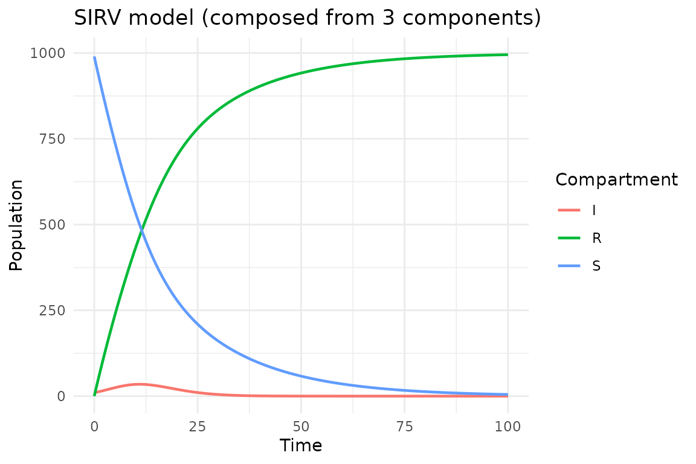

# Compositional modeling

## Introduction

The central idea of algebraicodin is **compositional modeling**: build
complex models by assembling reusable components. Instead of writing a
monolithic SIR model, we define *infection* and *recovery* as separate
**open Petri nets**, then compose them by declaring how they share
species.

This approach mirrors the mathematical framework of
[AlgebraicPetri.jl](https://algebraicjulia.github.io/AlgebraicPetri.jl/)
and uses **undirected wiring diagrams** (UWDs) from applied category
theory to specify the composition pattern.

``` r
library(algebraicodin)
#> 
#> Attaching package: 'algebraicodin'
#> The following objects are masked from 'package:base':
#> 
#>     %o%, %x%
```

## Building blocks

An **open Petri net** is a Petri net with designated *legs*—species that
are exposed for composition. The package provides helpers for common
epidemiological transitions:

``` r
# Infection: S + I → I + I (frequency-dependent transmission)
infection <- exposure_petri("S", "I", "I", "inf")

# Recovery: I → R (spontaneous transition)
recovery <- spontaneous_petri("I", "R", "rec")
```

Each component is self-contained with its own species and transitions.
The legs expose species that will be identified during composition.

``` r
plot_petri(infection)
```

``` r
plot_petri(recovery)
```

## Composing with the `%o%` operator

The simplest way to compose two open Petri nets is the `%o%` operator,
which automatically identifies species with matching names:

``` r
sir_composed <- infection %o% recovery
species_names(apex(sir_composed))
#> [1] "S" "I" "R"
transition_names(apex(sir_composed))
#> [1] "inf" "rec"
```

Species “I” appears in both components, so it gets identified (shared).
The result is the standard SIR model.

``` r
plot_petri(sir_composed)
```

``` r
sir_code <- pn_to_odin(apex(sir_composed), "ode")
cat(sir_code)
#> ## Auto-generated by algebraicodin
#> 
#> ## Parameters
#> inf <- parameter()
#> rec <- parameter()
#> 
#> ## Initial conditions
#> S0 <- parameter()
#> I0 <- parameter()
#> R0 <- parameter()
#> 
#> initial(S) <- S0
#> initial(I) <- I0
#> initial(R) <- R0
#> 
#> ## Transition rates
#> rate_inf <- inf * S * I
#> rate_rec <- rec * I
#> 
#> ## Derivatives
#> deriv(S) <- -rate_inf
#> deriv(I) <- rate_inf - rate_rec
#> deriv(R) <- rate_rec
```

## Composing with wiring diagrams

For more control, define an explicit **undirected wiring diagram** (UWD)
and use
[`oapply()`](https://catrgory.github.io/algebraicodin/reference/oapply.md).
The UWD specifies *junctions* (shared species) and *boxes* (components):

``` r
w_sir <- catlab::uwd(
  outer = c("S", "I", "R"),
  infection = c("S", "I"),
  recovery  = c("I", "R")
)
sir_via_uwd <- oapply(w_sir, list(infection, recovery))
species_names(apex(sir_via_uwd))
#> [1] "S" "I" "R"
```

The UWD approach is equivalent to `%o%` for two components but
generalises naturally to more complex diagrams.

``` r
plot_uwd(w_sir)
```

## Extending to SEIR

Adding an exposed compartment requires a third component—*progression*
from E to I:

``` r
# Exposure: S + I → E + I (infectious contact produces exposed, not infectious)
exposure <- exposure_petri("S", "I", "E", "exp")

# Progression: E → I
progression <- spontaneous_petri("E", "I", "prog")

# Compose with explicit UWD
w_seir <- catlab::uwd(
  outer    = c("S", "E", "I", "R"),
  exposure = c("S", "I", "E"),
  progression  = c("E", "I"),
  recovery = c("I", "R")
)
seir <- oapply(w_seir, list(exposure, progression, recovery))
species_names(apex(seir))
#> [1] "S" "E" "I" "R"
transition_names(apex(seir))
#> [1] "exp"  "prog" "rec"
```

The wiring diagram shows how the three components share species:

``` r
plot_uwd(w_seir)
```

``` r
plot_petri(seir)
```

``` r
cat(pn_to_odin(apex(seir), "ode"))
#> ## Auto-generated by algebraicodin
#> 
#> ## Parameters
#> exp <- parameter()
#> prog <- parameter()
#> rec <- parameter()
#> 
#> ## Initial conditions
#> S0 <- parameter()
#> E0 <- parameter()
#> I0 <- parameter()
#> R0 <- parameter()
#> 
#> initial(S) <- S0
#> initial(E) <- E0
#> initial(I) <- I0
#> initial(R) <- R0
#> 
#> ## Transition rates
#> rate_exp <- exp * S * I
#> rate_prog <- prog * E
#> rate_rec <- rec * I
#> 
#> ## Derivatives
#> deriv(S) <- -rate_exp
#> deriv(E) <- rate_exp - rate_prog
#> deriv(I) <- rate_prog - rate_rec
#> deriv(R) <- rate_rec
```

## Comparison: composed vs hand-written SEIR

The hand-written odin2 SEIR model:

``` r
seir_handwritten <- "
exp <- parameter()
prog <- parameter()
rec <- parameter()
S0 <- parameter()
E0 <- parameter()
I0 <- parameter()
R0 <- parameter()
initial(S) <- S0
initial(E) <- E0
initial(I) <- I0
initial(R) <- R0
rate_exp <- exp * S * I
rate_prog <- prog * E
rate_rec <- rec * I
deriv(S) <- -rate_exp
deriv(E) <- rate_exp - rate_prog
deriv(I) <- rate_prog - rate_rec
deriv(R) <- rate_rec
"
```

Let us run both and verify they produce identical trajectories:

``` r
# Algebraic version
gen_alg <- odin2::odin(pn_to_odin(apex(seir), "ode"))
#> ✔ Wrote 'DESCRIPTION'
#> ✔ Wrote 'NAMESPACE'
#> ✔ Wrote 'R/dust.R'
#> ✔ Wrote 'src/dust.cpp'
#> ✔ Wrote 'src/Makevars'
#> ℹ 13 functions decorated with [[cpp11::register]]
#> ✔ generated file cpp11.R
#> ✔ generated file cpp11.cpp
#> ℹ Re-compiling odin.system523a0040
#> ── R CMD INSTALL ───────────────────────────────────────────────────────────────
#> * installing *source* package ‘odin.system523a0040’ ...
#> ** this is package ‘odin.system523a0040’ version ‘0.0.1’
#> ** using staged installation
#> ** libs
#> using C++ compiler: ‘g++ (Ubuntu 13.3.0-6ubuntu2~24.04.1) 13.3.0’
#> g++ -std=gnu++17 -I"/opt/R/4.5.3/lib/R/include" -DNDEBUG  -I'/home/runner/work/_temp/Library/cpp11/include' -I'/home/runner/work/_temp/Library/dust2/include' -I'/home/runner/work/_temp/Library/monty/include' -I/usr/local/include   -DHAVE_INLINE -fopenmp  -fpic  -g -O2  -Wall -pedantic -fdiagnostics-color=always  -c cpp11.cpp -o cpp11.o
#> g++ -std=gnu++17 -I"/opt/R/4.5.3/lib/R/include" -DNDEBUG  -I'/home/runner/work/_temp/Library/cpp11/include' -I'/home/runner/work/_temp/Library/dust2/include' -I'/home/runner/work/_temp/Library/monty/include' -I/usr/local/include   -DHAVE_INLINE -fopenmp  -fpic  -g -O2  -Wall -pedantic -fdiagnostics-color=always  -c dust.cpp -o dust.o
#> g++ -std=gnu++17 -shared -L/opt/R/4.5.3/lib/R/lib -L/usr/local/lib -o odin.system523a0040.so cpp11.o dust.o -fopenmp -L/opt/R/4.5.3/lib/R/lib -lR
#> installing to /tmp/RtmpYmXffh/devtools_install_28812afabe55/00LOCK-dust_28817fc042cd/00new/odin.system523a0040/libs
#> ** checking absolute paths in shared objects and dynamic libraries
#> * DONE (odin.system523a0040)
#> ℹ Loading odin.system523a0040
pars <- list(exp = 0.001, prog = 0.2, rec = 0.1,
             S0 = 990, E0 = 0, I0 = 10, R0 = 0)
sys_alg <- dust2::dust_system_create(gen_alg, pars, n_particles = 1)
dust2::dust_system_set_state_initial(sys_alg)
t <- seq(0, 100, by = 0.5)
y_alg <- dust2::dust_system_simulate(sys_alg, t)

# Hand-written version
gen_hw <- odin2::odin(seir_handwritten)
#> ℹ Using cached generator
sys_hw <- dust2::dust_system_create(gen_hw, pars, n_particles = 1)
dust2::dust_system_set_state_initial(sys_hw)
y_hw <- dust2::dust_system_simulate(sys_hw, t)

cat("Max absolute difference:", max(abs(y_alg - y_hw)), "\n")
#> Max absolute difference: 0
```

The outputs match exactly—both compile to the same C++ system.

## Adding vaccination: SIRV

We can extend SIR with a vaccination transition (S → R at rate `vac`):

``` r
vaccination <- spontaneous_petri("S", "R", "vac")

w_sirv <- catlab::uwd(
  outer      = c("S", "I", "R"),
  infection  = c("S", "I"),
  recovery   = c("I", "R"),
  vaccination = c("S", "R")
)
sirv <- oapply(w_sirv, list(infection, recovery, vaccination))
cat(pn_to_odin(apex(sirv), "ode"))
#> ## Auto-generated by algebraicodin
#> 
#> ## Parameters
#> inf <- parameter()
#> rec <- parameter()
#> vac <- parameter()
#> 
#> ## Initial conditions
#> S0 <- parameter()
#> I0 <- parameter()
#> R0 <- parameter()
#> 
#> initial(S) <- S0
#> initial(I) <- I0
#> initial(R) <- R0
#> 
#> ## Transition rates
#> rate_inf <- inf * S * I
#> rate_rec <- rec * I
#> rate_vac <- vac * S
#> 
#> ## Derivatives
#> deriv(S) <- -rate_inf - rate_vac
#> deriv(I) <- rate_inf - rate_rec
#> deriv(R) <- rate_rec + rate_vac
```

``` r
plot_uwd(w_sirv)
```

``` r
plot_petri(sirv)
```

``` r
gen <- odin2::odin(pn_to_odin(apex(sirv), "ode"))
#> ✔ Wrote 'DESCRIPTION'
#> ✔ Wrote 'NAMESPACE'
#> ✔ Wrote 'R/dust.R'
#> ✔ Wrote 'src/dust.cpp'
#> ✔ Wrote 'src/Makevars'
#> ℹ 13 functions decorated with [[cpp11::register]]
#> ✔ generated file cpp11.R
#> ✔ generated file cpp11.cpp
#> ℹ Re-compiling odin.systemd0eef7b9
#> ── R CMD INSTALL ───────────────────────────────────────────────────────────────
#> * installing *source* package ‘odin.systemd0eef7b9’ ...
#> ** this is package ‘odin.systemd0eef7b9’ version ‘0.0.1’
#> ** using staged installation
#> ** libs
#> using C++ compiler: ‘g++ (Ubuntu 13.3.0-6ubuntu2~24.04.1) 13.3.0’
#> g++ -std=gnu++17 -I"/opt/R/4.5.3/lib/R/include" -DNDEBUG  -I'/home/runner/work/_temp/Library/cpp11/include' -I'/home/runner/work/_temp/Library/dust2/include' -I'/home/runner/work/_temp/Library/monty/include' -I/usr/local/include   -DHAVE_INLINE -fopenmp  -fpic  -g -O2  -Wall -pedantic -fdiagnostics-color=always  -c cpp11.cpp -o cpp11.o
#> g++ -std=gnu++17 -I"/opt/R/4.5.3/lib/R/include" -DNDEBUG  -I'/home/runner/work/_temp/Library/cpp11/include' -I'/home/runner/work/_temp/Library/dust2/include' -I'/home/runner/work/_temp/Library/monty/include' -I/usr/local/include   -DHAVE_INLINE -fopenmp  -fpic  -g -O2  -Wall -pedantic -fdiagnostics-color=always  -c dust.cpp -o dust.o
#> g++ -std=gnu++17 -shared -L/opt/R/4.5.3/lib/R/lib -L/usr/local/lib -o odin.systemd0eef7b9.so cpp11.o dust.o -fopenmp -L/opt/R/4.5.3/lib/R/lib -lR
#> installing to /tmp/RtmpYmXffh/devtools_install_2881484bbab1/00LOCK-dust_2881258e7b9a/00new/odin.systemd0eef7b9/libs
#> ** checking absolute paths in shared objects and dynamic libraries
#> * DONE (odin.systemd0eef7b9)
#> ℹ Loading odin.systemd0eef7b9
pars <- list(inf = 0.0005, rec = 0.25, vac = 0.05,
             S0 = 990, I0 = 10, R0 = 0)
sys <- dust2::dust_system_create(gen, pars, n_particles = 1)
dust2::dust_system_set_state_initial(sys)
y <- dust2::dust_system_simulate(sys, t)

df <- data.frame(
  time = rep(t, 3),
  value = c(y[1, ], y[2, ], y[3, ]),
  compartment = rep(c("S", "I", "R"), each = length(t))
)
library(ggplot2)
ggplot(df, aes(time, value, colour = compartment)) +
  geom_line(linewidth = 0.8) +
  labs(title = "SIRV model (composed from 3 components)",
       x = "Time", y = "Population", colour = "Compartment") +
  theme_minimal()
```



## Using the epidemiology dictionary

For convenience,
[`epi_dict()`](https://catrgory.github.io/algebraicodin/reference/epi_dict.md)
provides pre-built components for common transitions:

``` r
dict <- epi_dict()
names(dict)
#> [1] "infection"       "recovery"        "vaccination"     "waning"         
#> [5] "death"           "exposure"        "progression"     "hospitalization"
```

You can compose a model directly from the dictionary using
[`compose_epi()`](https://catrgory.github.io/algebraicodin/reference/compose_epi.md):

``` r
w <- catlab::uwd(
  outer     = c("S", "I", "R"),
  infection = c("S", "I"),
  recovery  = c("I", "R")
)
sir <- compose_epi(w, dict, c("infection", "recovery"))
species_names(apex(sir))
#> [1] "S" "I" "R"
```

## Composing more than two components

The
[`compose()`](https://catrgory.github.io/algebraicodin/reference/compose.md)
function chains multiple `%o%` operations:

``` r
sirh <- compose(
  exposure_petri("S", "I", "I", "inf"),
  spontaneous_petri("I", "R", "rec"),
  spontaneous_petri("I", "H", "hosp"),
  spontaneous_petri("H", "R", "hosp_rec")
)
species_names(apex(sirh))
#> [1] "S" "I" "R" "H"
transition_names(apex(sirh))
#> [1] "inf"      "rec"      "hosp"     "hosp_rec"
```

## Summary

| Method                                                                               | Syntax                          | Best for                         |
|--------------------------------------------------------------------------------------|---------------------------------|----------------------------------|
| `%o%`                                                                                | `a %o% b`                       | Quick binary composition         |
| [`oapply()`](https://catrgory.github.io/algebraicodin/reference/oapply.md)           | `oapply(uwd, components)`       | Full control via wiring diagrams |
| [`compose()`](https://catrgory.github.io/algebraicodin/reference/compose.md)         | `compose(a, b, c)`              | Chaining multiple components     |
| [`compose_epi()`](https://catrgory.github.io/algebraicodin/reference/compose_epi.md) | `compose_epi(uwd, dict, names)` | Dictionary-based workflows       |

The compositional approach ensures that every shared species is
correctly identified and that stoichiometry is preserved across
components. For stratification by age, risk, or vaccination status, see
[`vignette("stratification")`](https://catrgory.github.io/algebraicodin/articles/stratification.md).
