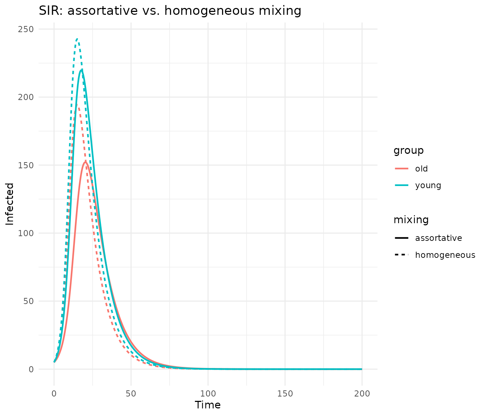
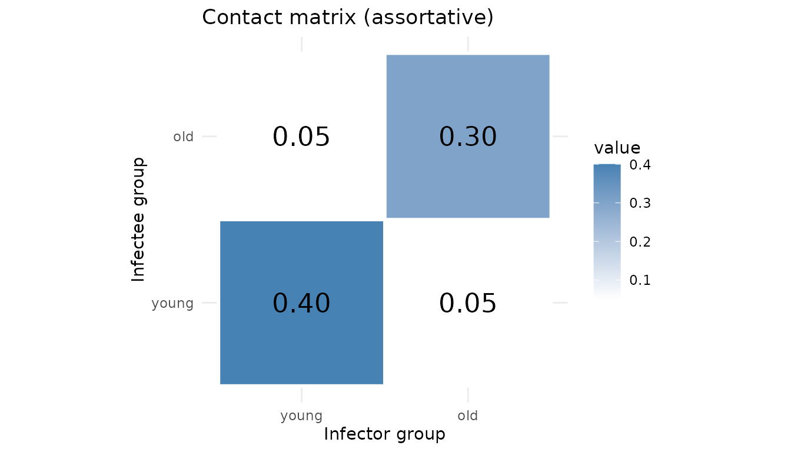
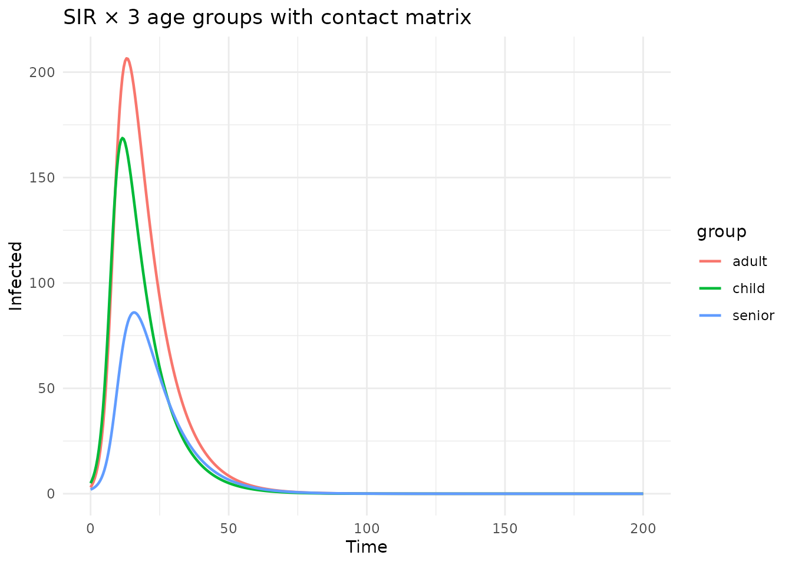
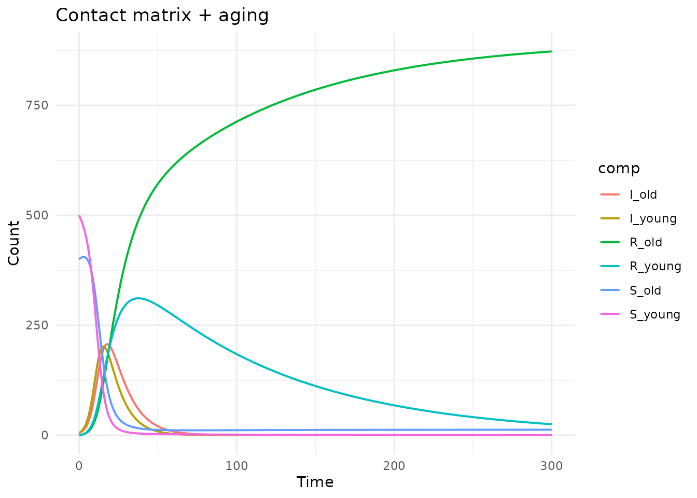

# Contact matrix mixing

## Introduction

In age-stratified epidemiological models, the **contact matrix** (also
called the WAIFW — “Who Acquires Infection From Whom” — matrix)
describes how much contact occurs between different age groups. This is
critical because transmission is rarely homogeneous: children tend to
have more contacts with other children, adults with other adults, etc.

Without a contact matrix, each stratum’s infection depends only on its
own group:

$$\text{infection}_{i} = \beta \cdot S_{i} \cdot I_{i}/N_{i}$$

With a contact matrix $C$, the **force of infection** on group $i$ sums
infectious pressure from *all* groups:

$$\lambda_{i} = \sum\limits_{j}C_{ij} \cdot I_{j}/N_{j}$$$$\text{infection}_{i} = \lambda_{i} \cdot S_{i}$$

The `algebraicodin` package supports this via the `mixing` parameter in
[`sf_stratify()`](https://catrgory.github.io/algebraicodin/reference/sf_stratify.md).

``` r
library(algebraicodin)
library(ggplot2)
library(odin2)
library(dust2)
```

## Basic example: SIR with 2 age groups

### Define the base model

``` r
sir <- stock_and_flow(
  stocks = c("S", "I", "R"),
  flows = list(
    infection = flow(from = "S", to = "I", rate = beta * S * I / N),
    recovery = flow(from = "I", to = "R", rate = gamma * I)
  ),
  sums = list(N = c("S", "I", "R")),
  params = c("beta", "gamma")
)
```

### Stratify with a contact matrix

Pass `mixing = list(infection = "C")` to replace the per-stratum `beta`
with a contact matrix where entries `C_i_j` represent the transmission
rate from group $j$ to group $i$:

``` r
sir_mix <- sf_stratify(sir, c("young", "old"),
  flow_types = c(infection = "disease", recovery = "disease"),
  mixing = list(infection = "C")
)

cat("Stocks:", paste(sf_snames(sir_mix), collapse = ", "), "\n")
#> Stocks: S_young, S_old, I_young, I_old, R_young, R_old
cat("Flows:", paste(sf_fnames(sir_mix), collapse = ", "), "\n")
#> Flows: infection_id_young, infection_id_old, recovery_id_young, recovery_id_old
cat("Params:", paste(sf_pnames(sir_mix), collapse = ", "), "\n")
#> Params: C_old_old, gamma, C_young_young, C_young_old, C_old_young
```

Note that `beta` has been absorbed into the contact matrix — only
`gamma` and the four `C_*_*` entries remain as parameters.

### Generated odin2 code

``` r
cat(sf_to_odin(sir_mix, type = "ode"))
#> C_old_old <- parameter()
#> gamma <- parameter()
#> C_young_young <- parameter()
#> C_young_old <- parameter()
#> C_old_young <- parameter()
#> 
#> S_young0 <- parameter(0)
#> initial(S_young) <- S_young0
#> S_old0 <- parameter(0)
#> initial(S_old) <- S_old0
#> I_young0 <- parameter(0)
#> initial(I_young) <- I_young0
#> I_old0 <- parameter(0)
#> initial(I_old) <- I_old0
#> R_young0 <- parameter(0)
#> initial(R_young) <- R_young0
#> R_old0 <- parameter(0)
#> initial(R_old) <- R_old0
#> 
#> N_young <- S_young + I_young + R_young
#> N_old <- S_old + I_old + R_old
#> 
#> lambda_infection_young <- C_young_young * I_young / N_young + C_young_old * I_old / N_old
#> lambda_infection_old <- C_old_young * I_young / N_young + C_old_old * I_old / N_old
#> 
#> v_infection_id_young <- lambda_infection_young * S_young
#> v_infection_id_old <- lambda_infection_old * S_old
#> v_recovery_id_young <- gamma * I_young
#> v_recovery_id_old <- gamma * I_old
#> 
#> deriv(S_young) <- - v_infection_id_young
#> deriv(S_old) <- - v_infection_id_old
#> deriv(I_young) <- v_infection_id_young - v_recovery_id_young
#> deriv(I_old) <- v_infection_id_old - v_recovery_id_old
#> deriv(R_young) <- v_recovery_id_young
#> deriv(R_old) <- v_recovery_id_old
```

The `lambda_infection_*` variables compute the force of infection by
summing over all source groups, weighted by the contact matrix.

### Simulate: assortative vs. homogeneous mixing

``` r
gen <- sf_to_odin_system(sir_mix, type = "ode")

# Assortative mixing: more within-group contact
pars_assort <- list(
  gamma = 0.1,
  C_young_young = 0.4, C_young_old = 0.05,
  C_old_young = 0.05, C_old_old = 0.3,
  S_young0 = 500, S_old0 = 400,
  I_young0 = 5, I_old0 = 5,
  R_young0 = 0, R_old0 = 0
)

# Homogeneous mixing: equal contact across groups
pars_homog <- pars_assort
pars_homog$C_young_young <- 0.25
pars_homog$C_young_old <- 0.25
pars_homog$C_old_young <- 0.25
pars_homog$C_old_old <- 0.25

times <- seq(0, 200, by = 0.5)

run_model <- function(pars) {
  sys <- dust_system_create(gen(), pars)
  dust_system_set_state_initial(sys)
  res <- dust_system_simulate(sys, times)
  dust_unpack_state(sys, res)
}

state_a <- run_model(pars_assort)
#> ── R CMD INSTALL ───────────────────────────────────────────────────────────────
#> * installing *source* package ‘odin.system3a5fe2dc’ ...
#> ** this is package ‘odin.system3a5fe2dc’ version ‘0.0.1’
#> ** using staged installation
#> ** libs
#> using C++ compiler: ‘g++ (Ubuntu 13.3.0-6ubuntu2~24.04.1) 13.3.0’
#> g++ -std=gnu++17 -I"/opt/R/4.5.3/lib/R/include" -DNDEBUG  -I'/home/runner/work/_temp/Library/cpp11/include' -I'/home/runner/work/_temp/Library/dust2/include' -I'/home/runner/work/_temp/Library/monty/include' -I/usr/local/include   -DHAVE_INLINE -fopenmp  -fpic  -g -O2  -Wall -pedantic -fdiagnostics-color=always  -c cpp11.cpp -o cpp11.o
#> g++ -std=gnu++17 -I"/opt/R/4.5.3/lib/R/include" -DNDEBUG  -I'/home/runner/work/_temp/Library/cpp11/include' -I'/home/runner/work/_temp/Library/dust2/include' -I'/home/runner/work/_temp/Library/monty/include' -I/usr/local/include   -DHAVE_INLINE -fopenmp  -fpic  -g -O2  -Wall -pedantic -fdiagnostics-color=always  -c dust.cpp -o dust.o
#> g++ -std=gnu++17 -shared -L/opt/R/4.5.3/lib/R/lib -L/usr/local/lib -o odin.system3a5fe2dc.so cpp11.o dust.o -fopenmp -L/opt/R/4.5.3/lib/R/lib -lR
#> installing to /tmp/RtmpXCGSYR/devtools_install_297776056062/00LOCK-dust_2977343ca4dc/00new/odin.system3a5fe2dc/libs
#> ** checking absolute paths in shared objects and dynamic libraries
#> * DONE (odin.system3a5fe2dc)
state_h <- run_model(pars_homog)
```

``` r
df <- rbind(
  data.frame(time = times, value = state_a$I_young,
             group = "young", mixing = "assortative"),
  data.frame(time = times, value = state_a$I_old,
             group = "old", mixing = "assortative"),
  data.frame(time = times, value = state_h$I_young,
             group = "young", mixing = "homogeneous"),
  data.frame(time = times, value = state_h$I_old,
             group = "old", mixing = "homogeneous")
)

ggplot(df, aes(x = time, y = value, colour = group, linetype = mixing)) +
  geom_line(linewidth = 0.8) +
  labs(title = "SIR: assortative vs. homogeneous mixing",
       x = "Time", y = "Infected") +
  theme_minimal()
```



With **assortative mixing** (high diagonal, low off-diagonal), the young
group peaks higher and earlier due to its stronger within-group contact
rate. With **homogeneous mixing**, both groups follow more similar
trajectories.

## Visualising the contact matrix

``` r
C <- matrix(c(0.4, 0.05, 0.05, 0.3), 2, 2,
            dimnames = list(c("young", "old"), c("young", "old")))

df_C <- expand.grid(from = colnames(C), to = rownames(C))
df_C$value <- as.vector(C)

ggplot(df_C, aes(x = from, y = to, fill = value)) +
  geom_tile(colour = "white", linewidth = 1) +
  geom_text(aes(label = sprintf("%.2f", value)), size = 6) +
  scale_fill_gradient(low = "white", high = "steelblue") +
  labs(title = "Contact matrix (assortative)",
       x = "Infector group", y = "Infectee group") +
  theme_minimal() +
  coord_equal()
```



## Three age groups

``` r
sir_3 <- sf_stratify(sir, c("child", "adult", "senior"),
  flow_types = c(infection = "disease", recovery = "disease"),
  mixing = list(infection = "C")
)

cat("Num contact params:", sum(grepl("^C_", sf_pnames(sir_3))), "(3×3 matrix)\n")
#> Num contact params: 9 (3×3 matrix)
```

``` r
gen3 <- sf_to_odin_system(sir_3, type = "ode")

# Realistic-ish contact pattern: children mix most, seniors least
sys3 <- dust_system_create(gen3(), list(
  gamma = 0.1,
  C_child_child = 0.5,  C_child_adult = 0.15, C_child_senior = 0.05,
  C_adult_child = 0.15, C_adult_adult = 0.3,  C_adult_senior = 0.1,
  C_senior_child = 0.05, C_senior_adult = 0.1, C_senior_senior = 0.2,
  S_child0 = 300, S_adult0 = 400, S_senior0 = 200,
  I_child0 = 5, I_adult0 = 3, I_senior0 = 2,
  R_child0 = 0, R_adult0 = 0, R_senior0 = 0
))
#> ── R CMD INSTALL ───────────────────────────────────────────────────────────────
#> * installing *source* package ‘odin.system659c5d81’ ...
#> ** this is package ‘odin.system659c5d81’ version ‘0.0.1’
#> ** using staged installation
#> ** libs
#> using C++ compiler: ‘g++ (Ubuntu 13.3.0-6ubuntu2~24.04.1) 13.3.0’
#> g++ -std=gnu++17 -I"/opt/R/4.5.3/lib/R/include" -DNDEBUG  -I'/home/runner/work/_temp/Library/cpp11/include' -I'/home/runner/work/_temp/Library/dust2/include' -I'/home/runner/work/_temp/Library/monty/include' -I/usr/local/include   -DHAVE_INLINE -fopenmp  -fpic  -g -O2  -Wall -pedantic -fdiagnostics-color=always  -c cpp11.cpp -o cpp11.o
#> g++ -std=gnu++17 -I"/opt/R/4.5.3/lib/R/include" -DNDEBUG  -I'/home/runner/work/_temp/Library/cpp11/include' -I'/home/runner/work/_temp/Library/dust2/include' -I'/home/runner/work/_temp/Library/monty/include' -I/usr/local/include   -DHAVE_INLINE -fopenmp  -fpic  -g -O2  -Wall -pedantic -fdiagnostics-color=always  -c dust.cpp -o dust.o
#> g++ -std=gnu++17 -shared -L/opt/R/4.5.3/lib/R/lib -L/usr/local/lib -o odin.system659c5d81.so cpp11.o dust.o -fopenmp -L/opt/R/4.5.3/lib/R/lib -lR
#> installing to /tmp/RtmpXCGSYR/devtools_install_2977189bf322/00LOCK-dust_29772f9cda6c/00new/odin.system659c5d81/libs
#> ** checking absolute paths in shared objects and dynamic libraries
#> * DONE (odin.system659c5d81)
dust_system_set_state_initial(sys3)
res3 <- dust_system_simulate(sys3, seq(0, 200, by = 0.5))
state3 <- dust_unpack_state(sys3, res3)
t3 <- seq(0, 200, by = 0.5)

df3 <- data.frame(
  time = rep(t3, 3),
  infected = c(state3$I_child, state3$I_adult, state3$I_senior),
  group = rep(c("child", "adult", "senior"), each = length(t3))
)

ggplot(df3, aes(x = time, y = infected, colour = group)) +
  geom_line(linewidth = 0.8) +
  labs(title = "SIR × 3 age groups with contact matrix",
       x = "Time", y = "Infected") +
  theme_minimal()
```



Children peak first and highest (highest contact rate), seniors peak
last and lowest.

## Contact matrix with aging

The `mixing` parameter works together with `cross_strata_flows`:

``` r
sir_mix_age <- sf_stratify(sir, c("young", "old"),
  flow_types = c(infection = "disease", recovery = "disease"),
  cross_strata_flows = list(
    list(name = "aging", from = "young", to = "old",
         rate = quote(aging_rate * young), params = c("aging_rate"))
  ),
  mixing = list(infection = "C")
)

cat("Flows:", paste(sf_fnames(sir_mix_age), collapse = ", "), "\n")
#> Flows: infection_id_young, infection_id_old, recovery_id_young, recovery_id_old, aging_S, aging_I, aging_R
cat("Params:", paste(sf_pnames(sir_mix_age), collapse = ", "), "\n")
#> Params: C_old_old, gamma, aging_rate, C_young_young, C_young_old, C_old_young
```

``` r
gen_ma <- sf_to_odin_system(sir_mix_age, type = "ode")
sys_ma <- dust_system_create(gen_ma(), list(
  gamma = 0.1, aging_rate = 0.01,
  C_young_young = 0.4, C_young_old = 0.1,
  C_old_young = 0.1, C_old_old = 0.3,
  S_young0 = 500, S_old0 = 400,
  I_young0 = 5, I_old0 = 5,
  R_young0 = 0, R_old0 = 0
))
#> ── R CMD INSTALL ───────────────────────────────────────────────────────────────
#> * installing *source* package ‘odin.systemd897bf7c’ ...
#> ** this is package ‘odin.systemd897bf7c’ version ‘0.0.1’
#> ** using staged installation
#> ** libs
#> using C++ compiler: ‘g++ (Ubuntu 13.3.0-6ubuntu2~24.04.1) 13.3.0’
#> g++ -std=gnu++17 -I"/opt/R/4.5.3/lib/R/include" -DNDEBUG  -I'/home/runner/work/_temp/Library/cpp11/include' -I'/home/runner/work/_temp/Library/dust2/include' -I'/home/runner/work/_temp/Library/monty/include' -I/usr/local/include   -DHAVE_INLINE -fopenmp  -fpic  -g -O2  -Wall -pedantic -fdiagnostics-color=always  -c cpp11.cpp -o cpp11.o
#> g++ -std=gnu++17 -I"/opt/R/4.5.3/lib/R/include" -DNDEBUG  -I'/home/runner/work/_temp/Library/cpp11/include' -I'/home/runner/work/_temp/Library/dust2/include' -I'/home/runner/work/_temp/Library/monty/include' -I/usr/local/include   -DHAVE_INLINE -fopenmp  -fpic  -g -O2  -Wall -pedantic -fdiagnostics-color=always  -c dust.cpp -o dust.o
#> g++ -std=gnu++17 -shared -L/opt/R/4.5.3/lib/R/lib -L/usr/local/lib -o odin.systemd897bf7c.so cpp11.o dust.o -fopenmp -L/opt/R/4.5.3/lib/R/lib -lR
#> installing to /tmp/RtmpXCGSYR/devtools_install_297749cd8b8d/00LOCK-dust_2977382f8d62/00new/odin.systemd897bf7c/libs
#> ** checking absolute paths in shared objects and dynamic libraries
#> * DONE (odin.systemd897bf7c)
dust_system_set_state_initial(sys_ma)
res_ma <- dust_system_simulate(sys_ma, seq(0, 300, by = 0.5))
state_ma <- dust_unpack_state(sys_ma, res_ma)
t_ma <- seq(0, 300, by = 0.5)

df_ma <- data.frame(
  time = rep(t_ma, 6),
  value = c(state_ma$S_young, state_ma$S_old,
            state_ma$I_young, state_ma$I_old,
            state_ma$R_young, state_ma$R_old),
  comp = rep(c("S_young", "S_old", "I_young", "I_old",
               "R_young", "R_old"), each = length(t_ma))
)

ggplot(df_ma, aes(x = time, y = value, colour = comp)) +
  geom_line(linewidth = 0.7) +
  labs(title = "Contact matrix + aging",
       x = "Time", y = "Count") +
  theme_minimal()
```



## Frequency vs. density dependence

The default mixing type is **frequency-dependent** (divided by $N_{j}$).
For **density-dependent** transmission (no normalization), use:

``` r
sir_dens <- sf_stratify(sir, c("a", "b"),
  flow_types = c(infection = "disease", recovery = "disease"),
  mixing = list(infection = list(contact = "C", type = "density")))

# Check: no N in lambda
cat(sir_dens@var_exprs[["lambda_infection_a"]], "\n")
#> C_a_a * I_a + C_a_b * I_b
```

## Cross-validation with manual odin2

To verify the algebraic approach, let’s compare with a hand-written
model:

``` r
manual_code <- "
C_a_a <- parameter()
C_a_b <- parameter()
C_b_a <- parameter()
C_b_b <- parameter()
gamma <- parameter()

S_a0 <- parameter(0)
I_a0 <- parameter(0)
R_a0 <- parameter(0)
S_b0 <- parameter(0)
I_b0 <- parameter(0)
R_b0 <- parameter(0)

initial(S_a) <- S_a0
initial(I_a) <- I_a0
initial(R_a) <- R_a0
initial(S_b) <- S_b0
initial(I_b) <- I_b0
initial(R_b) <- R_b0

N_a <- S_a + I_a + R_a
N_b <- S_b + I_b + R_b

lambda_a <- C_a_a * I_a / N_a + C_a_b * I_b / N_b
lambda_b <- C_b_a * I_a / N_a + C_b_b * I_b / N_b

deriv(S_a) <- -lambda_a * S_a
deriv(I_a) <- lambda_a * S_a - gamma * I_a
deriv(R_a) <- gamma * I_a
deriv(S_b) <- -lambda_b * S_b
deriv(I_b) <- lambda_b * S_b - gamma * I_b
deriv(R_b) <- gamma * I_b
"

sir_m <- sf_stratify(sir, c("a", "b"),
  flow_types = c(infection = "disease", recovery = "disease"),
  mixing = list(infection = "C"))

gen_alg <- sf_to_odin_system(sir_m, type = "ode")
gen_man <- function() odin(manual_code)

pars <- list(
  C_a_a = 0.35, C_a_b = 0.15, C_b_a = 0.1, C_b_b = 0.3,
  gamma = 0.1,
  S_a0 = 500, I_a0 = 5, R_a0 = 0,
  S_b0 = 400, I_b0 = 5, R_b0 = 0
)

sys_a <- dust_system_create(gen_alg(), pars)
#> ── R CMD INSTALL ───────────────────────────────────────────────────────────────
#> * installing *source* package ‘odin.systembb972baa’ ...
#> ** this is package ‘odin.systembb972baa’ version ‘0.0.1’
#> ** using staged installation
#> ** libs
#> using C++ compiler: ‘g++ (Ubuntu 13.3.0-6ubuntu2~24.04.1) 13.3.0’
#> g++ -std=gnu++17 -I"/opt/R/4.5.3/lib/R/include" -DNDEBUG  -I'/home/runner/work/_temp/Library/cpp11/include' -I'/home/runner/work/_temp/Library/dust2/include' -I'/home/runner/work/_temp/Library/monty/include' -I/usr/local/include   -DHAVE_INLINE -fopenmp  -fpic  -g -O2  -Wall -pedantic -fdiagnostics-color=always  -c cpp11.cpp -o cpp11.o
#> g++ -std=gnu++17 -I"/opt/R/4.5.3/lib/R/include" -DNDEBUG  -I'/home/runner/work/_temp/Library/cpp11/include' -I'/home/runner/work/_temp/Library/dust2/include' -I'/home/runner/work/_temp/Library/monty/include' -I/usr/local/include   -DHAVE_INLINE -fopenmp  -fpic  -g -O2  -Wall -pedantic -fdiagnostics-color=always  -c dust.cpp -o dust.o
#> g++ -std=gnu++17 -shared -L/opt/R/4.5.3/lib/R/lib -L/usr/local/lib -o odin.systembb972baa.so cpp11.o dust.o -fopenmp -L/opt/R/4.5.3/lib/R/lib -lR
#> installing to /tmp/RtmpXCGSYR/devtools_install_29774eba312e/00LOCK-dust_2977afb72e4/00new/odin.systembb972baa/libs
#> ** checking absolute paths in shared objects and dynamic libraries
#> * DONE (odin.systembb972baa)
dust_system_set_state_initial(sys_a)
sys_m <- dust_system_create(gen_man(), pars)
#> ── R CMD INSTALL ───────────────────────────────────────────────────────────────
#> * installing *source* package ‘odin.systemcb9f5eb6’ ...
#> ** this is package ‘odin.systemcb9f5eb6’ version ‘0.0.1’
#> ** using staged installation
#> ** libs
#> using C++ compiler: ‘g++ (Ubuntu 13.3.0-6ubuntu2~24.04.1) 13.3.0’
#> g++ -std=gnu++17 -I"/opt/R/4.5.3/lib/R/include" -DNDEBUG  -I'/home/runner/work/_temp/Library/cpp11/include' -I'/home/runner/work/_temp/Library/dust2/include' -I'/home/runner/work/_temp/Library/monty/include' -I/usr/local/include   -DHAVE_INLINE -fopenmp  -fpic  -g -O2  -Wall -pedantic -fdiagnostics-color=always  -c cpp11.cpp -o cpp11.o
#> g++ -std=gnu++17 -I"/opt/R/4.5.3/lib/R/include" -DNDEBUG  -I'/home/runner/work/_temp/Library/cpp11/include' -I'/home/runner/work/_temp/Library/dust2/include' -I'/home/runner/work/_temp/Library/monty/include' -I/usr/local/include   -DHAVE_INLINE -fopenmp  -fpic  -g -O2  -Wall -pedantic -fdiagnostics-color=always  -c dust.cpp -o dust.o
#> g++ -std=gnu++17 -shared -L/opt/R/4.5.3/lib/R/lib -L/usr/local/lib -o odin.systemcb9f5eb6.so cpp11.o dust.o -fopenmp -L/opt/R/4.5.3/lib/R/lib -lR
#> installing to /tmp/RtmpXCGSYR/devtools_install_2977aedc6a/00LOCK-dust_29771d240211/00new/odin.systemcb9f5eb6/libs
#> ** checking absolute paths in shared objects and dynamic libraries
#> * DONE (odin.systemcb9f5eb6)
dust_system_set_state_initial(sys_m)

t_cv <- seq(0, 100, by = 1)
res_a <- dust_system_simulate(sys_a, t_cv)
res_m <- dust_system_simulate(sys_m, t_cv)
sa <- dust_unpack_state(sys_a, res_a)
sm <- dust_unpack_state(sys_m, res_m)

max_diff <- max(abs(sa$I_a - sm$I_a), abs(sa$I_b - sm$I_b),
                abs(sa$S_a - sm$S_a), abs(sa$S_b - sm$S_b))
cat(sprintf("Max difference: %.2e\n", max_diff))
#> Max difference: 0.00e+00
```

## Summary

| Feature                    | Syntax                                                             |
|----------------------------|--------------------------------------------------------------------|
| Frequency-dependent mixing | `mixing = list(infection = "C")`                                   |
| Density-dependent mixing   | `mixing = list(infection = list(contact = "C", type = "density"))` |
| Combined with aging        | Add `cross_strata_flows` as usual                                  |
| Contact parameter names    | `C_<infectee>_<infector>` (e.g., `C_young_old`)                    |

The contact matrix entries `C_i_j` represent the rate at which an
individual in group $i$ acquires infection from group $j$. The original
`beta` parameter is absorbed into the matrix entries and removed.
