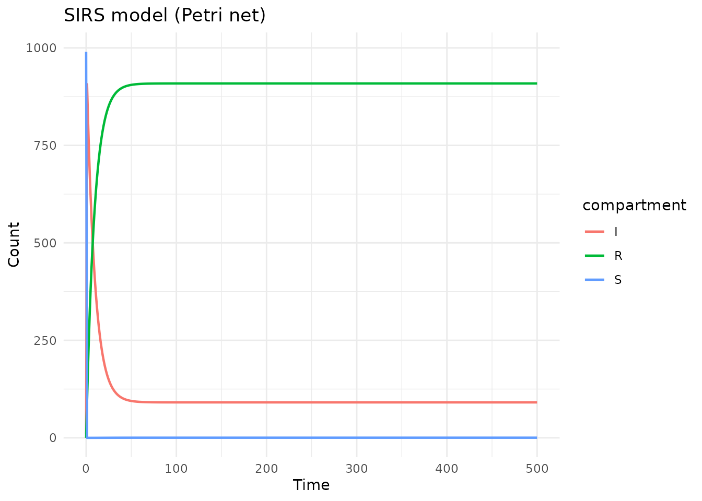
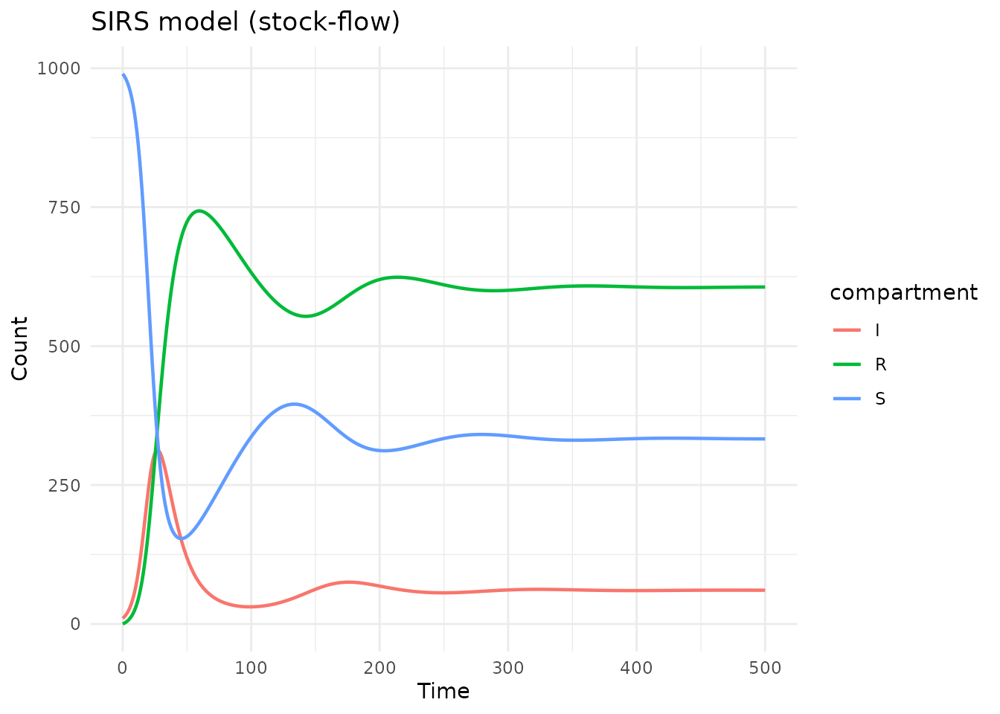
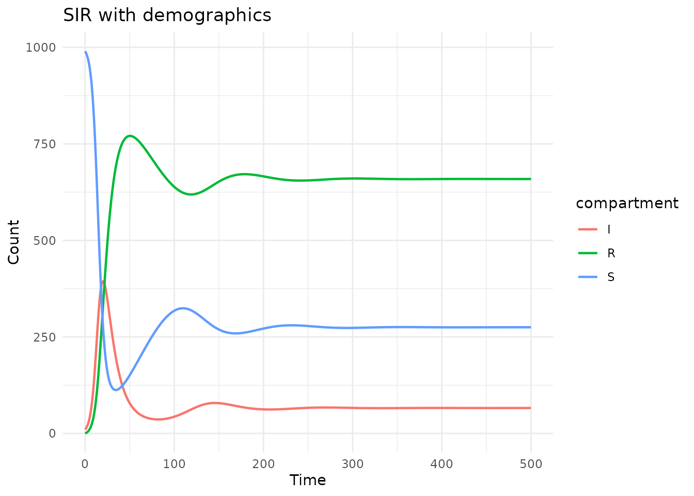
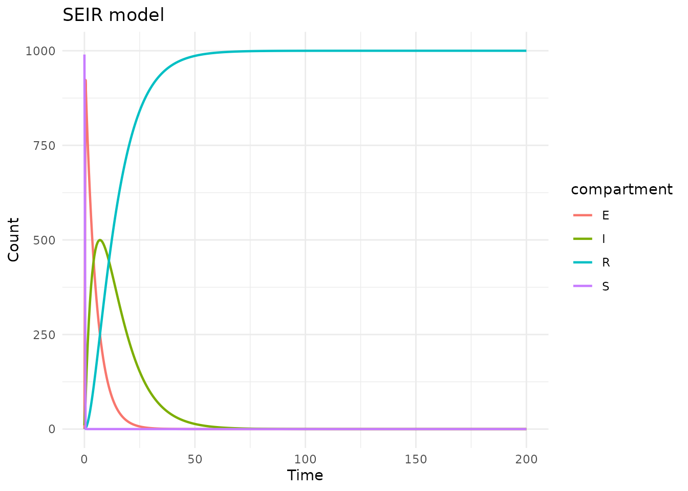
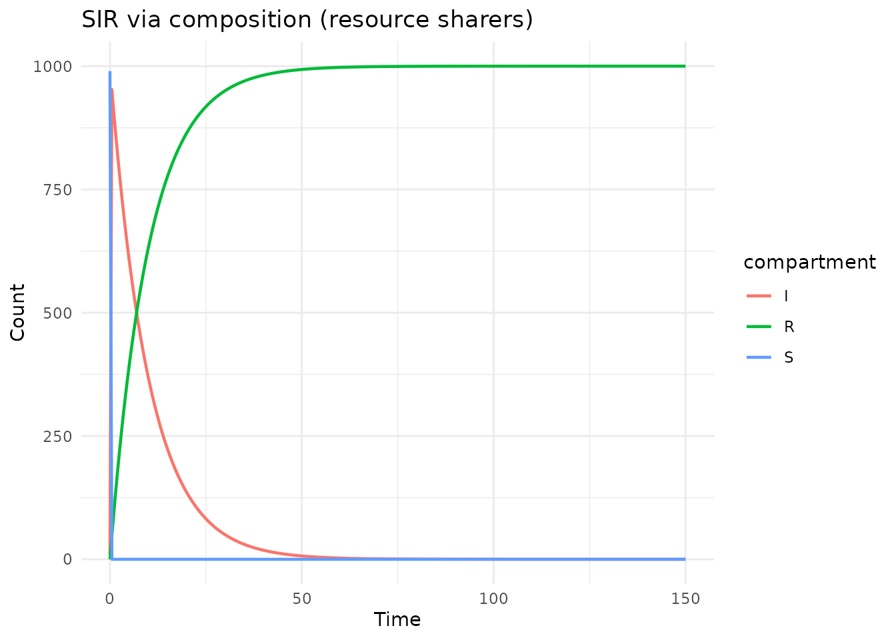
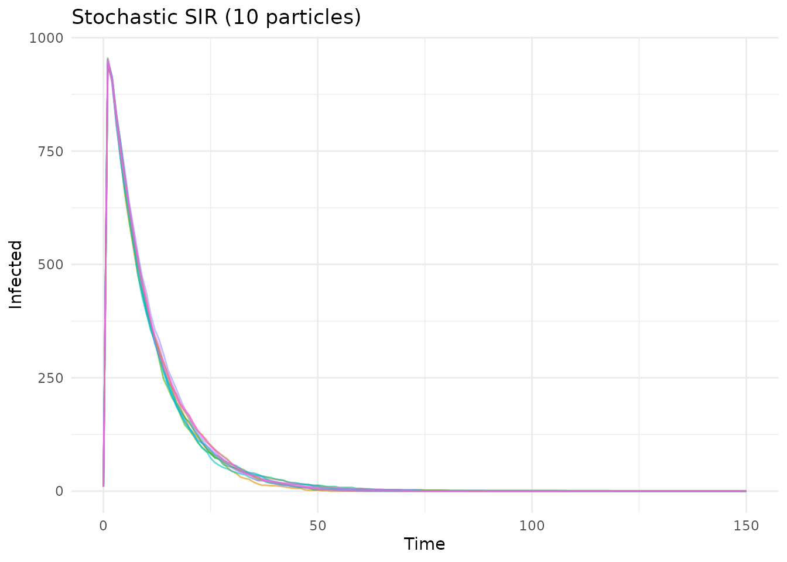
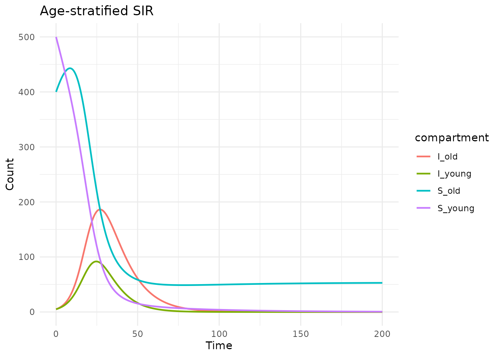
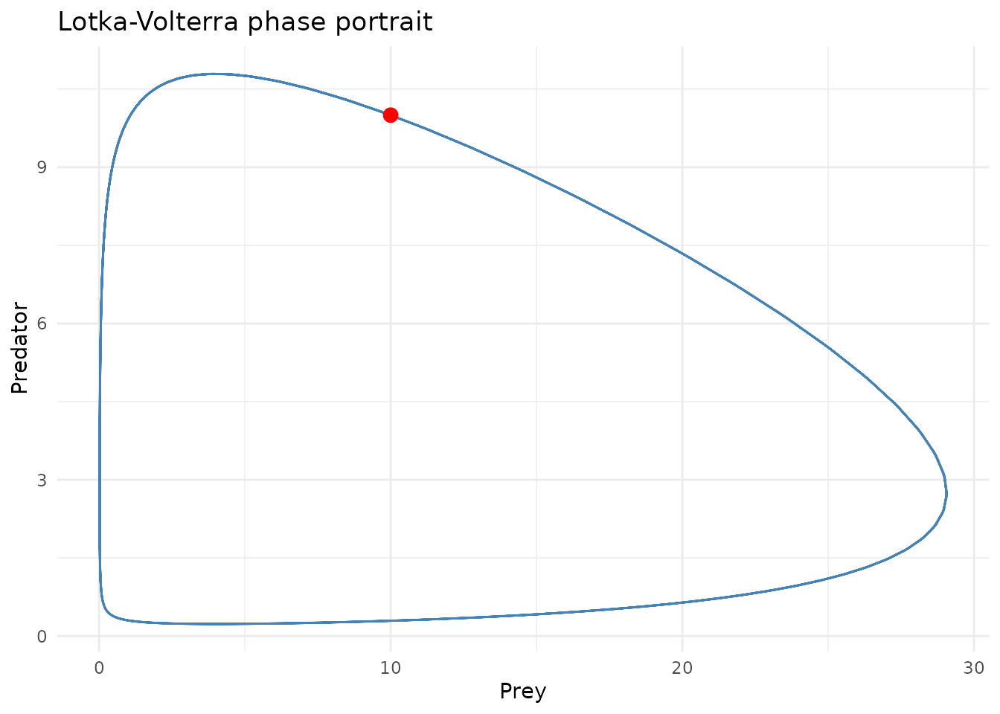

# Model examples

## Introduction

This vignette demonstrates a variety of epidemiological models built
with `algebraicodin`, showcasing Petri net, stock-flow, and
compositional (AlgebraicDynamics-style) approaches. Each model is
generated as odin2 code, compiled, and simulated.

``` r
library(algebraicodin)
library(catlab)
library(ggplot2)
library(odin2)
library(dust2)
```

## 1. SIRS model (waning immunity)

The SIRS model extends SIR with waning immunity: recovered individuals
return to the susceptible class.

### Petri net approach

``` r
sirs_pn <- labelled_petri_net(
  c("S", "I", "R"),
  infection = c("S", "I") %=>% c("I", "I"),
  recovery = "I" %=>% "R",
  waning = "R" %=>% "S"
)

code <- pn_to_odin(sirs_pn)
cat(code)
#> ## Auto-generated by algebraicodin
#> 
#> ## Parameters
#> infection <- parameter()
#> recovery <- parameter()
#> waning <- parameter()
#> 
#> ## Initial conditions
#> S0 <- parameter()
#> I0 <- parameter()
#> R0 <- parameter()
#> 
#> initial(S) <- S0
#> initial(I) <- I0
#> initial(R) <- R0
#> 
#> ## Transition rates
#> rate_infection <- infection * S * I
#> rate_recovery <- recovery * I
#> rate_waning <- waning * R
#> 
#> ## Derivatives
#> deriv(S) <- -rate_infection + rate_waning
#> deriv(I) <- rate_infection - rate_recovery
#> deriv(R) <- rate_recovery - rate_waning
```

``` r
gen <- pn_to_odin_system(sirs_pn)
sys <- dust_system_create(gen(), list(
  S0 = 990, I0 = 10, R0 = 0,
  infection = 0.3, recovery = 0.1, waning = 0.01
))
#> ── R CMD INSTALL ───────────────────────────────────────────────────────────────
#> * installing *source* package ‘odin.system4d017138’ ...
#> ** this is package ‘odin.system4d017138’ version ‘0.0.1’
#> ** using staged installation
#> ** libs
#> using C++ compiler: ‘g++ (Ubuntu 13.3.0-6ubuntu2~24.04.1) 13.3.0’
#> g++ -std=gnu++17 -I"/opt/R/4.5.3/lib/R/include" -DNDEBUG  -I'/home/runner/work/_temp/Library/cpp11/include' -I'/home/runner/work/_temp/Library/dust2/include' -I'/home/runner/work/_temp/Library/monty/include' -I/usr/local/include   -DHAVE_INLINE -fopenmp  -fpic  -g -O2  -Wall -pedantic -fdiagnostics-color=always  -c cpp11.cpp -o cpp11.o
#> g++ -std=gnu++17 -I"/opt/R/4.5.3/lib/R/include" -DNDEBUG  -I'/home/runner/work/_temp/Library/cpp11/include' -I'/home/runner/work/_temp/Library/dust2/include' -I'/home/runner/work/_temp/Library/monty/include' -I/usr/local/include   -DHAVE_INLINE -fopenmp  -fpic  -g -O2  -Wall -pedantic -fdiagnostics-color=always  -c dust.cpp -o dust.o
#> g++ -std=gnu++17 -shared -L/opt/R/4.5.3/lib/R/lib -L/usr/local/lib -o odin.system4d017138.so cpp11.o dust.o -fopenmp -L/opt/R/4.5.3/lib/R/lib -lR
#> installing to /tmp/RtmpaHgr1T/devtools_install_2b6f5d05be34/00LOCK-dust_2b6f4bf305aa/00new/odin.system4d017138/libs
#> ** checking absolute paths in shared objects and dynamic libraries
#> * DONE (odin.system4d017138)
dust_system_set_state_initial(sys)
times <- seq(0, 500, by = 1)
res <- dust_system_simulate(sys, times)
state <- dust_unpack_state(sys, res)

df <- data.frame(
  time = rep(times, 3),
  value = c(state$S, state$I, state$R),
  compartment = rep(c("S", "I", "R"), each = length(times))
)

ggplot(df, aes(x = time, y = value, colour = compartment)) +
  geom_line(linewidth = 0.8) +
  labs(title = "SIRS model (Petri net)", x = "Time", y = "Count") +
  theme_minimal()
```



### Stock-flow approach

``` r
sirs_sf <- stock_and_flow(
  stocks = c("S", "I", "R"),
  flows = list(
    infection = flow(from = "S", to = "I", rate = beta * S * I / N),
    recovery = flow(from = "I", to = "R", rate = gamma * I),
    waning = flow(from = "R", to = "S", rate = omega * R)
  ),
  sums = list(N = c("S", "I", "R")),
  params = c("beta", "gamma", "omega")
)

plot_stock_flow(sirs_sf)
```

``` r
gen <- sf_to_odin_system(sirs_sf, type = "ode")
sys <- dust_system_create(gen(), list(
  beta = 0.3, gamma = 0.1, omega = 0.01,
  S0 = 990, I0 = 10, R0 = 0
))
#> ── R CMD INSTALL ───────────────────────────────────────────────────────────────
#> * installing *source* package ‘odin.systemb6dd3362’ ...
#> ** this is package ‘odin.systemb6dd3362’ version ‘0.0.1’
#> ** using staged installation
#> ** libs
#> using C++ compiler: ‘g++ (Ubuntu 13.3.0-6ubuntu2~24.04.1) 13.3.0’
#> g++ -std=gnu++17 -I"/opt/R/4.5.3/lib/R/include" -DNDEBUG  -I'/home/runner/work/_temp/Library/cpp11/include' -I'/home/runner/work/_temp/Library/dust2/include' -I'/home/runner/work/_temp/Library/monty/include' -I/usr/local/include   -DHAVE_INLINE -fopenmp  -fpic  -g -O2  -Wall -pedantic -fdiagnostics-color=always  -c cpp11.cpp -o cpp11.o
#> g++ -std=gnu++17 -I"/opt/R/4.5.3/lib/R/include" -DNDEBUG  -I'/home/runner/work/_temp/Library/cpp11/include' -I'/home/runner/work/_temp/Library/dust2/include' -I'/home/runner/work/_temp/Library/monty/include' -I/usr/local/include   -DHAVE_INLINE -fopenmp  -fpic  -g -O2  -Wall -pedantic -fdiagnostics-color=always  -c dust.cpp -o dust.o
#> g++ -std=gnu++17 -shared -L/opt/R/4.5.3/lib/R/lib -L/usr/local/lib -o odin.systemb6dd3362.so cpp11.o dust.o -fopenmp -L/opt/R/4.5.3/lib/R/lib -lR
#> installing to /tmp/RtmpaHgr1T/devtools_install_2b6f7a298917/00LOCK-dust_2b6f4946a5cd/00new/odin.systemb6dd3362/libs
#> ** checking absolute paths in shared objects and dynamic libraries
#> * DONE (odin.systemb6dd3362)
dust_system_set_state_initial(sys)
res <- dust_system_simulate(sys, times)
state <- dust_unpack_state(sys, res)

df <- data.frame(
  time = rep(times, 3),
  value = c(state$S, state$I, state$R),
  compartment = rep(c("S", "I", "R"), each = length(times))
)

ggplot(df, aes(x = time, y = value, colour = compartment)) +
  geom_line(linewidth = 0.8) +
  labs(title = "SIRS model (stock-flow)", x = "Time", y = "Count") +
  theme_minimal()
```



## 2. SIR with demographics (births and deaths)

An open-population SIR model where the total population is maintained by
births and natural deaths.

``` r
sir_demog <- stock_and_flow(
  stocks = c("S", "I", "R"),
  flows = list(
    birth = flow(from = NULL, to = "S", rate = mu * N),
    infection = flow(from = "S", to = "I", rate = beta * S * I / N),
    recovery = flow(from = "I", to = "R", rate = gamma * I),
    death_S = flow(from = "S", to = NULL, rate = mu * S),
    death_I = flow(from = "I", to = NULL, rate = mu * I),
    death_R = flow(from = "R", to = NULL, rate = mu * R)
  ),
  sums = list(N = c("S", "I", "R")),
  params = c("beta", "gamma", "mu")
)

plot_stock_flow(sir_demog)
```

``` r
gen <- sf_to_odin_system(sir_demog, type = "ode")
sys <- dust_system_create(gen(), list(
  beta = 0.4, gamma = 0.1, mu = 0.01,
  S0 = 990, I0 = 10, R0 = 0
))
#> ── R CMD INSTALL ───────────────────────────────────────────────────────────────
#> * installing *source* package ‘odin.systemd434ad23’ ...
#> ** this is package ‘odin.systemd434ad23’ version ‘0.0.1’
#> ** using staged installation
#> ** libs
#> using C++ compiler: ‘g++ (Ubuntu 13.3.0-6ubuntu2~24.04.1) 13.3.0’
#> g++ -std=gnu++17 -I"/opt/R/4.5.3/lib/R/include" -DNDEBUG  -I'/home/runner/work/_temp/Library/cpp11/include' -I'/home/runner/work/_temp/Library/dust2/include' -I'/home/runner/work/_temp/Library/monty/include' -I/usr/local/include   -DHAVE_INLINE -fopenmp  -fpic  -g -O2  -Wall -pedantic -fdiagnostics-color=always  -c cpp11.cpp -o cpp11.o
#> g++ -std=gnu++17 -I"/opt/R/4.5.3/lib/R/include" -DNDEBUG  -I'/home/runner/work/_temp/Library/cpp11/include' -I'/home/runner/work/_temp/Library/dust2/include' -I'/home/runner/work/_temp/Library/monty/include' -I/usr/local/include   -DHAVE_INLINE -fopenmp  -fpic  -g -O2  -Wall -pedantic -fdiagnostics-color=always  -c dust.cpp -o dust.o
#> g++ -std=gnu++17 -shared -L/opt/R/4.5.3/lib/R/lib -L/usr/local/lib -o odin.systemd434ad23.so cpp11.o dust.o -fopenmp -L/opt/R/4.5.3/lib/R/lib -lR
#> installing to /tmp/RtmpaHgr1T/devtools_install_2b6f2aacdf3c/00LOCK-dust_2b6f29e5cf97/00new/odin.systemd434ad23/libs
#> ** checking absolute paths in shared objects and dynamic libraries
#> * DONE (odin.systemd434ad23)
dust_system_set_state_initial(sys)
times <- seq(0, 500, by = 1)
res <- dust_system_simulate(sys, times)
state <- dust_unpack_state(sys, res)

df <- data.frame(
  time = rep(times, 3),
  value = c(state$S, state$I, state$R),
  compartment = rep(c("S", "I", "R"), each = length(times))
)

ggplot(df, aes(x = time, y = value, colour = compartment)) +
  geom_line(linewidth = 0.8) +
  labs(title = "SIR with demographics", x = "Time", y = "Count") +
  theme_minimal()
```



## 3. SEIR model

The SEIR model includes an exposed (latent) class between susceptible
and infectious.

``` r
seir_pn <- labelled_petri_net(
  c("S", "E", "I", "R"),
  exposure = c("S", "I") %=>% c("E", "I"),
  infection = "E" %=>% "I",
  recovery = "I" %=>% "R"
)

code <- pn_to_odin(seir_pn)
cat(code)
#> ## Auto-generated by algebraicodin
#> 
#> ## Parameters
#> exposure <- parameter()
#> infection <- parameter()
#> recovery <- parameter()
#> 
#> ## Initial conditions
#> S0 <- parameter()
#> E0 <- parameter()
#> I0 <- parameter()
#> R0 <- parameter()
#> 
#> initial(S) <- S0
#> initial(E) <- E0
#> initial(I) <- I0
#> initial(R) <- R0
#> 
#> ## Transition rates
#> rate_exposure <- exposure * S * I
#> rate_infection <- infection * E
#> rate_recovery <- recovery * I
#> 
#> ## Derivatives
#> deriv(S) <- -rate_exposure
#> deriv(E) <- rate_exposure - rate_infection
#> deriv(I) <- rate_infection - rate_recovery
#> deriv(R) <- rate_recovery
```

``` r
gen <- pn_to_odin_system(seir_pn)
sys <- dust_system_create(gen(), list(
  S0 = 990, E0 = 0, I0 = 10, R0 = 0,
  exposure = 0.4, infection = 0.2, recovery = 0.1
))
#> ── R CMD INSTALL ───────────────────────────────────────────────────────────────
#> * installing *source* package ‘odin.systemca2473fd’ ...
#> ** this is package ‘odin.systemca2473fd’ version ‘0.0.1’
#> ** using staged installation
#> ** libs
#> using C++ compiler: ‘g++ (Ubuntu 13.3.0-6ubuntu2~24.04.1) 13.3.0’
#> g++ -std=gnu++17 -I"/opt/R/4.5.3/lib/R/include" -DNDEBUG  -I'/home/runner/work/_temp/Library/cpp11/include' -I'/home/runner/work/_temp/Library/dust2/include' -I'/home/runner/work/_temp/Library/monty/include' -I/usr/local/include   -DHAVE_INLINE -fopenmp  -fpic  -g -O2  -Wall -pedantic -fdiagnostics-color=always  -c cpp11.cpp -o cpp11.o
#> g++ -std=gnu++17 -I"/opt/R/4.5.3/lib/R/include" -DNDEBUG  -I'/home/runner/work/_temp/Library/cpp11/include' -I'/home/runner/work/_temp/Library/dust2/include' -I'/home/runner/work/_temp/Library/monty/include' -I/usr/local/include   -DHAVE_INLINE -fopenmp  -fpic  -g -O2  -Wall -pedantic -fdiagnostics-color=always  -c dust.cpp -o dust.o
#> g++ -std=gnu++17 -shared -L/opt/R/4.5.3/lib/R/lib -L/usr/local/lib -o odin.systemca2473fd.so cpp11.o dust.o -fopenmp -L/opt/R/4.5.3/lib/R/lib -lR
#> installing to /tmp/RtmpaHgr1T/devtools_install_2b6f8696b46/00LOCK-dust_2b6f4687223d/00new/odin.systemca2473fd/libs
#> ** checking absolute paths in shared objects and dynamic libraries
#> * DONE (odin.systemca2473fd)
dust_system_set_state_initial(sys)
times <- seq(0, 200, by = 0.5)
res <- dust_system_simulate(sys, times)
state <- dust_unpack_state(sys, res)

df <- data.frame(
  time = rep(times, 4),
  value = c(state$S, state$E, state$I, state$R),
  compartment = rep(c("S", "E", "I", "R"), each = length(times))
)

ggplot(df, aes(x = time, y = value, colour = compartment)) +
  geom_line(linewidth = 0.8) +
  labs(title = "SEIR model", x = "Time", y = "Count") +
  theme_minimal()
```



## 4. Compositional SIR using resource sharers

The same SIR model can be built by composing independent sub-models:

``` r
infection_rs <- continuous_resource_sharer(
  state_names = c("S", "I"),
  dynamics_expr = list(S = quote(-beta * S * I), I = quote(beta * S * I)),
  params = c("beta")
)

recovery_rs <- continuous_resource_sharer(
  state_names = c("I", "R"),
  dynamics_expr = list(I = quote(-gamma * I), R = quote(gamma * I)),
  params = c("gamma")
)

sir_uwd <- uwd(
  outer = c("s", "i", "r"),
  infection = c("s", "i"),
  recovery = c("i", "r")
)

sir_composed <- oapply_dynam(sir_uwd, list(
  infection = infection_rs,
  recovery = recovery_rs
))

code <- rs_to_odin(sir_composed, type = "ode",
  initial = c(S = 990, I = 10, R = 0))
cat(code)
#> ## Auto-generated by algebraicodin (ResourceSharer)
#> 
#> ## Parameters
#> beta <- parameter()
#> gamma <- parameter()
#> 
#> ## Initial conditions
#> S0 <- parameter(990)
#> I0 <- parameter(10)
#> R0 <- parameter(0)
#> 
#> initial(S) <- S0
#> initial(I) <- I0
#> initial(R) <- R0
#> 
#> ## Derivatives
#> deriv(S) <- -beta * S * I
#> deriv(I) <- beta * S * I - gamma * I
#> deriv(R) <- gamma * I
```

``` r
gen_fn <- function() odin2::odin(code)
sys <- dust_system_create(gen_fn(), list(
  beta = 0.3, gamma = 0.1,
  S0 = 990, I0 = 10, R0 = 0
))
#> ── R CMD INSTALL ───────────────────────────────────────────────────────────────
#> * installing *source* package ‘odin.system935e5e40’ ...
#> ** this is package ‘odin.system935e5e40’ version ‘0.0.1’
#> ** using staged installation
#> ** libs
#> using C++ compiler: ‘g++ (Ubuntu 13.3.0-6ubuntu2~24.04.1) 13.3.0’
#> g++ -std=gnu++17 -I"/opt/R/4.5.3/lib/R/include" -DNDEBUG  -I'/home/runner/work/_temp/Library/cpp11/include' -I'/home/runner/work/_temp/Library/dust2/include' -I'/home/runner/work/_temp/Library/monty/include' -I/usr/local/include   -DHAVE_INLINE -fopenmp  -fpic  -g -O2  -Wall -pedantic -fdiagnostics-color=always  -c cpp11.cpp -o cpp11.o
#> g++ -std=gnu++17 -I"/opt/R/4.5.3/lib/R/include" -DNDEBUG  -I'/home/runner/work/_temp/Library/cpp11/include' -I'/home/runner/work/_temp/Library/dust2/include' -I'/home/runner/work/_temp/Library/monty/include' -I/usr/local/include   -DHAVE_INLINE -fopenmp  -fpic  -g -O2  -Wall -pedantic -fdiagnostics-color=always  -c dust.cpp -o dust.o
#> g++ -std=gnu++17 -shared -L/opt/R/4.5.3/lib/R/lib -L/usr/local/lib -o odin.system935e5e40.so cpp11.o dust.o -fopenmp -L/opt/R/4.5.3/lib/R/lib -lR
#> installing to /tmp/RtmpaHgr1T/devtools_install_2b6ffb6bafd/00LOCK-dust_2b6f31c87c15/00new/odin.system935e5e40/libs
#> ** checking absolute paths in shared objects and dynamic libraries
#> * DONE (odin.system935e5e40)
dust_system_set_state_initial(sys)
times <- seq(0, 150, by = 0.5)
res <- dust_system_simulate(sys, times)
state <- dust_unpack_state(sys, res)

df <- data.frame(
  time = rep(times, 3),
  value = c(state$S, state$I, state$R),
  compartment = rep(c("S", "I", "R"), each = length(times))
)

ggplot(df, aes(x = time, y = value, colour = compartment)) +
  geom_line(linewidth = 0.8) +
  labs(title = "SIR via composition (resource sharers)", x = "Time", y = "Count") +
  theme_minimal()
```



## 5. Stochastic SIR (Petri net)

Using odin2’s stochastic generation for a discrete-time stochastic SIR:

``` r
sir_pn <- labelled_petri_net(
  c("S", "I", "R"),
  infection = c("S", "I") %=>% c("I", "I"),
  recovery = "I" %=>% "R"
)

stoch_code <- pn_to_odin(sir_pn, type = "stochastic")
cat(stoch_code)
#> ## Auto-generated by algebraicodin
#> 
#> ## Parameters
#> infection <- parameter()
#> recovery <- parameter()
#> 
#> ## Initial conditions
#> S0 <- parameter()
#> I0 <- parameter()
#> R0 <- parameter()
#> 
#> initial(S) <- S0
#> initial(I) <- I0
#> initial(R) <- R0
#> 
#> ## Transition probabilities and draws
#> p_infection <- 1 - exp(-(infection * I) * dt)
#> n_infection <- Binomial(S, p_infection)
#> p_recovery <- 1 - exp(-(recovery) * dt)
#> n_recovery <- Binomial(I, p_recovery)
#> 
#> ## Update equations
#> update(S) <- S - n_infection
#> update(I) <- I + n_infection - n_recovery
#> update(R) <- R + n_recovery
```

``` r
gen <- pn_to_odin_system(sir_pn, type = "stochastic")
sys <- dust_system_create(gen(), list(
  S0 = 990, I0 = 10, R0 = 0,
  infection = 0.3, recovery = 0.1, dt = 0.1
), n_particles = 10)
#> ── R CMD INSTALL ───────────────────────────────────────────────────────────────
#> * installing *source* package ‘odin.systemc19734ba’ ...
#> ** this is package ‘odin.systemc19734ba’ version ‘0.0.1’
#> ** using staged installation
#> ** libs
#> using C++ compiler: ‘g++ (Ubuntu 13.3.0-6ubuntu2~24.04.1) 13.3.0’
#> g++ -std=gnu++17 -I"/opt/R/4.5.3/lib/R/include" -DNDEBUG  -I'/home/runner/work/_temp/Library/cpp11/include' -I'/home/runner/work/_temp/Library/dust2/include' -I'/home/runner/work/_temp/Library/monty/include' -I/usr/local/include   -DHAVE_INLINE -fopenmp  -fpic  -g -O2  -Wall -pedantic -fdiagnostics-color=always  -c cpp11.cpp -o cpp11.o
#> g++ -std=gnu++17 -I"/opt/R/4.5.3/lib/R/include" -DNDEBUG  -I'/home/runner/work/_temp/Library/cpp11/include' -I'/home/runner/work/_temp/Library/dust2/include' -I'/home/runner/work/_temp/Library/monty/include' -I/usr/local/include   -DHAVE_INLINE -fopenmp  -fpic  -g -O2  -Wall -pedantic -fdiagnostics-color=always  -c dust.cpp -o dust.o
#> g++ -std=gnu++17 -shared -L/opt/R/4.5.3/lib/R/lib -L/usr/local/lib -o odin.systemc19734ba.so cpp11.o dust.o -fopenmp -L/opt/R/4.5.3/lib/R/lib -lR
#> installing to /tmp/RtmpaHgr1T/devtools_install_2b6f48b6c2e4/00LOCK-dust_2b6f79a45e7/00new/odin.systemc19734ba/libs
#> ** checking absolute paths in shared objects and dynamic libraries
#> * DONE (odin.systemc19734ba)
dust_system_set_state_initial(sys)
times <- seq(0, 150, by = 1)
res <- dust_system_simulate(sys, times)
state <- dust_unpack_state(sys, res)

# Plot multiple particles for I
df_list <- lapply(1:10, function(p) {
  data.frame(time = times, I = state$I[p, ], particle = factor(p))
})
df <- do.call(rbind, df_list)

ggplot(df, aes(x = time, y = I, group = particle, colour = particle)) +
  geom_line(alpha = 0.6) +
  labs(title = "Stochastic SIR (10 particles)", x = "Time", y = "Infected") +
  theme_minimal() +
  theme(legend.position = "none")
```



## 6. Age-stratified SIR (stock-flow stratification)

Using the stratification machinery:

``` r
sir_sf <- stock_and_flow(
  stocks = c("S", "I", "R"),
  flows = list(
    infection = flow(from = "S", to = "I", rate = beta * S * I / N),
    recovery = flow(from = "I", to = "R", rate = gamma * I)
  ),
  sums = list(N = c("S", "I", "R")),
  params = c("beta", "gamma")
)

sir_age <- sf_stratify(sir_sf, c("young", "old"),
  flow_types = c(infection = "disease", recovery = "disease"),
  cross_strata_flows = list(
    list(name = "aging", from = "young", to = "old",
         rate = quote(aging_rate * young), params = c("aging_rate"))
  )
)

plot_stock_flow(sir_age)
```

``` r
gen <- sf_to_odin_system(sir_age, type = "ode")
sys <- dust_system_create(gen(), list(
  beta = 0.3, gamma = 0.1, aging_rate = 0.02,
  S_young0 = 500, S_old0 = 400,
  I_young0 = 5, I_old0 = 5,
  R_young0 = 0, R_old0 = 0
))
#> ── R CMD INSTALL ───────────────────────────────────────────────────────────────
#> * installing *source* package ‘odin.systemaea97e8a’ ...
#> ** this is package ‘odin.systemaea97e8a’ version ‘0.0.1’
#> ** using staged installation
#> ** libs
#> using C++ compiler: ‘g++ (Ubuntu 13.3.0-6ubuntu2~24.04.1) 13.3.0’
#> g++ -std=gnu++17 -I"/opt/R/4.5.3/lib/R/include" -DNDEBUG  -I'/home/runner/work/_temp/Library/cpp11/include' -I'/home/runner/work/_temp/Library/dust2/include' -I'/home/runner/work/_temp/Library/monty/include' -I/usr/local/include   -DHAVE_INLINE -fopenmp  -fpic  -g -O2  -Wall -pedantic -fdiagnostics-color=always  -c cpp11.cpp -o cpp11.o
#> g++ -std=gnu++17 -I"/opt/R/4.5.3/lib/R/include" -DNDEBUG  -I'/home/runner/work/_temp/Library/cpp11/include' -I'/home/runner/work/_temp/Library/dust2/include' -I'/home/runner/work/_temp/Library/monty/include' -I/usr/local/include   -DHAVE_INLINE -fopenmp  -fpic  -g -O2  -Wall -pedantic -fdiagnostics-color=always  -c dust.cpp -o dust.o
#> g++ -std=gnu++17 -shared -L/opt/R/4.5.3/lib/R/lib -L/usr/local/lib -o odin.systemaea97e8a.so cpp11.o dust.o -fopenmp -L/opt/R/4.5.3/lib/R/lib -lR
#> installing to /tmp/RtmpaHgr1T/devtools_install_2b6f6b9cfefd/00LOCK-dust_2b6f49580eb8/00new/odin.systemaea97e8a/libs
#> ** checking absolute paths in shared objects and dynamic libraries
#> * DONE (odin.systemaea97e8a)
dust_system_set_state_initial(sys)
times <- seq(0, 200, by = 0.5)
res <- dust_system_simulate(sys, times)
state <- dust_unpack_state(sys, res)

df <- data.frame(
  time = rep(times, 4),
  value = c(state$I_young, state$I_old, state$S_young, state$S_old),
  compartment = rep(c("I_young", "I_old", "S_young", "S_old"),
                    each = length(times))
)

ggplot(df, aes(x = time, y = value, colour = compartment)) +
  geom_line(linewidth = 0.8) +
  labs(title = "Age-stratified SIR", x = "Time", y = "Count") +
  theme_minimal()
```



## 7. Lotka-Volterra predator-prey

Stock-flow models aren’t limited to epidemiology. Here’s the classic
Lotka-Volterra predator-prey system:

``` r
lv <- stock_and_flow(
  stocks = c("prey", "predator"),
  flows = list(
    prey_growth = flow(from = NULL, to = "prey", rate = alpha * prey),
    predation = flow(from = "prey", to = NULL, rate = beta * prey * predator),
    predator_growth = flow(from = NULL, to = "predator",
                           rate = delta * prey * predator),
    predator_death = flow(from = "predator", to = NULL, rate = gamma * predator)
  ),
  params = c("alpha", "beta", "delta", "gamma")
)

plot_stock_flow(lv)
```

``` r
gen <- sf_to_odin_system(lv, type = "ode")
sys <- dust_system_create(gen(), list(
  alpha = 1.1, beta = 0.4, delta = 0.1, gamma = 0.4,
  prey0 = 10, predator0 = 10
))
#> ── R CMD INSTALL ───────────────────────────────────────────────────────────────
#> * installing *source* package ‘odin.systemeab00875’ ...
#> ** this is package ‘odin.systemeab00875’ version ‘0.0.1’
#> ** using staged installation
#> ** libs
#> using C++ compiler: ‘g++ (Ubuntu 13.3.0-6ubuntu2~24.04.1) 13.3.0’
#> g++ -std=gnu++17 -I"/opt/R/4.5.3/lib/R/include" -DNDEBUG  -I'/home/runner/work/_temp/Library/cpp11/include' -I'/home/runner/work/_temp/Library/dust2/include' -I'/home/runner/work/_temp/Library/monty/include' -I/usr/local/include   -DHAVE_INLINE -fopenmp  -fpic  -g -O2  -Wall -pedantic -fdiagnostics-color=always  -c cpp11.cpp -o cpp11.o
#> g++ -std=gnu++17 -I"/opt/R/4.5.3/lib/R/include" -DNDEBUG  -I'/home/runner/work/_temp/Library/cpp11/include' -I'/home/runner/work/_temp/Library/dust2/include' -I'/home/runner/work/_temp/Library/monty/include' -I/usr/local/include   -DHAVE_INLINE -fopenmp  -fpic  -g -O2  -Wall -pedantic -fdiagnostics-color=always  -c dust.cpp -o dust.o
#> g++ -std=gnu++17 -shared -L/opt/R/4.5.3/lib/R/lib -L/usr/local/lib -o odin.systemeab00875.so cpp11.o dust.o -fopenmp -L/opt/R/4.5.3/lib/R/lib -lR
#> installing to /tmp/RtmpaHgr1T/devtools_install_2b6f100b2ccd/00LOCK-dust_2b6f5dd8ce8b/00new/odin.systemeab00875/libs
#> ** checking absolute paths in shared objects and dynamic libraries
#> * DONE (odin.systemeab00875)
dust_system_set_state_initial(sys)
times <- seq(0, 50, by = 0.05)
res <- dust_system_simulate(sys, times)
state <- dust_unpack_state(sys, res)

# Phase plot
df_phase <- data.frame(prey = state$prey, predator = state$predator)
ggplot(df_phase, aes(x = prey, y = predator)) +
  geom_path(colour = "steelblue", linewidth = 0.5) +
  geom_point(data = df_phase[1, ], colour = "red", size = 3) +
  labs(title = "Lotka-Volterra phase portrait", x = "Prey", y = "Predator") +
  theme_minimal()
```



## Summary

| Model              | Approach                  | Key feature         |
|--------------------|---------------------------|---------------------|
| SIRS               | Petri net + stock-flow    | Waning immunity     |
| SIR demographics   | Stock-flow                | Open population     |
| SEIR               | Petri net                 | Latent class        |
| Composed SIR       | Resource sharers          | Compositional       |
| Stochastic SIR     | Petri net                 | Multiple particles  |
| Age-stratified SIR | Stock-flow stratification | Cross-strata aging  |
| Lotka-Volterra     | Stock-flow                | Non-epi application |

All models are generated as odin2 code, compiled to C++ by dust2, and
simulated efficiently.
