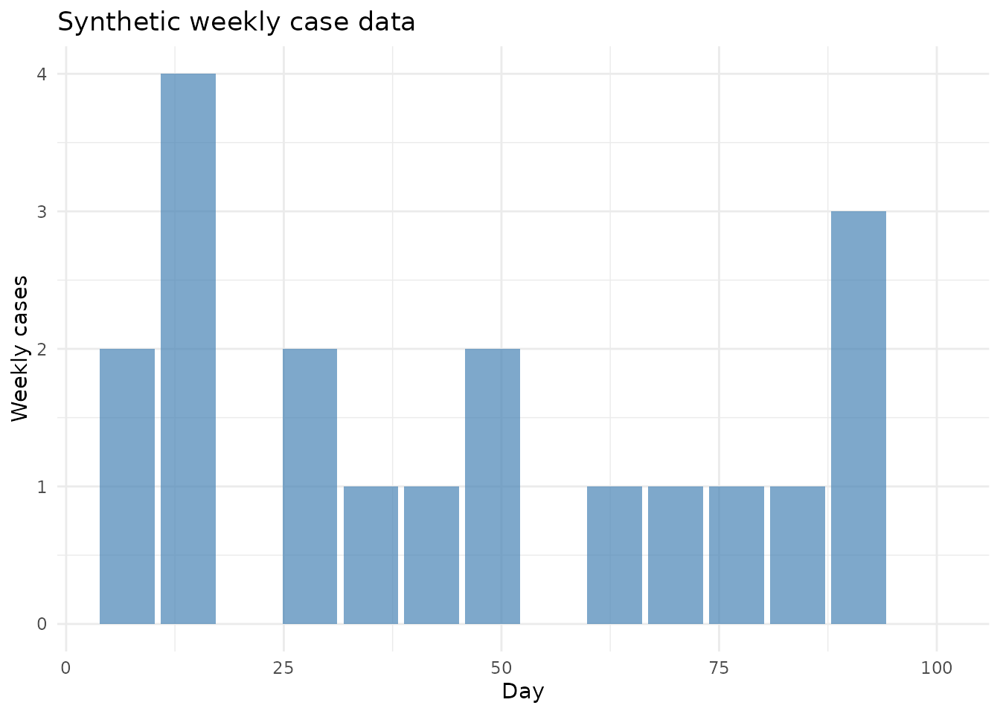
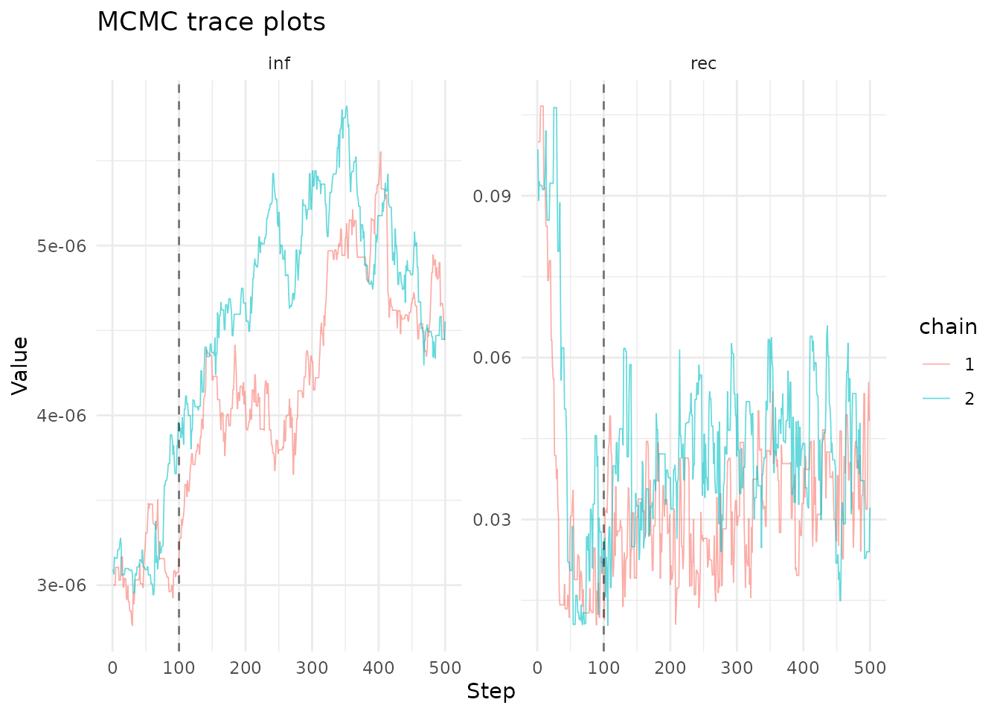
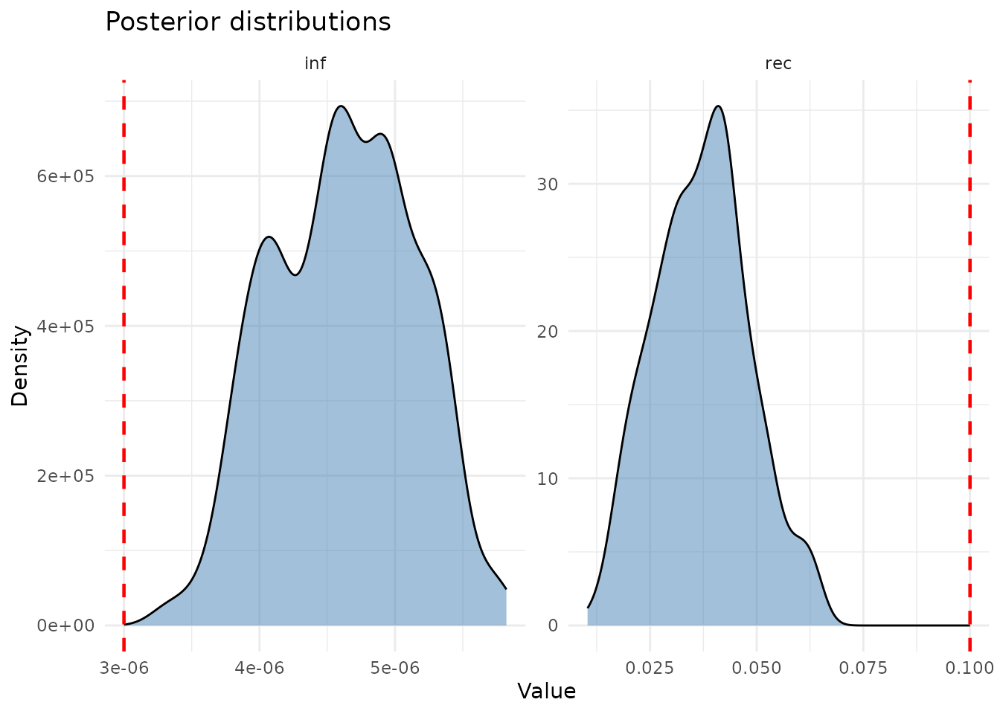

# Fitting models to data

## Introduction

A key advantage of composing models algebraically is that the same model
definition used for simulation can also be used for **data fitting**.
`algebraicodin` integrates with dust2’s particle filter and monty’s MCMC
infrastructure to enable Bayesian inference on compartmental models.

This vignette walks through:

1.  Generating synthetic epidemic data
2.  Adding an observation model to a Petri net
3.  Creating a particle filter
4.  Running MCMC to recover parameters
5.  Plotting diagnostics and posterior distributions

``` r
library(algebraicodin)
library(catlab)
library(ggplot2)
library(odin2)
library(dust2)
library(monty)
```

## Defining the model

We start with a simple SIR Petri net:

``` r
sir <- labelled_petri_net(
  c("S", "I", "R"),
  inf = c("S", "I") %=>% c("I", "I"),
  rec = "I" %=>% "R"
)
```

## Generating synthetic data

First, simulate an epidemic using the stochastic model to create
“observed” incidence data:

``` r
gen <- pn_to_odin_system(sir, type = "stochastic")

# True parameters
true_pars <- list(inf = 3e-6, rec = 0.1,
                  S0 = 9990, I0 = 10, R0 = 0)

sys <- dust_system_create(gen(), true_pars,
                          n_particles = 1, dt = 1, seed = 1)
#> ✔ Wrote 'DESCRIPTION'
#> ✔ Wrote 'NAMESPACE'
#> ✔ Wrote 'R/dust.R'
#> ✔ Wrote 'src/dust.cpp'
#> ✔ Wrote 'src/Makevars'
#> ℹ 12 functions decorated with [[cpp11::register]]
#> ✔ generated file cpp11.R
#> ✔ generated file cpp11.cpp
#> ℹ Re-compiling odin.system1c0df591
#> ── R CMD INSTALL ───────────────────────────────────────────────────────────────
#> * installing *source* package ‘odin.system1c0df591’ ...
#> ** this is package ‘odin.system1c0df591’ version ‘0.0.1’
#> ** using staged installation
#> ** libs
#> using C++ compiler: ‘g++ (Ubuntu 13.3.0-6ubuntu2~24.04.1) 13.3.0’
#> g++ -std=gnu++17 -I"/opt/R/4.5.3/lib/R/include" -DNDEBUG  -I'/home/runner/work/_temp/Library/cpp11/include' -I'/home/runner/work/_temp/Library/dust2/include' -I'/home/runner/work/_temp/Library/monty/include' -I/usr/local/include   -DHAVE_INLINE -fopenmp  -fpic  -g -O2  -Wall -pedantic -fdiagnostics-color=always  -c cpp11.cpp -o cpp11.o
#> g++ -std=gnu++17 -I"/opt/R/4.5.3/lib/R/include" -DNDEBUG  -I'/home/runner/work/_temp/Library/cpp11/include' -I'/home/runner/work/_temp/Library/dust2/include' -I'/home/runner/work/_temp/Library/monty/include' -I/usr/local/include   -DHAVE_INLINE -fopenmp  -fpic  -g -O2  -Wall -pedantic -fdiagnostics-color=always  -c dust.cpp -o dust.o
#> g++ -std=gnu++17 -shared -L/opt/R/4.5.3/lib/R/lib -L/usr/local/lib -o odin.system1c0df591.so cpp11.o dust.o -fopenmp -L/opt/R/4.5.3/lib/R/lib -lR
#> installing to /tmp/RtmpxDhKwJ/devtools_install_2dd5699d385c/00LOCK-dust_2dd57cfe6733/00new/odin.system1c0df591/libs
#> ** checking absolute paths in shared objects and dynamic libraries
#> * DONE (odin.system1c0df591)
#> ℹ Loading odin.system1c0df591
dust_system_set_state_initial(sys)
times <- seq(0, 100)
res <- dust_system_simulate(sys, times)
state <- dust_unpack_state(sys, res)

# Extract "true" incidence (new infections per day)
new_inf <- c(0, pmax(0, -diff(state$S)))

# Observe with Poisson noise at weekly intervals
obs_times <- seq(7, 98, by = 7)
obs_cases <- sapply(obs_times, function(t) {
  idx <- which(times >= (t - 6) & times <= t)
  rpois(1, lambda = max(1, sum(new_inf[idx])))
})

data <- data.frame(time = obs_times, cases = obs_cases)

ggplot(data, aes(x = time, y = cases)) +
  geom_col(fill = "steelblue", alpha = 0.7) +
  labs(title = "Synthetic weekly case data",
       x = "Day", y = "Weekly cases") +
  theme_minimal()
```



## Adding an observation model

The
[`observe()`](https://catrgory.github.io/algebraicodin/reference/observe.md)
function specifies how model quantities relate to data. For incidence
data, we track the `inf` transition and compare with a Poisson
distribution. Adding a noise parameter prevents zero-lambda issues:

``` r
compare_spec <- list(
  cases = observe("Poisson", transition = "inf", noise = "exp_noise")
)

# See generated code
code <- pn_to_odin(sir, type = "stochastic", compare = compare_spec)
cat(code)
#> ## Auto-generated by algebraicodin
#> 
#> ## Parameters
#> inf <- parameter()
#> rec <- parameter()
#> 
#> ## Initial conditions
#> S0 <- parameter()
#> I0 <- parameter()
#> R0 <- parameter()
#> 
#> initial(S) <- S0
#> initial(I) <- I0
#> initial(R) <- R0
#> 
#> ## Transition probabilities and draws
#> p_inf <- 1 - exp(-(inf * I) * dt)
#> n_inf <- Binomial(S, p_inf)
#> p_rec <- 1 - exp(-(rec) * dt)
#> n_rec <- Binomial(I, p_rec)
#> 
#> ## Update equations
#> update(S) <- S - n_inf
#> update(I) <- I + n_inf - n_rec
#> update(R) <- R + n_rec
#> 
#> ## Observation parameters
#> exp_noise <- parameter(1e6)
#> 
#> ## Incidence tracking
#> initial(incidence_inf, zero_every = 1) <- 0
#> update(incidence_inf) <- incidence_inf + n_inf
#> 
#> ## Observation noise
#> noise_cases <- incidence_inf + 1 / exp_noise
#> 
#> ## Comparison to data
#> cases <- data()
#> cases ~ Poisson(noise_cases)
```

The key additions are: - **Incidence tracking**: `incidence_inf`
accumulates new infections, resetting each timestep via `zero_every` -
**Noise**: `1 / exp_noise` adds a tiny positive floor - **Comparison**:
`cases ~ Poisson(noise_cases)` defines the likelihood

## Creating a particle filter

``` r
filter <- create_filter(sir, data,
  compare = compare_spec,
  type = "stochastic",
  n_particles = 100)
#> ✔ Wrote 'DESCRIPTION'
#> ✔ Wrote 'NAMESPACE'
#> ✔ Wrote 'R/dust.R'
#> ✔ Wrote 'src/dust.cpp'
#> ✔ Wrote 'src/Makevars'
#> ℹ 27 functions decorated with [[cpp11::register]]
#> ✔ generated file cpp11.R
#> ✔ generated file cpp11.cpp
#> ℹ Re-compiling odin.systemefda35e3
#> ── R CMD INSTALL ───────────────────────────────────────────────────────────────
#> * installing *source* package ‘odin.systemefda35e3’ ...
#> ** this is package ‘odin.systemefda35e3’ version ‘0.0.1’
#> ** using staged installation
#> ** libs
#> using C++ compiler: ‘g++ (Ubuntu 13.3.0-6ubuntu2~24.04.1) 13.3.0’
#> g++ -std=gnu++17 -I"/opt/R/4.5.3/lib/R/include" -DNDEBUG  -I'/home/runner/work/_temp/Library/cpp11/include' -I'/home/runner/work/_temp/Library/dust2/include' -I'/home/runner/work/_temp/Library/monty/include' -I/usr/local/include   -DHAVE_INLINE -fopenmp  -fpic  -g -O2  -Wall -pedantic -fdiagnostics-color=always  -c cpp11.cpp -o cpp11.o
#> g++ -std=gnu++17 -I"/opt/R/4.5.3/lib/R/include" -DNDEBUG  -I'/home/runner/work/_temp/Library/cpp11/include' -I'/home/runner/work/_temp/Library/dust2/include' -I'/home/runner/work/_temp/Library/monty/include' -I/usr/local/include   -DHAVE_INLINE -fopenmp  -fpic  -g -O2  -Wall -pedantic -fdiagnostics-color=always  -c dust.cpp -o dust.o
#> g++ -std=gnu++17 -shared -L/opt/R/4.5.3/lib/R/lib -L/usr/local/lib -o odin.systemefda35e3.so cpp11.o dust.o -fopenmp -L/opt/R/4.5.3/lib/R/lib -lR
#> installing to /tmp/RtmpxDhKwJ/devtools_install_2dd55cd03a62/00LOCK-dust_2dd52e36303b/00new/odin.systemefda35e3/libs
#> ** checking absolute paths in shared objects and dynamic libraries
#> * DONE (odin.systemefda35e3)
#> ℹ Loading odin.systemefda35e3
```

Test the likelihood at the true parameters:

``` r
pars_test <- c(true_pars, list(exp_noise = 1e6))
ll <- dust_likelihood_run(filter, pars_test)
cat("Log-likelihood at true params:", ll, "\n")
#> Log-likelihood at true params: -44.65336
```

## Setting up MCMC

### Prior distributions

``` r
prior <- build_prior(
  inf = prior_uniform(min = 1e-7, max = 1e-4),
  rec = prior_uniform(min = 0.01, max = 0.5)
)
```

### Running the sampler

``` r
samples <- fit_mcmc(
  filter = filter,
  pars = c("inf", "rec"),
  fixed = list(S0 = 9990, I0 = 10, R0 = 0, exp_noise = 1e6),
  prior = prior,
  n_steps = 500,
  n_chains = 2,
  initial = c(3e-6, 0.1),
  vcv = diag(c(1e-14, 1e-4))
)
```

## Diagnostics

### Trace plots

``` r
plot_traces(samples, pars = c("inf", "rec"), burnin = 100)
```



### Posterior distributions

``` r
plot_posterior(samples, burnin = 100,
  true_values = list(inf = 3e-6, rec = 0.1))
```



### Parameter summary

``` r
burnin <- 100
n_steps <- dim(samples$pars)[2]

for (i in 1:2) {
  nm <- c("inf", "rec")[i]
  vals <- as.vector(samples$pars[i, (burnin+1):n_steps, ])
  cat(sprintf("%s: mean=%.2e, median=%.2e, 95%% CI=[%.2e, %.2e]\n",
    nm, mean(vals), median(vals),
    quantile(vals, 0.025), quantile(vals, 0.975)))
}
#> inf: mean=4.62e-06, median=4.62e-06, 95% CI=[3.71e-06, 5.50e-06]
#> rec: mean=3.72e-02, median=3.73e-02, 95% CI=[1.74e-02, 6.12e-02]
```

## Stock-flow model fitting

The same workflow applies to stock-flow models:

``` r
sir_sf <- stock_and_flow(
  stocks = c("S", "I", "R"),
  flows = list(
    infection = flow(from = "S", to = "I", rate = beta * S * I / N),
    recovery = flow(from = "I", to = "R", rate = gamma * I)
  ),
  sums = list(N = c("S", "I", "R")),
  params = c("beta", "gamma")
)

# Create filter with flow-based incidence tracking
filter_sf <- create_filter(sir_sf, data,
  compare = list(
    cases = observe("Poisson", flow = "infection", noise = "exp_noise")
  ),
  type = "stochastic",
  n_particles = 100)
#> ── R CMD INSTALL ───────────────────────────────────────────────────────────────
#> * installing *source* package ‘odin.system6944e5f3’ ...
#> ** this is package ‘odin.system6944e5f3’ version ‘0.0.1’
#> ** using staged installation
#> ** libs
#> using C++ compiler: ‘g++ (Ubuntu 13.3.0-6ubuntu2~24.04.1) 13.3.0’
#> g++ -std=gnu++17 -I"/opt/R/4.5.3/lib/R/include" -DNDEBUG  -I'/home/runner/work/_temp/Library/cpp11/include' -I'/home/runner/work/_temp/Library/dust2/include' -I'/home/runner/work/_temp/Library/monty/include' -I/usr/local/include   -DHAVE_INLINE -fopenmp  -fpic  -g -O2  -Wall -pedantic -fdiagnostics-color=always  -c cpp11.cpp -o cpp11.o
#> g++ -std=gnu++17 -I"/opt/R/4.5.3/lib/R/include" -DNDEBUG  -I'/home/runner/work/_temp/Library/cpp11/include' -I'/home/runner/work/_temp/Library/dust2/include' -I'/home/runner/work/_temp/Library/monty/include' -I/usr/local/include   -DHAVE_INLINE -fopenmp  -fpic  -g -O2  -Wall -pedantic -fdiagnostics-color=always  -c dust.cpp -o dust.o
#> g++ -std=gnu++17 -shared -L/opt/R/4.5.3/lib/R/lib -L/usr/local/lib -o odin.system6944e5f3.so cpp11.o dust.o -fopenmp -L/opt/R/4.5.3/lib/R/lib -lR
#> installing to /tmp/RtmpxDhKwJ/devtools_install_2dd573d2e1ee/00LOCK-dust_2dd57c210937/00new/odin.system6944e5f3/libs
#> ** checking absolute paths in shared objects and dynamic libraries
#> * DONE (odin.system6944e5f3)

# Check likelihood
ll_sf <- dust_likelihood_run(filter_sf, list(
  beta = 0.03, gamma = 0.1,
  S0 = 9990, I0 = 10, R0 = 0, exp_noise = 1e6
))
cat("Stock-flow log-likelihood:", ll_sf, "\n")
#> Stock-flow log-likelihood: -47.6366
```

## Prevalence data

For data that measures current state (not incidence), use `state`
instead of `transition`:

``` r
code_prev <- pn_to_odin(sir, type = "stochastic",
  compare = list(
    prevalence = observe("Normal", state = "I", sd = "obs_sd")
  ))
cat(code_prev)
#> ## Auto-generated by algebraicodin
#> 
#> ## Parameters
#> inf <- parameter()
#> rec <- parameter()
#> 
#> ## Initial conditions
#> S0 <- parameter()
#> I0 <- parameter()
#> R0 <- parameter()
#> 
#> initial(S) <- S0
#> initial(I) <- I0
#> initial(R) <- R0
#> 
#> ## Transition probabilities and draws
#> p_inf <- 1 - exp(-(inf * I) * dt)
#> n_inf <- Binomial(S, p_inf)
#> p_rec <- 1 - exp(-(rec) * dt)
#> n_rec <- Binomial(I, p_rec)
#> 
#> ## Update equations
#> update(S) <- S - n_inf
#> update(I) <- I + n_inf - n_rec
#> update(R) <- R + n_rec
#> 
#> ## Observation parameters
#> obs_sd <- parameter()
#> 
#> ## Comparison to data
#> prevalence <- data()
#> prevalence ~ Normal(I, obs_sd)
```

## Composed model fitting

Algebraically composed models work seamlessly:

``` r
# Compose SIR from building blocks
dict <- epi_dict()
sir_uwd <- uwd(
  outer = c("s", "i", "r"),
  infection = c("s", "i"),
  recovery = c("i", "r")
)
sir_composed <- apex(oapply(sir_uwd, list(dict$infection, dict$recovery)))

# Generate with comparison — works identically
code_comp <- pn_to_odin(sir_composed, type = "stochastic",
  compare = list(cases = observe("Poisson", transition = "inf")))
cat(code_comp)
#> ## Auto-generated by algebraicodin
#> 
#> ## Parameters
#> inf <- parameter()
#> rec <- parameter()
#> 
#> ## Initial conditions
#> s0 <- parameter()
#> i0 <- parameter()
#> r0 <- parameter()
#> 
#> initial(s) <- s0
#> initial(i) <- i0
#> initial(r) <- r0
#> 
#> ## Transition probabilities and draws
#> p_inf <- 1 - exp(-(inf * i) * dt)
#> n_inf <- Binomial(s, p_inf)
#> p_rec <- 1 - exp(-(rec) * dt)
#> n_rec <- Binomial(i, p_rec)
#> 
#> ## Update equations
#> update(s) <- s - n_inf
#> update(i) <- i + n_inf - n_rec
#> update(r) <- r + n_rec
#> 
#> ## Incidence tracking
#> initial(incidence_inf, zero_every = 1) <- 0
#> update(incidence_inf) <- incidence_inf + n_inf
#> 
#> ## Comparison to data
#> cases <- data()
#> cases ~ Poisson(incidence_inf)
```

## Summary

| Function                                                                                   | Purpose                     |
|--------------------------------------------------------------------------------------------|-----------------------------|
| [`observe()`](https://catrgory.github.io/algebraicodin/reference/observe.md)               | Define observation model    |
| [`create_filter()`](https://catrgory.github.io/algebraicodin/reference/create_filter.md)   | Build dust2 particle filter |
| [`fit_mcmc()`](https://catrgory.github.io/algebraicodin/reference/fit_mcmc.md)             | Run MCMC inference          |
| [`build_prior()`](https://catrgory.github.io/algebraicodin/reference/build_prior.md)       | Create prior from specs     |
| [`plot_traces()`](https://catrgory.github.io/algebraicodin/reference/plot_traces.md)       | MCMC trace plots            |
| [`plot_posterior()`](https://catrgory.github.io/algebraicodin/reference/plot_posterior.md) | Posterior density plots     |
| [`plot_fit()`](https://catrgory.github.io/algebraicodin/reference/plot_fit.md)             | Model vs data comparison    |

Key observation types: - **Incidence**:
`observe("Poisson", transition = "inf")` — tracks new events per
timestep - **Prevalence**:
`observe("Normal", state = "I", sd = "sigma")` — observes current
state - **Custom**: `observe("Poisson", expr = "mu * I")` — arbitrary
expression
