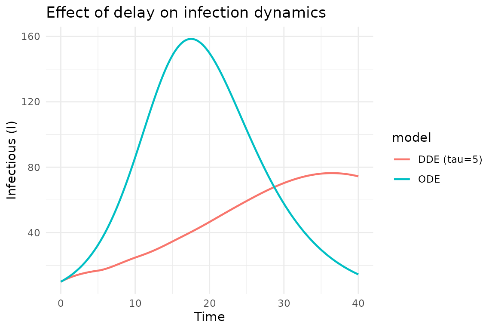
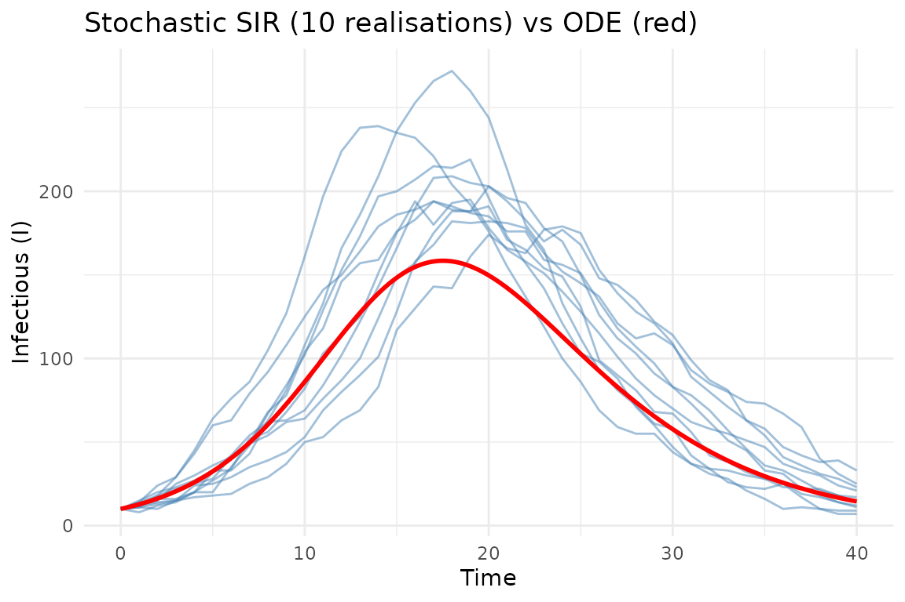
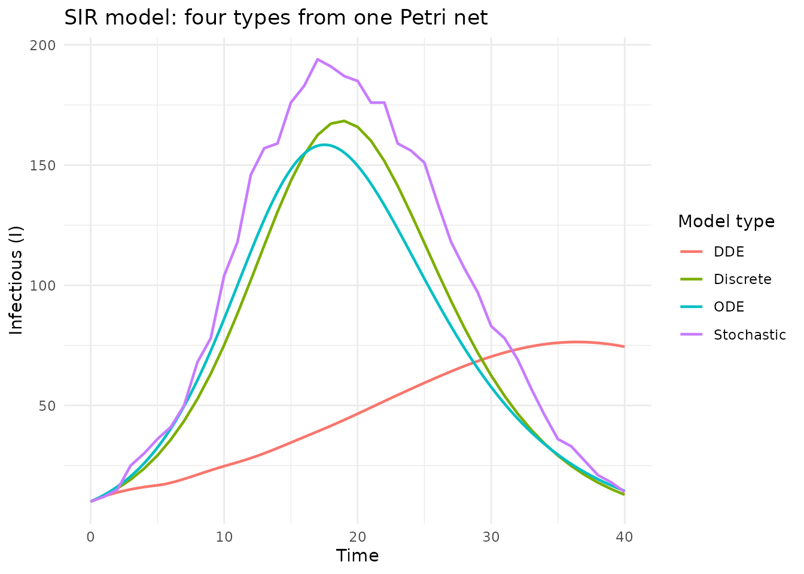

# Model types: ODE, DDE, stochastic, and discrete

## Introduction

A single Petri net can generate odin2 code for four different model
types, following the framework of
[AlgebraicDynamics.jl](https://algebraicjulia.github.io/AlgebraicDynamics.jl/).
Each type uses the same stoichiometry but differs in how the dynamics
are computed.

| Type           | odin2 keyword                                                    | Time       | Randomness    |
|----------------|------------------------------------------------------------------|------------|---------------|
| **ODE**        | [`deriv()`](https://rdrr.io/r/stats/deriv.html)                  | Continuous | Deterministic |
| **DDE**        | [`deriv()`](https://rdrr.io/r/stats/deriv.html) + `delay()`      | Continuous | Deterministic |
| **Stochastic** | [`update()`](https://rdrr.io/r/stats/update.html) + `Binomial()` | Discrete   | Stochastic    |
| **Discrete**   | [`update()`](https://rdrr.io/r/stats/update.html)                | Discrete   | Deterministic |

``` r
library(algebraicodin)
#> 
#> Attaching package: 'algebraicodin'
#> The following objects are masked from 'package:base':
#> 
#>     %o%, %x%
```

We use the standard SIR model throughout:

``` r
sir <- labelled_petri_net(
  c("S", "I", "R"),
  inf = c("S", "I") %=>% c("I", "I"),
  rec = "I" %=>% "R"
)
```

``` r
plot_petri(sir)
```

## ODE (continuous deterministic)

The default model type. Uses
[`deriv()`](https://rdrr.io/r/stats/deriv.html) to define continuous
derivatives solved by numerical integration:

``` r
cat(pn_to_odin(sir, "ode"))
#> ## Auto-generated by algebraicodin
#> 
#> ## Parameters
#> inf <- parameter()
#> rec <- parameter()
#> 
#> ## Initial conditions
#> S0 <- parameter()
#> I0 <- parameter()
#> R0 <- parameter()
#> 
#> initial(S) <- S0
#> initial(I) <- I0
#> initial(R) <- R0
#> 
#> ## Transition rates
#> rate_inf <- inf * S * I
#> rate_rec <- rec * I
#> 
#> ## Derivatives
#> deriv(S) <- -rate_inf
#> deriv(I) <- rate_inf - rate_rec
#> deriv(R) <- rate_rec
```

``` r
gen <- odin2::odin(pn_to_odin(sir, "ode"))
#> ✔ Wrote 'DESCRIPTION'
#> ✔ Wrote 'NAMESPACE'
#> ✔ Wrote 'R/dust.R'
#> ✔ Wrote 'src/dust.cpp'
#> ✔ Wrote 'src/Makevars'
#> ℹ 13 functions decorated with [[cpp11::register]]
#> ✔ generated file cpp11.R
#> ✔ generated file cpp11.cpp
#> ℹ Re-compiling odin.system840d9d16
#> ── R CMD INSTALL ───────────────────────────────────────────────────────────────
#> * installing *source* package ‘odin.system840d9d16’ ...
#> ** this is package ‘odin.system840d9d16’ version ‘0.0.1’
#> ** using staged installation
#> ** libs
#> using C++ compiler: ‘g++ (Ubuntu 13.3.0-6ubuntu2~24.04.1) 13.3.0’
#> g++ -std=gnu++17 -I"/opt/R/4.5.3/lib/R/include" -DNDEBUG  -I'/home/runner/work/_temp/Library/cpp11/include' -I'/home/runner/work/_temp/Library/dust2/include' -I'/home/runner/work/_temp/Library/monty/include' -I/usr/local/include   -DHAVE_INLINE -fopenmp  -fpic  -g -O2  -Wall -pedantic -fdiagnostics-color=always  -c cpp11.cpp -o cpp11.o
#> g++ -std=gnu++17 -I"/opt/R/4.5.3/lib/R/include" -DNDEBUG  -I'/home/runner/work/_temp/Library/cpp11/include' -I'/home/runner/work/_temp/Library/dust2/include' -I'/home/runner/work/_temp/Library/monty/include' -I/usr/local/include   -DHAVE_INLINE -fopenmp  -fpic  -g -O2  -Wall -pedantic -fdiagnostics-color=always  -c dust.cpp -o dust.o
#> g++ -std=gnu++17 -shared -L/opt/R/4.5.3/lib/R/lib -L/usr/local/lib -o odin.system840d9d16.so cpp11.o dust.o -fopenmp -L/opt/R/4.5.3/lib/R/lib -lR
#> installing to /tmp/RtmpQ9raFG/devtools_install_2f4b38790a3b/00LOCK-dust_2f4b5f7cd338/00new/odin.system840d9d16/libs
#> ** checking absolute paths in shared objects and dynamic libraries
#> * DONE (odin.system840d9d16)
#> ℹ Loading odin.system840d9d16
pars <- list(inf = 0.0005, rec = 0.25, S0 = 990, I0 = 10, R0 = 0)
sys <- dust2::dust_system_create(gen, pars, n_particles = 1)
dust2::dust_system_set_state_initial(sys)
t_ode <- seq(0, 40, by = 0.1)
y_ode <- dust2::dust_system_simulate(sys, t_ode)
```

### Hand-written comparison

``` r
ode_handwritten <- "
inf <- parameter()
rec <- parameter()
S0 <- parameter()
I0 <- parameter()
R0 <- parameter()
initial(S) <- S0
initial(I) <- I0
initial(R) <- R0
deriv(S) <- -inf * S * I
deriv(I) <- inf * S * I - rec * I
deriv(R) <- rec * I
"
gen_hw <- odin2::odin(ode_handwritten)
#> ✔ Wrote 'DESCRIPTION'
#> ✔ Wrote 'NAMESPACE'
#> ✔ Wrote 'R/dust.R'
#> ✔ Wrote 'src/dust.cpp'
#> ✔ Wrote 'src/Makevars'
#> ℹ 13 functions decorated with [[cpp11::register]]
#> ✔ generated file cpp11.R
#> ✔ generated file cpp11.cpp
#> ℹ Re-compiling odin.system4ba2abf0
#> ── R CMD INSTALL ───────────────────────────────────────────────────────────────
#> * installing *source* package ‘odin.system4ba2abf0’ ...
#> ** this is package ‘odin.system4ba2abf0’ version ‘0.0.1’
#> ** using staged installation
#> ** libs
#> using C++ compiler: ‘g++ (Ubuntu 13.3.0-6ubuntu2~24.04.1) 13.3.0’
#> g++ -std=gnu++17 -I"/opt/R/4.5.3/lib/R/include" -DNDEBUG  -I'/home/runner/work/_temp/Library/cpp11/include' -I'/home/runner/work/_temp/Library/dust2/include' -I'/home/runner/work/_temp/Library/monty/include' -I/usr/local/include   -DHAVE_INLINE -fopenmp  -fpic  -g -O2  -Wall -pedantic -fdiagnostics-color=always  -c cpp11.cpp -o cpp11.o
#> g++ -std=gnu++17 -I"/opt/R/4.5.3/lib/R/include" -DNDEBUG  -I'/home/runner/work/_temp/Library/cpp11/include' -I'/home/runner/work/_temp/Library/dust2/include' -I'/home/runner/work/_temp/Library/monty/include' -I/usr/local/include   -DHAVE_INLINE -fopenmp  -fpic  -g -O2  -Wall -pedantic -fdiagnostics-color=always  -c dust.cpp -o dust.o
#> g++ -std=gnu++17 -shared -L/opt/R/4.5.3/lib/R/lib -L/usr/local/lib -o odin.system4ba2abf0.so cpp11.o dust.o -fopenmp -L/opt/R/4.5.3/lib/R/lib -lR
#> installing to /tmp/RtmpQ9raFG/devtools_install_2f4b338cef93/00LOCK-dust_2f4b1af54c5/00new/odin.system4ba2abf0/libs
#> ** checking absolute paths in shared objects and dynamic libraries
#> * DONE (odin.system4ba2abf0)
#> ℹ Loading odin.system4ba2abf0
sys_hw <- dust2::dust_system_create(gen_hw, pars, n_particles = 1)
dust2::dust_system_set_state_initial(sys_hw)
y_hw <- dust2::dust_system_simulate(sys_hw, t_ode)
cat("ODE max diff:", max(abs(y_ode - y_hw)), "\n")
#> ODE max diff: 0
```

## DDE (delay differential equations)

DDEs introduce delays into the dynamics. In epidemiology, this can model
a fixed incubation period or delayed immune response.

The `delays` argument specifies which transitions use delayed values and
the delay time (`tau`):

``` r
dde_code <- pn_to_odin(sir, "dde", delays = list(
  inf = list(tau = 5, species = "I")
))
cat(dde_code)
#> ## Auto-generated by algebraicodin
#> 
#> ## Parameters
#> inf <- parameter()
#> rec <- parameter()
#> 
#> ## Initial conditions
#> S0 <- parameter()
#> I0 <- parameter()
#> R0 <- parameter()
#> 
#> initial(S) <- S0
#> initial(I) <- I0
#> initial(R) <- R0
#> 
#> ## Delayed variables
#> I_delayed_inf <- delay(I, 5)
#> 
#> ## Transition rates
#> rate_inf <- inf * S * I_delayed_inf
#> rate_rec <- rec * I
#> 
#> ## Derivatives
#> deriv(S) <- -rate_inf
#> deriv(I) <- rate_inf - rate_rec
#> deriv(R) <- rate_rec
```

The infection rate now uses `delay(I, 5)` instead of the current value
of I, meaning that infectiousness depends on the state 5 time units in
the past.

### Hand-written comparison

``` r
dde_handwritten <- "
inf <- parameter()
rec <- parameter()
S0 <- parameter()
I0 <- parameter()
R0 <- parameter()
initial(S) <- S0
initial(I) <- I0
initial(R) <- R0
I_delayed <- delay(I, 5)
deriv(S) <- -inf * S * I_delayed
deriv(I) <- inf * S * I_delayed - rec * I
deriv(R) <- rec * I
"
```

``` r
gen_dde <- odin2::odin(dde_code)
#> ✔ Wrote 'DESCRIPTION'
#> ✔ Wrote 'NAMESPACE'
#> ✔ Wrote 'R/dust.R'
#> ✔ Wrote 'src/dust.cpp'
#> ✔ Wrote 'src/Makevars'
#> ℹ 13 functions decorated with [[cpp11::register]]
#> ✔ generated file cpp11.R
#> ✔ generated file cpp11.cpp
#> ℹ Re-compiling odin.systemdb69a213
#> ── R CMD INSTALL ───────────────────────────────────────────────────────────────
#> * installing *source* package ‘odin.systemdb69a213’ ...
#> ** this is package ‘odin.systemdb69a213’ version ‘0.0.1’
#> ** using staged installation
#> ** libs
#> using C++ compiler: ‘g++ (Ubuntu 13.3.0-6ubuntu2~24.04.1) 13.3.0’
#> g++ -std=gnu++17 -I"/opt/R/4.5.3/lib/R/include" -DNDEBUG  -I'/home/runner/work/_temp/Library/cpp11/include' -I'/home/runner/work/_temp/Library/dust2/include' -I'/home/runner/work/_temp/Library/monty/include' -I/usr/local/include   -DHAVE_INLINE -fopenmp  -fpic  -g -O2  -Wall -pedantic -fdiagnostics-color=always  -c cpp11.cpp -o cpp11.o
#> g++ -std=gnu++17 -I"/opt/R/4.5.3/lib/R/include" -DNDEBUG  -I'/home/runner/work/_temp/Library/cpp11/include' -I'/home/runner/work/_temp/Library/dust2/include' -I'/home/runner/work/_temp/Library/monty/include' -I/usr/local/include   -DHAVE_INLINE -fopenmp  -fpic  -g -O2  -Wall -pedantic -fdiagnostics-color=always  -c dust.cpp -o dust.o
#> g++ -std=gnu++17 -shared -L/opt/R/4.5.3/lib/R/lib -L/usr/local/lib -o odin.systemdb69a213.so cpp11.o dust.o -fopenmp -L/opt/R/4.5.3/lib/R/lib -lR
#> installing to /tmp/RtmpQ9raFG/devtools_install_2f4b61d369fa/00LOCK-dust_2f4b3995e8cd/00new/odin.systemdb69a213/libs
#> ** checking absolute paths in shared objects and dynamic libraries
#> * DONE (odin.systemdb69a213)
#> ℹ Loading odin.systemdb69a213
pars_dde <- list(inf = 0.0005, rec = 0.25, S0 = 990, I0 = 10, R0 = 0)
sys_dde <- dust2::dust_system_create(gen_dde, pars_dde, n_particles = 1)
dust2::dust_system_set_state_initial(sys_dde)
y_dde <- dust2::dust_system_simulate(sys_dde, t_ode)

gen_hw2 <- odin2::odin(dde_handwritten)
#> ✔ Wrote 'DESCRIPTION'
#> ✔ Wrote 'NAMESPACE'
#> ✔ Wrote 'R/dust.R'
#> ✔ Wrote 'src/dust.cpp'
#> ✔ Wrote 'src/Makevars'
#> ℹ 13 functions decorated with [[cpp11::register]]
#> ✔ generated file cpp11.R
#> ✔ generated file cpp11.cpp
#> ℹ Re-compiling odin.system87a9fd7a
#> ── R CMD INSTALL ───────────────────────────────────────────────────────────────
#> * installing *source* package ‘odin.system87a9fd7a’ ...
#> ** this is package ‘odin.system87a9fd7a’ version ‘0.0.1’
#> ** using staged installation
#> ** libs
#> using C++ compiler: ‘g++ (Ubuntu 13.3.0-6ubuntu2~24.04.1) 13.3.0’
#> g++ -std=gnu++17 -I"/opt/R/4.5.3/lib/R/include" -DNDEBUG  -I'/home/runner/work/_temp/Library/cpp11/include' -I'/home/runner/work/_temp/Library/dust2/include' -I'/home/runner/work/_temp/Library/monty/include' -I/usr/local/include   -DHAVE_INLINE -fopenmp  -fpic  -g -O2  -Wall -pedantic -fdiagnostics-color=always  -c cpp11.cpp -o cpp11.o
#> g++ -std=gnu++17 -I"/opt/R/4.5.3/lib/R/include" -DNDEBUG  -I'/home/runner/work/_temp/Library/cpp11/include' -I'/home/runner/work/_temp/Library/dust2/include' -I'/home/runner/work/_temp/Library/monty/include' -I/usr/local/include   -DHAVE_INLINE -fopenmp  -fpic  -g -O2  -Wall -pedantic -fdiagnostics-color=always  -c dust.cpp -o dust.o
#> g++ -std=gnu++17 -shared -L/opt/R/4.5.3/lib/R/lib -L/usr/local/lib -o odin.system87a9fd7a.so cpp11.o dust.o -fopenmp -L/opt/R/4.5.3/lib/R/lib -lR
#> installing to /tmp/RtmpQ9raFG/devtools_install_2f4babdfea2/00LOCK-dust_2f4b522b2029/00new/odin.system87a9fd7a/libs
#> ** checking absolute paths in shared objects and dynamic libraries
#> * DONE (odin.system87a9fd7a)
#> ℹ Loading odin.system87a9fd7a
sys_hw2 <- dust2::dust_system_create(gen_hw2, pars_dde, n_particles = 1)
dust2::dust_system_set_state_initial(sys_hw2)
y_hw2 <- dust2::dust_system_simulate(sys_hw2, t_ode)
cat("DDE max diff:", max(abs(y_dde - y_hw2)), "\n")
#> DDE max diff: 0
```

``` r
library(ggplot2)
df <- data.frame(
  time = rep(t_ode, 2),
  I = c(y_ode[2, ], y_dde[2, ]),
  model = rep(c("ODE", "DDE (tau=5)"), each = length(t_ode))
)
ggplot(df, aes(time, I, colour = model)) +
  geom_line(linewidth = 0.8) +
  labs(title = "Effect of delay on infection dynamics",
       x = "Time", y = "Infectious (I)") +
  theme_minimal()
```



The delay shifts the epidemic peak later and reduces its height, as the
infection rate responds to historical rather than current
infectiousness.

## Stochastic (discrete-time)

The stochastic model uses `Binomial()` draws for each transition,
modelling demographic stochasticity:

``` r
cat(pn_to_odin(sir, "stochastic"))
#> ## Auto-generated by algebraicodin
#> 
#> ## Parameters
#> inf <- parameter()
#> rec <- parameter()
#> 
#> ## Initial conditions
#> S0 <- parameter()
#> I0 <- parameter()
#> R0 <- parameter()
#> 
#> initial(S) <- S0
#> initial(I) <- I0
#> initial(R) <- R0
#> 
#> ## Transition probabilities and draws
#> p_inf <- 1 - exp(-(inf * I) * dt)
#> n_inf <- Binomial(S, p_inf)
#> p_rec <- 1 - exp(-(rec) * dt)
#> n_rec <- Binomial(I, p_rec)
#> 
#> ## Update equations
#> update(S) <- S - n_inf
#> update(I) <- I + n_inf - n_rec
#> update(R) <- R + n_rec
```

Key features: - Transition probabilities:
$p = 1 - e^{- \text{rate} \cdot dt}$ - Draws:
`Binomial(substrate, probability)` - Update equations use draws instead
of rates

### Hand-written comparison

``` r
stoch_handwritten <- "
inf <- parameter()
rec <- parameter()
S0 <- parameter()
I0 <- parameter()
R0 <- parameter()
initial(S) <- S0
initial(I) <- I0
initial(R) <- R0
p_inf <- 1 - exp(-(inf * I) * dt)
n_inf <- Binomial(S, p_inf)
p_rec <- 1 - exp(-(rec) * dt)
n_rec <- Binomial(I, p_rec)
update(S) <- S - n_inf
update(I) <- I + n_inf - n_rec
update(R) <- R + n_rec
"
```

``` r
gen_stoch <- odin2::odin(pn_to_odin(sir, "stochastic"))
#> ✔ Wrote 'DESCRIPTION'
#> ✔ Wrote 'NAMESPACE'
#> ✔ Wrote 'R/dust.R'
#> ✔ Wrote 'src/dust.cpp'
#> ✔ Wrote 'src/Makevars'
#> ℹ 12 functions decorated with [[cpp11::register]]
#> ✔ generated file cpp11.R
#> ✔ generated file cpp11.cpp
#> ℹ Re-compiling odin.system1c0df591
#> ── R CMD INSTALL ───────────────────────────────────────────────────────────────
#> * installing *source* package ‘odin.system1c0df591’ ...
#> ** this is package ‘odin.system1c0df591’ version ‘0.0.1’
#> ** using staged installation
#> ** libs
#> using C++ compiler: ‘g++ (Ubuntu 13.3.0-6ubuntu2~24.04.1) 13.3.0’
#> g++ -std=gnu++17 -I"/opt/R/4.5.3/lib/R/include" -DNDEBUG  -I'/home/runner/work/_temp/Library/cpp11/include' -I'/home/runner/work/_temp/Library/dust2/include' -I'/home/runner/work/_temp/Library/monty/include' -I/usr/local/include   -DHAVE_INLINE -fopenmp  -fpic  -g -O2  -Wall -pedantic -fdiagnostics-color=always  -c cpp11.cpp -o cpp11.o
#> g++ -std=gnu++17 -I"/opt/R/4.5.3/lib/R/include" -DNDEBUG  -I'/home/runner/work/_temp/Library/cpp11/include' -I'/home/runner/work/_temp/Library/dust2/include' -I'/home/runner/work/_temp/Library/monty/include' -I/usr/local/include   -DHAVE_INLINE -fopenmp  -fpic  -g -O2  -Wall -pedantic -fdiagnostics-color=always  -c dust.cpp -o dust.o
#> g++ -std=gnu++17 -shared -L/opt/R/4.5.3/lib/R/lib -L/usr/local/lib -o odin.system1c0df591.so cpp11.o dust.o -fopenmp -L/opt/R/4.5.3/lib/R/lib -lR
#> installing to /tmp/RtmpQ9raFG/devtools_install_2f4b5acd3dd6/00LOCK-dust_2f4b55205541/00new/odin.system1c0df591/libs
#> ** checking absolute paths in shared objects and dynamic libraries
#> * DONE (odin.system1c0df591)
#> ℹ Loading odin.system1c0df591
pars_stoch <- list(inf = 0.0005, rec = 0.25,
                   S0 = 990, I0 = 10, R0 = 0)
sys_stoch <- dust2::dust_system_create(gen_stoch, pars_stoch, n_particles = 10,
                                        seed = 42, dt = 1)
dust2::dust_system_set_state_initial(sys_stoch)
t_disc <- seq(0L, 40L, by = 1L)
y_stoch <- dust2::dust_system_simulate(sys_stoch, t_disc)

# Plot multiple realisations
dfs <- do.call(rbind, lapply(1:10, function(p) {
  data.frame(time = t_disc, I = y_stoch[2, p, ], particle = p)
}))
ggplot(dfs, aes(time, I, group = particle)) +
  geom_line(alpha = 0.5, colour = "steelblue") +
  geom_line(data = data.frame(time = t_ode, I = y_ode[2, ]),
            aes(group = NULL), colour = "red", linewidth = 1) +
  labs(title = "Stochastic SIR (10 realisations) vs ODE (red)",
       x = "Time", y = "Infectious (I)") +
  theme_minimal()
```



## Discrete deterministic (Euler method)

The discrete deterministic model uses a forward Euler step, useful for
comparison with the stochastic model or when discrete-time dynamics are
desired:

``` r
cat(pn_to_odin(sir, "discrete"))
#> ## Auto-generated by algebraicodin
#> 
#> ## Parameters
#> inf <- parameter()
#> rec <- parameter()
#> 
#> ## Initial conditions
#> S0 <- parameter()
#> I0 <- parameter()
#> R0 <- parameter()
#> 
#> initial(S) <- S0
#> initial(I) <- I0
#> initial(R) <- R0
#> 
#> ## Transition rates (deterministic Euler step)
#> rate_inf <- inf * S * I
#> rate_rec <- rec * I
#> 
#> ## Update equations
#> update(S) <- S - dt * rate_inf
#> update(I) <- I + dt * rate_inf - dt * rate_rec
#> update(R) <- R + dt * rate_rec
```

### Hand-written comparison

``` r
disc_handwritten <- "
inf <- parameter()
rec <- parameter()
S0 <- parameter()
I0 <- parameter()
R0 <- parameter()
initial(S) <- S0
initial(I) <- I0
initial(R) <- R0
rate_inf <- inf * S * I
rate_rec <- rec * I
update(S) <- S - dt * rate_inf
update(I) <- I + dt * rate_inf - dt * rate_rec
update(R) <- R + dt * rate_rec
"
gen_disc <- odin2::odin(pn_to_odin(sir, "discrete"))
#> ✔ Wrote 'DESCRIPTION'
#> ✔ Wrote 'NAMESPACE'
#> ✔ Wrote 'R/dust.R'
#> ✔ Wrote 'src/dust.cpp'
#> ✔ Wrote 'src/Makevars'
#> ℹ 12 functions decorated with [[cpp11::register]]
#> ✔ generated file cpp11.R
#> ✔ generated file cpp11.cpp
#> ℹ Re-compiling odin.system7dcfd95e
#> ── R CMD INSTALL ───────────────────────────────────────────────────────────────
#> * installing *source* package ‘odin.system7dcfd95e’ ...
#> ** this is package ‘odin.system7dcfd95e’ version ‘0.0.1’
#> ** using staged installation
#> ** libs
#> using C++ compiler: ‘g++ (Ubuntu 13.3.0-6ubuntu2~24.04.1) 13.3.0’
#> g++ -std=gnu++17 -I"/opt/R/4.5.3/lib/R/include" -DNDEBUG  -I'/home/runner/work/_temp/Library/cpp11/include' -I'/home/runner/work/_temp/Library/dust2/include' -I'/home/runner/work/_temp/Library/monty/include' -I/usr/local/include   -DHAVE_INLINE -fopenmp  -fpic  -g -O2  -Wall -pedantic -fdiagnostics-color=always  -c cpp11.cpp -o cpp11.o
#> g++ -std=gnu++17 -I"/opt/R/4.5.3/lib/R/include" -DNDEBUG  -I'/home/runner/work/_temp/Library/cpp11/include' -I'/home/runner/work/_temp/Library/dust2/include' -I'/home/runner/work/_temp/Library/monty/include' -I/usr/local/include   -DHAVE_INLINE -fopenmp  -fpic  -g -O2  -Wall -pedantic -fdiagnostics-color=always  -c dust.cpp -o dust.o
#> g++ -std=gnu++17 -shared -L/opt/R/4.5.3/lib/R/lib -L/usr/local/lib -o odin.system7dcfd95e.so cpp11.o dust.o -fopenmp -L/opt/R/4.5.3/lib/R/lib -lR
#> installing to /tmp/RtmpQ9raFG/devtools_install_2f4b5b5939e0/00LOCK-dust_2f4b5069f42d/00new/odin.system7dcfd95e/libs
#> ** checking absolute paths in shared objects and dynamic libraries
#> * DONE (odin.system7dcfd95e)
#> ℹ Loading odin.system7dcfd95e
gen_hw3 <- odin2::odin(disc_handwritten)
#> ℹ Using cached generator

pars_disc <- list(inf = 0.0005, rec = 0.25,
                  S0 = 990, I0 = 10, R0 = 0)
sys_disc <- dust2::dust_system_create(gen_disc, pars_disc, n_particles = 1, dt = 1)
dust2::dust_system_set_state_initial(sys_disc)
t_int <- seq(0L, 40L, by = 1L)
y_disc <- dust2::dust_system_simulate(sys_disc, t_int)

sys_hw3 <- dust2::dust_system_create(gen_hw3, pars_disc, n_particles = 1, dt = 1)
dust2::dust_system_set_state_initial(sys_hw3)
y_hw3 <- dust2::dust_system_simulate(sys_hw3, t_int)
cat("Discrete max diff:", max(abs(y_disc - y_hw3)), "\n")
#> Discrete max diff: 0
```

## ResourceSharer and Machine types

For programmatic manipulation of dynamical systems (rather than code
generation), algebraicodin provides `ResourceSharer` and `Machine`
classes following AlgebraicDynamics.jl:

``` r
rs <- petri_to_continuous(sir)
rs@system_type
#> [1] "continuous"
rs@nstates
#> [1] 3
rs@state_names
#> [1] "S" "I" "R"
```

Evaluate the vector field at a given state:

``` r
u <- c(990, 10, 0)
p <- list(inf = 0.0005, rec = 0.25)
eval_dynamics(rs, u, p, t = 0)
#> [1] -4.95  2.45  2.50
```

## Euler approximation

Convert a continuous system to discrete via forward Euler:

``` r
rs_disc <- euler_approx(rs, h = 0.1)
rs_disc@system_type
#> [1] "discrete"

# One Euler step
u_next <- eval_dynamics(rs_disc, u, p, t = 0)
cat("u_next:", u_next, "\n")
#> u_next: 989.505 10.245 0.25
cat("u + 0.1 * f(u):", u + 0.1 * eval_dynamics(rs, u, p, t = 0), "\n")
#> u + 0.1 * f(u): 989.505 10.245 0.25
```

## All four types from one Petri net

``` r
# Run all four model types
run_model <- function(code, pars, times, type) {
  gen <- odin2::odin(code)
  is_discrete <- type %in% c("Stochastic", "Discrete")
  args <- list(generator = gen, pars = pars, n_particles = 1L,
               deterministic = (type != "Stochastic"), seed = 42L)
  if (is_discrete) args$dt <- 1
  sys <- do.call(dust2::dust_system_create, args)
  dust2::dust_system_set_state_initial(sys)
  y <- dust2::dust_system_simulate(sys, times)
  data.frame(time = times, I = y[2, ], type = type)
}

pars_cont <- list(inf = 0.0005, rec = 0.25, S0 = 990, I0 = 10, R0 = 0)
pars_disc <- pars_cont

dde_delays <- list(inf = list(tau = 5, species = "I"))

df_all <- rbind(
  run_model(pn_to_odin(sir, "ode"), pars_cont, t_ode, "ODE"),
  run_model(pn_to_odin(sir, "dde", delays = dde_delays), pars_cont, t_ode, "DDE"),
  run_model(pn_to_odin(sir, "stochastic"), pars_disc, t_disc, "Stochastic"),
  run_model(pn_to_odin(sir, "discrete"), pars_disc, t_disc, "Discrete")
)
#> ℹ Using cached generator
#> ℹ Using cached generator
#> ℹ Using cached generator
#> ℹ Using cached generator

ggplot(df_all, aes(time, I, colour = type)) +
  geom_line(linewidth = 0.8) +
  labs(title = "SIR model: four types from one Petri net",
       x = "Time", y = "Infectious (I)", colour = "Model type") +
  theme_minimal()
```



## Summary

| Type           | [`pn_to_odin()`](https://catrgory.github.io/algebraicodin/reference/pn_to_odin.md) | Use case                            |
|----------------|------------------------------------------------------------------------------------|-------------------------------------|
| `"ode"`        | [`deriv()`](https://rdrr.io/r/stats/deriv.html)                                    | Standard deterministic dynamics     |
| `"dde"`        | [`deriv()`](https://rdrr.io/r/stats/deriv.html) + `delay()`                        | Fixed delays (incubation, immunity) |
| `"stochastic"` | [`update()`](https://rdrr.io/r/stats/update.html) + `Binomial()`                   | Demographic stochasticity           |
| `"discrete"`   | [`update()`](https://rdrr.io/r/stats/update.html) (Euler)                          | Discrete-time deterministic         |

The Petri net is the single source of truth. Changing the model type is
a one-line change to `pn_to_odin(sir, type = ...)`, and the
stoichiometry remains consistent across all four formulations.
