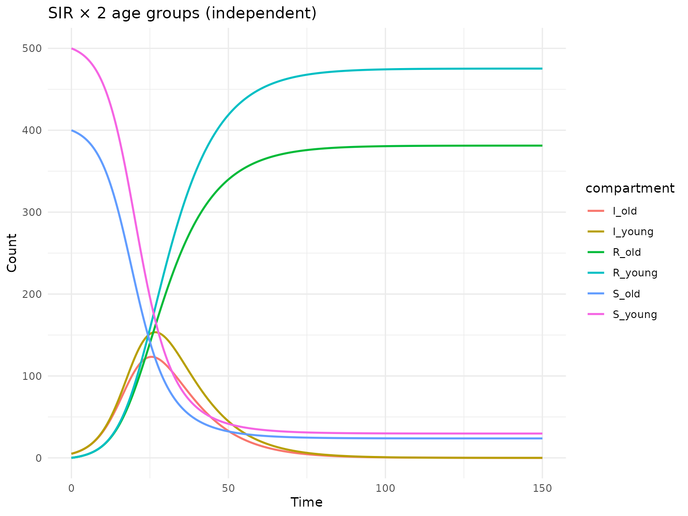
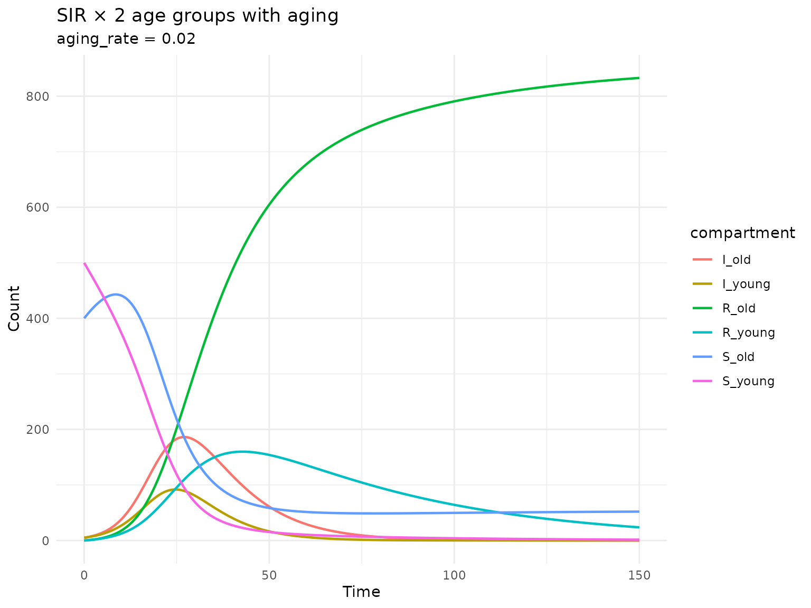
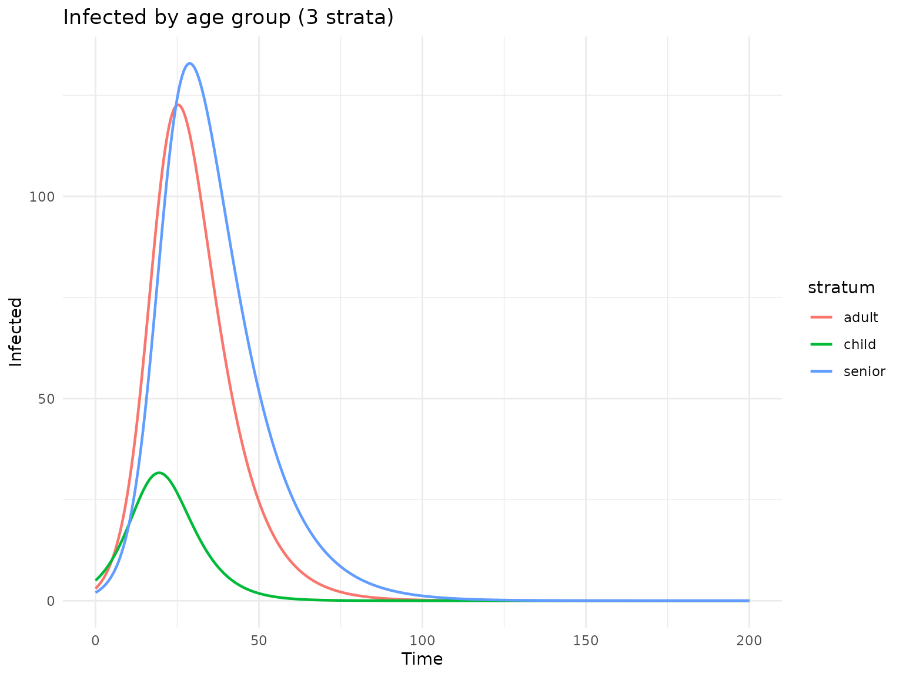
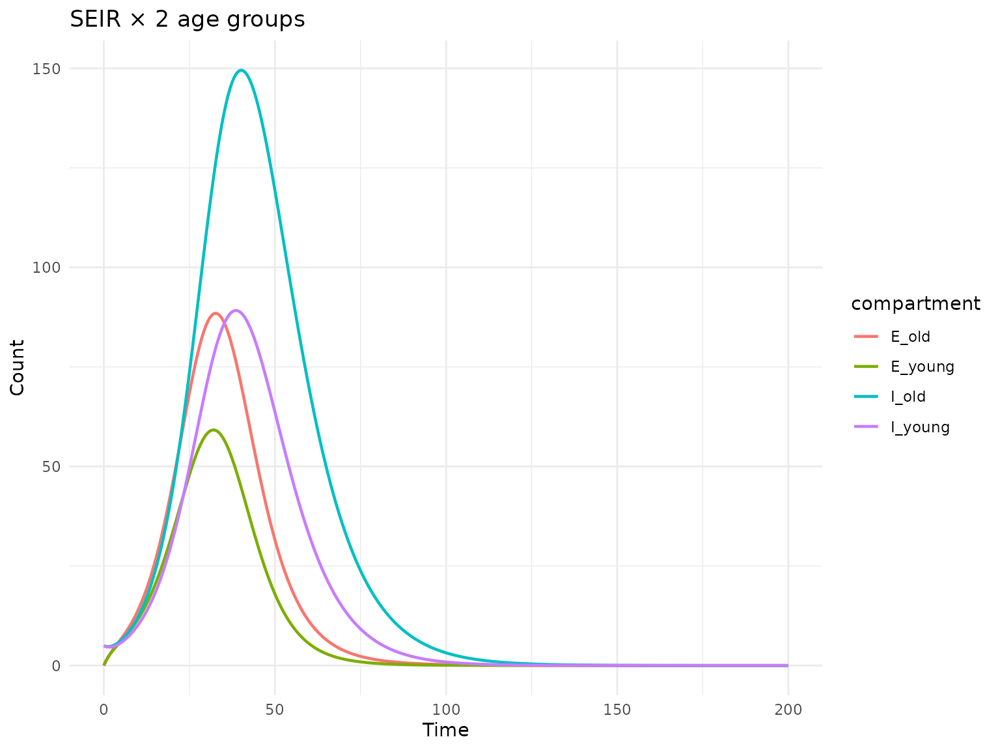

# Stock-flow stratification

## Introduction

Stratification is a key technique in epidemiological modeling that adds
heterogeneity to a model by subdividing populations into subgroups
(strata). For example, an SIR model can be stratified by age group to
capture age-dependent transmission and recovery.

The `algebraicodin` package implements stock-flow stratification
following the approach in
[StockFlow.jl](https://github.com/AlgebraicJulia/StockFlow.jl). This is
based on the **typed product** (pullback) of stock-flow models: given a
base disease model and a strata model, both typed over a common type
template, the product creates all valid pairs of stocks and flows.

## Simple stratification: SIR × 2 age groups

Let’s start with a basic SIR model and stratify it by two age groups.

``` r
library(algebraicodin)
#> 
#> Attaching package: 'algebraicodin'
#> The following objects are masked from 'package:base':
#> 
#>     %o%, %x%
library(ggplot2)
```

### Define the base SIR model

``` r
sir <- stock_and_flow(
  stocks = c("S", "I", "R"),
  flows = list(
    infection = flow(from = "S", to = "I", rate = beta * S * I / N),
    recovery = flow(from = "I", to = "R", rate = gamma * I)
  ),
  sums = list(N = c("S", "I", "R")),
  params = c("beta", "gamma")
)

plot_stock_flow(sir)
```

### Stratify without cross-strata flows

The simplest case replicates the disease dynamics within each stratum,
with no movement between strata:

``` r
sir_2age <- sf_stratify(sir, c("young", "old"),
  flow_types = c(infection = "disease", recovery = "disease"))

cat("Stocks:", paste(sf_snames(sir_2age), collapse = ", "), "\n")
#> Stocks: S_young, S_old, I_young, I_old, R_young, R_old
cat("Flows:", paste(sf_fnames(sir_2age), collapse = ", "), "\n")
#> Flows: infection_id_young, infection_id_old, recovery_id_young, recovery_id_old
cat("Params:", paste(sf_pnames(sir_2age), collapse = ", "), "\n")
#> Params: beta, gamma
```

The stratified model has 6 stocks (3 disease states × 2 age groups) and
4 flows (2 disease flows × 2 age groups). Parameters are shared across
strata.

``` r
plot_stock_flow(sir_2age)
```

### Generate and simulate the odin2 model

``` r
cat(sf_to_odin(sir_2age, type = "ode"))
#> beta <- parameter()
#> gamma <- parameter()
#> 
#> S_young0 <- parameter(0)
#> initial(S_young) <- S_young0
#> S_old0 <- parameter(0)
#> initial(S_old) <- S_old0
#> I_young0 <- parameter(0)
#> initial(I_young) <- I_young0
#> I_old0 <- parameter(0)
#> initial(I_old) <- I_old0
#> R_young0 <- parameter(0)
#> initial(R_young) <- R_young0
#> R_old0 <- parameter(0)
#> initial(R_old) <- R_old0
#> 
#> N_young <- S_young + I_young + R_young
#> N_old <- S_old + I_old + R_old
#> 
#> v_infection_id_young <- beta * S_young * I_young/N_young
#> v_infection_id_old <- beta * S_old * I_old/N_old
#> v_recovery_id_young <- gamma * I_young
#> v_recovery_id_old <- gamma * I_old
#> 
#> deriv(S_young) <- - v_infection_id_young
#> deriv(S_old) <- - v_infection_id_old
#> deriv(I_young) <- v_infection_id_young - v_recovery_id_young
#> deriv(I_old) <- v_infection_id_old - v_recovery_id_old
#> deriv(R_young) <- v_recovery_id_young
#> deriv(R_old) <- v_recovery_id_old
```

``` r
gen <- sf_to_odin_system(sir_2age, type = "ode")
sys <- dust2::dust_system_create(gen(), list(
  beta = 0.3, gamma = 0.1,
  S_young0 = 500, S_old0 = 400,
  I_young0 = 5, I_old0 = 5,
  R_young0 = 0, R_old0 = 0
))
#> ── R CMD INSTALL ───────────────────────────────────────────────────────────────
#> * installing *source* package ‘odin.systemef03de17’ ...
#> ** this is package ‘odin.systemef03de17’ version ‘0.0.1’
#> ** using staged installation
#> ** libs
#> using C++ compiler: ‘g++ (Ubuntu 13.3.0-6ubuntu2~24.04.1) 13.3.0’
#> g++ -std=gnu++17 -I"/opt/R/4.5.3/lib/R/include" -DNDEBUG  -I'/home/runner/work/_temp/Library/cpp11/include' -I'/home/runner/work/_temp/Library/dust2/include' -I'/home/runner/work/_temp/Library/monty/include' -I/usr/local/include   -DHAVE_INLINE -fopenmp  -fpic  -g -O2  -Wall -pedantic -fdiagnostics-color=always  -c cpp11.cpp -o cpp11.o
#> g++ -std=gnu++17 -I"/opt/R/4.5.3/lib/R/include" -DNDEBUG  -I'/home/runner/work/_temp/Library/cpp11/include' -I'/home/runner/work/_temp/Library/dust2/include' -I'/home/runner/work/_temp/Library/monty/include' -I/usr/local/include   -DHAVE_INLINE -fopenmp  -fpic  -g -O2  -Wall -pedantic -fdiagnostics-color=always  -c dust.cpp -o dust.o
#> g++ -std=gnu++17 -shared -L/opt/R/4.5.3/lib/R/lib -L/usr/local/lib -o odin.systemef03de17.so cpp11.o dust.o -fopenmp -L/opt/R/4.5.3/lib/R/lib -lR
#> installing to /tmp/RtmpI3Lf0A/devtools_install_35f32f146aad/00LOCK-dust_35f33183c7d6/00new/odin.systemef03de17/libs
#> ** checking absolute paths in shared objects and dynamic libraries
#> * DONE (odin.systemef03de17)
dust2::dust_system_set_state_initial(sys)
times <- seq(0, 150, by = 0.5)
res <- dust2::dust_system_simulate(sys, times)
state <- dust2::dust_unpack_state(sys, res)

df <- data.frame(
  time = rep(times, 6),
  value = c(state$S_young, state$S_old,
            state$I_young, state$I_old,
            state$R_young, state$R_old),
  compartment = rep(c("S_young", "S_old", "I_young", "I_old",
                       "R_young", "R_old"), each = length(times))
)

ggplot(df, aes(x = time, y = value, colour = compartment)) +
  geom_line(linewidth = 0.8) +
  labs(title = "SIR × 2 age groups (independent)", x = "Time", y = "Count") +
  theme_minimal()
```



## Stratification with cross-strata flows (aging)

In many applications, individuals move between strata. For age
stratification, this means aging: individuals in the “young” group
transition to “old” at some rate.

``` r
sir_age <- sf_stratify(sir, c("young", "old"),
  flow_types = c(infection = "disease", recovery = "disease"),
  cross_strata_flows = list(
    list(name = "aging", from = "young", to = "old",
         rate = quote(aging_rate * young), params = c("aging_rate"))
  )
)

cat("Stocks:", paste(sf_snames(sir_age), collapse = ", "), "\n")
#> Stocks: S_young, S_old, I_young, I_old, R_young, R_old
cat("Flows:", paste(sf_fnames(sir_age), collapse = ", "), "\n")
#> Flows: infection_id_young, infection_id_old, recovery_id_young, recovery_id_old, aging_S, aging_I, aging_R
cat("Params:", paste(sf_pnames(sir_age), collapse = ", "), "\n")
#> Params: beta, gamma, aging_rate
```

Now there are 7 flows: 4 disease flows (infection and recovery in each
stratum) plus 3 aging flows (one per disease compartment: S, I, R).

``` r
plot_stock_flow(sir_age)
```

### Simulate the aging model

``` r
gen <- sf_to_odin_system(sir_age, type = "ode")
sys <- dust2::dust_system_create(gen(), list(
  beta = 0.3, gamma = 0.1, aging_rate = 0.02,
  S_young0 = 500, S_old0 = 400,
  I_young0 = 5, I_old0 = 5,
  R_young0 = 0, R_old0 = 0
))
#> ── R CMD INSTALL ───────────────────────────────────────────────────────────────
#> * installing *source* package ‘odin.systemaea97e8a’ ...
#> ** this is package ‘odin.systemaea97e8a’ version ‘0.0.1’
#> ** using staged installation
#> ** libs
#> using C++ compiler: ‘g++ (Ubuntu 13.3.0-6ubuntu2~24.04.1) 13.3.0’
#> g++ -std=gnu++17 -I"/opt/R/4.5.3/lib/R/include" -DNDEBUG  -I'/home/runner/work/_temp/Library/cpp11/include' -I'/home/runner/work/_temp/Library/dust2/include' -I'/home/runner/work/_temp/Library/monty/include' -I/usr/local/include   -DHAVE_INLINE -fopenmp  -fpic  -g -O2  -Wall -pedantic -fdiagnostics-color=always  -c cpp11.cpp -o cpp11.o
#> g++ -std=gnu++17 -I"/opt/R/4.5.3/lib/R/include" -DNDEBUG  -I'/home/runner/work/_temp/Library/cpp11/include' -I'/home/runner/work/_temp/Library/dust2/include' -I'/home/runner/work/_temp/Library/monty/include' -I/usr/local/include   -DHAVE_INLINE -fopenmp  -fpic  -g -O2  -Wall -pedantic -fdiagnostics-color=always  -c dust.cpp -o dust.o
#> g++ -std=gnu++17 -shared -L/opt/R/4.5.3/lib/R/lib -L/usr/local/lib -o odin.systemaea97e8a.so cpp11.o dust.o -fopenmp -L/opt/R/4.5.3/lib/R/lib -lR
#> installing to /tmp/RtmpI3Lf0A/devtools_install_35f316c896de/00LOCK-dust_35f32559da6c/00new/odin.systemaea97e8a/libs
#> ** checking absolute paths in shared objects and dynamic libraries
#> * DONE (odin.systemaea97e8a)
dust2::dust_system_set_state_initial(sys)
times <- seq(0, 150, by = 0.5)
res <- dust2::dust_system_simulate(sys, times)
state <- dust2::dust_unpack_state(sys, res)

df <- data.frame(
  time = rep(times, 6),
  value = c(state$S_young, state$S_old,
            state$I_young, state$I_old,
            state$R_young, state$R_old),
  compartment = rep(c("S_young", "S_old", "I_young", "I_old",
                       "R_young", "R_old"), each = length(times))
)

ggplot(df, aes(x = time, y = value, colour = compartment)) +
  geom_line(linewidth = 0.8) +
  labs(title = "SIR × 2 age groups with aging",
       subtitle = "aging_rate = 0.02",
       x = "Time", y = "Count") +
  theme_minimal()
```



## Three strata with multiple cross-strata flows

For finer age resolution, we can use 3 strata with two aging
transitions:

``` r
sir_3age <- sf_stratify(sir, c("child", "adult", "senior"),
  flow_types = c(infection = "disease", recovery = "disease"),
  cross_strata_flows = list(
    list(name = "aging_ca", from = "child", to = "adult",
         rate = quote(age_rate_1 * child), params = "age_rate_1"),
    list(name = "aging_as", from = "adult", to = "senior",
         rate = quote(age_rate_2 * adult), params = "age_rate_2")
  )
)

cat("Stocks:", paste(sf_snames(sir_3age), collapse = ", "), "\n")
#> Stocks: S_child, S_adult, S_senior, I_child, I_adult, I_senior, R_child, R_adult, R_senior
cat("Flows:", paste(sf_fnames(sir_3age), collapse = ", "), "\n")
#> Flows: infection_id_child, infection_id_adult, infection_id_senior, recovery_id_child, recovery_id_adult, recovery_id_senior, aging_ca_S, aging_as_S, aging_ca_I, aging_as_I, aging_ca_R, aging_as_R
cat("Num flows:", length(sf_fnames(sir_3age)), "\n")
#> Num flows: 12
cat("Params:", paste(sf_pnames(sir_3age), collapse = ", "), "\n")
#> Params: beta, gamma, age_rate_1, age_rate_2
```

``` r
gen <- sf_to_odin_system(sir_3age, type = "ode")
sys <- dust2::dust_system_create(gen(), list(
  beta = 0.3, gamma = 0.1,
  age_rate_1 = 0.05, age_rate_2 = 0.02,
  S_child0 = 300, S_adult0 = 400, S_senior0 = 200,
  I_child0 = 5, I_adult0 = 3, I_senior0 = 2,
  R_child0 = 0, R_adult0 = 0, R_senior0 = 0
))
#> ── R CMD INSTALL ───────────────────────────────────────────────────────────────
#> * installing *source* package ‘odin.system04d4cb34’ ...
#> ** this is package ‘odin.system04d4cb34’ version ‘0.0.1’
#> ** using staged installation
#> ** libs
#> using C++ compiler: ‘g++ (Ubuntu 13.3.0-6ubuntu2~24.04.1) 13.3.0’
#> g++ -std=gnu++17 -I"/opt/R/4.5.3/lib/R/include" -DNDEBUG  -I'/home/runner/work/_temp/Library/cpp11/include' -I'/home/runner/work/_temp/Library/dust2/include' -I'/home/runner/work/_temp/Library/monty/include' -I/usr/local/include   -DHAVE_INLINE -fopenmp  -fpic  -g -O2  -Wall -pedantic -fdiagnostics-color=always  -c cpp11.cpp -o cpp11.o
#> g++ -std=gnu++17 -I"/opt/R/4.5.3/lib/R/include" -DNDEBUG  -I'/home/runner/work/_temp/Library/cpp11/include' -I'/home/runner/work/_temp/Library/dust2/include' -I'/home/runner/work/_temp/Library/monty/include' -I/usr/local/include   -DHAVE_INLINE -fopenmp  -fpic  -g -O2  -Wall -pedantic -fdiagnostics-color=always  -c dust.cpp -o dust.o
#> g++ -std=gnu++17 -shared -L/opt/R/4.5.3/lib/R/lib -L/usr/local/lib -o odin.system04d4cb34.so cpp11.o dust.o -fopenmp -L/opt/R/4.5.3/lib/R/lib -lR
#> installing to /tmp/RtmpI3Lf0A/devtools_install_35f352560676/00LOCK-dust_35f31cde6826/00new/odin.system04d4cb34/libs
#> ** checking absolute paths in shared objects and dynamic libraries
#> * DONE (odin.system04d4cb34)
dust2::dust_system_set_state_initial(sys)
times <- seq(0, 200, by = 0.5)
res <- dust2::dust_system_simulate(sys, times)
state <- dust2::dust_unpack_state(sys, res)

df_I <- data.frame(
  time = rep(times, 3),
  value = c(state$I_child, state$I_adult, state$I_senior),
  stratum = rep(c("child", "adult", "senior"), each = length(times))
)

ggplot(df_I, aes(x = time, y = value, colour = stratum)) +
  geom_line(linewidth = 0.8) +
  labs(title = "Infected by age group (3 strata)",
       x = "Time", y = "Infected") +
  theme_minimal()
```



## SEIR stratification

Stock-flow stratification works with any base model. Here’s SEIR × 2 age
groups:

``` r
seir <- stock_and_flow(
  stocks = c("S", "E", "I", "R"),
  flows = list(
    exposure = flow(from = "S", to = "E", rate = beta * S * I / N),
    infection = flow(from = "E", to = "I", rate = sigma * E),
    recovery = flow(from = "I", to = "R", rate = gamma * I)
  ),
  sums = list(N = c("S", "E", "I", "R")),
  params = c("beta", "sigma", "gamma")
)

seir_age <- sf_stratify(seir, c("young", "old"),
  flow_types = c(exposure = "disease", infection = "disease",
                 recovery = "disease"),
  cross_strata_flows = list(
    list(name = "aging", from = "young", to = "old",
         rate = quote(aging_rate * young), params = c("aging_rate"))
  )
)

cat("Stocks:", length(sf_snames(seir_age)), "\n")
#> Stocks: 8
cat("Flows:", length(sf_fnames(seir_age)), "\n")
#> Flows: 10
```

``` r
gen <- sf_to_odin_system(seir_age, type = "ode")
sys <- dust2::dust_system_create(gen(), list(
  beta = 0.4, sigma = 0.2, gamma = 0.1, aging_rate = 0.01,
  S_young0 = 500, S_old0 = 400,
  E_young0 = 0, E_old0 = 0,
  I_young0 = 5, I_old0 = 5,
  R_young0 = 0, R_old0 = 0
))
#> ── R CMD INSTALL ───────────────────────────────────────────────────────────────
#> * installing *source* package ‘odin.system6f89bca5’ ...
#> ** this is package ‘odin.system6f89bca5’ version ‘0.0.1’
#> ** using staged installation
#> ** libs
#> using C++ compiler: ‘g++ (Ubuntu 13.3.0-6ubuntu2~24.04.1) 13.3.0’
#> g++ -std=gnu++17 -I"/opt/R/4.5.3/lib/R/include" -DNDEBUG  -I'/home/runner/work/_temp/Library/cpp11/include' -I'/home/runner/work/_temp/Library/dust2/include' -I'/home/runner/work/_temp/Library/monty/include' -I/usr/local/include   -DHAVE_INLINE -fopenmp  -fpic  -g -O2  -Wall -pedantic -fdiagnostics-color=always  -c cpp11.cpp -o cpp11.o
#> g++ -std=gnu++17 -I"/opt/R/4.5.3/lib/R/include" -DNDEBUG  -I'/home/runner/work/_temp/Library/cpp11/include' -I'/home/runner/work/_temp/Library/dust2/include' -I'/home/runner/work/_temp/Library/monty/include' -I/usr/local/include   -DHAVE_INLINE -fopenmp  -fpic  -g -O2  -Wall -pedantic -fdiagnostics-color=always  -c dust.cpp -o dust.o
#> g++ -std=gnu++17 -shared -L/opt/R/4.5.3/lib/R/lib -L/usr/local/lib -o odin.system6f89bca5.so cpp11.o dust.o -fopenmp -L/opt/R/4.5.3/lib/R/lib -lR
#> installing to /tmp/RtmpI3Lf0A/devtools_install_35f3730a9395/00LOCK-dust_35f314e44a46/00new/odin.system6f89bca5/libs
#> ** checking absolute paths in shared objects and dynamic libraries
#> * DONE (odin.system6f89bca5)
dust2::dust_system_set_state_initial(sys)
times <- seq(0, 200, by = 0.5)
res <- dust2::dust_system_simulate(sys, times)
state <- dust2::dust_unpack_state(sys, res)

df <- data.frame(
  time = rep(times, 4),
  value = c(state$I_young, state$I_old, state$E_young, state$E_old),
  compartment = rep(c("I_young", "I_old", "E_young", "E_old"),
                    each = length(times))
)

ggplot(df, aes(x = time, y = value, colour = compartment)) +
  geom_line(linewidth = 0.8) +
  labs(title = "SEIR × 2 age groups",
       x = "Time", y = "Count") +
  theme_minimal()
```



## Comparison with manually written odin2

To verify the stratification, let’s compare with a hand-written model:

``` r
manual_code <- "
beta <- parameter()
gamma <- parameter()

S_a0 <- parameter(0)
I_a0 <- parameter(0)
R_a0 <- parameter(0)
S_b0 <- parameter(0)
I_b0 <- parameter(0)
R_b0 <- parameter(0)

initial(S_a) <- S_a0
initial(I_a) <- I_a0
initial(R_a) <- R_a0
initial(S_b) <- S_b0
initial(I_b) <- I_b0
initial(R_b) <- R_b0

N_a <- S_a + I_a + R_a
N_b <- S_b + I_b + R_b

deriv(S_a) <- -beta * S_a * I_a / N_a
deriv(I_a) <- beta * S_a * I_a / N_a - gamma * I_a
deriv(R_a) <- gamma * I_a
deriv(S_b) <- -beta * S_b * I_b / N_b
deriv(I_b) <- beta * S_b * I_b / N_b - gamma * I_b
deriv(R_b) <- gamma * I_b
"

# Algebraic version
sir_2 <- sf_stratify(sir, c("a", "b"),
  flow_types = c(infection = "disease", recovery = "disease"))

gen_alg <- sf_to_odin_system(sir_2, type = "ode")
gen_man <- function() odin2::odin(manual_code)

pars <- list(beta = 0.3, gamma = 0.1,
             S_a0 = 500, I_a0 = 5, R_a0 = 0,
             S_b0 = 400, I_b0 = 5, R_b0 = 0)

sys_alg <- dust2::dust_system_create(gen_alg(), pars)
#> ── R CMD INSTALL ───────────────────────────────────────────────────────────────
#> * installing *source* package ‘odin.systemef2ee338’ ...
#> ** this is package ‘odin.systemef2ee338’ version ‘0.0.1’
#> ** using staged installation
#> ** libs
#> using C++ compiler: ‘g++ (Ubuntu 13.3.0-6ubuntu2~24.04.1) 13.3.0’
#> g++ -std=gnu++17 -I"/opt/R/4.5.3/lib/R/include" -DNDEBUG  -I'/home/runner/work/_temp/Library/cpp11/include' -I'/home/runner/work/_temp/Library/dust2/include' -I'/home/runner/work/_temp/Library/monty/include' -I/usr/local/include   -DHAVE_INLINE -fopenmp  -fpic  -g -O2  -Wall -pedantic -fdiagnostics-color=always  -c cpp11.cpp -o cpp11.o
#> g++ -std=gnu++17 -I"/opt/R/4.5.3/lib/R/include" -DNDEBUG  -I'/home/runner/work/_temp/Library/cpp11/include' -I'/home/runner/work/_temp/Library/dust2/include' -I'/home/runner/work/_temp/Library/monty/include' -I/usr/local/include   -DHAVE_INLINE -fopenmp  -fpic  -g -O2  -Wall -pedantic -fdiagnostics-color=always  -c dust.cpp -o dust.o
#> g++ -std=gnu++17 -shared -L/opt/R/4.5.3/lib/R/lib -L/usr/local/lib -o odin.systemef2ee338.so cpp11.o dust.o -fopenmp -L/opt/R/4.5.3/lib/R/lib -lR
#> installing to /tmp/RtmpI3Lf0A/devtools_install_35f36972763b/00LOCK-dust_35f316612553/00new/odin.systemef2ee338/libs
#> ** checking absolute paths in shared objects and dynamic libraries
#> * DONE (odin.systemef2ee338)
dust2::dust_system_set_state_initial(sys_alg)
sys_man <- dust2::dust_system_create(gen_man(), pars)
#> ── R CMD INSTALL ───────────────────────────────────────────────────────────────
#> * installing *source* package ‘odin.systemca5402e9’ ...
#> ** this is package ‘odin.systemca5402e9’ version ‘0.0.1’
#> ** using staged installation
#> ** libs
#> using C++ compiler: ‘g++ (Ubuntu 13.3.0-6ubuntu2~24.04.1) 13.3.0’
#> g++ -std=gnu++17 -I"/opt/R/4.5.3/lib/R/include" -DNDEBUG  -I'/home/runner/work/_temp/Library/cpp11/include' -I'/home/runner/work/_temp/Library/dust2/include' -I'/home/runner/work/_temp/Library/monty/include' -I/usr/local/include   -DHAVE_INLINE -fopenmp  -fpic  -g -O2  -Wall -pedantic -fdiagnostics-color=always  -c cpp11.cpp -o cpp11.o
#> g++ -std=gnu++17 -I"/opt/R/4.5.3/lib/R/include" -DNDEBUG  -I'/home/runner/work/_temp/Library/cpp11/include' -I'/home/runner/work/_temp/Library/dust2/include' -I'/home/runner/work/_temp/Library/monty/include' -I/usr/local/include   -DHAVE_INLINE -fopenmp  -fpic  -g -O2  -Wall -pedantic -fdiagnostics-color=always  -c dust.cpp -o dust.o
#> g++ -std=gnu++17 -shared -L/opt/R/4.5.3/lib/R/lib -L/usr/local/lib -o odin.systemca5402e9.so cpp11.o dust.o -fopenmp -L/opt/R/4.5.3/lib/R/lib -lR
#> installing to /tmp/RtmpI3Lf0A/devtools_install_35f3339ac7f5/00LOCK-dust_35f3752ef3ff/00new/odin.systemca5402e9/libs
#> ** checking absolute paths in shared objects and dynamic libraries
#> * DONE (odin.systemca5402e9)
dust2::dust_system_set_state_initial(sys_man)

times <- seq(0, 100, by = 1)
res_alg <- dust2::dust_system_simulate(sys_alg, times)
res_man <- dust2::dust_system_simulate(sys_man, times)

sa_alg <- dust2::dust_unpack_state(sys_alg, res_alg)
sa_man <- dust2::dust_unpack_state(sys_man, res_man)

max_diff <- max(abs(sa_alg$I_a - sa_man$I_a),
                abs(sa_alg$I_b - sa_man$I_b),
                abs(sa_alg$S_a - sa_man$S_a))
cat(sprintf("Maximum difference between algebraic and manual: %.2e\n", max_diff))
#> Maximum difference between algebraic and manual: 0.00e+00
```

## Low-level API: TypedStockFlow

For advanced use cases, you can work directly with the typed stock-flow
API:

``` r
type_sf <- sf_infectious_type()
cat("Type stocks:", sf_snames(type_sf), "\n")
#> Type stocks: pop
cat("Type flows:", sf_fnames(type_sf), "\n")
#> Type flows: disease strata
cat("Type params:", sf_pnames(type_sf), "\n")
#> Type params: rate
```

``` r
tsf <- sf_typed(sir, type_sf,
  stock_types = c(S = "pop", I = "pop", R = "pop"),
  flow_types = c(infection = "disease", recovery = "disease"),
  param_types = c(beta = "rate", gamma = "rate"))

tsf_r <- sf_add_reflexives(tsf, list(S = "strata", I = "strata", R = "strata"))
cat("After adding reflexives:",
    paste(sf_fnames(tsf_r@sf), collapse = ", "), "\n")
#> After adding reflexives: infection, recovery, refl_S_strata, refl_I_strata, refl_R_strata
```

## Summary

Stock-flow stratification in `algebraicodin`:

- [`sf_stratify()`](https://catrgory.github.io/algebraicodin/reference/sf_stratify.md)
  — high-level convenience function
- Supports arbitrary number of strata
- Cross-strata flows (e.g., aging) with rate expressions
- Parameters remain independent (not cross-multiplied)
- Generates correct odin2 code for simulation
- Based on the typed product (pullback) from StockFlow.jl

Lower-level API for advanced use:

- [`sf_typed()`](https://catrgory.github.io/algebraicodin/reference/sf_typed.md)
  — create typed stock-flow models
- [`sf_add_reflexives()`](https://catrgory.github.io/algebraicodin/reference/sf_add_reflexives.md)
  — add identity flows for stratification
- [`sf_typed_product()`](https://catrgory.github.io/algebraicodin/reference/sf_typed_product.md)
  — compute the pullback directly
- [`sf_infectious_type()`](https://catrgory.github.io/algebraicodin/reference/sf_infectious_type.md)
  — standard epidemiological type template
