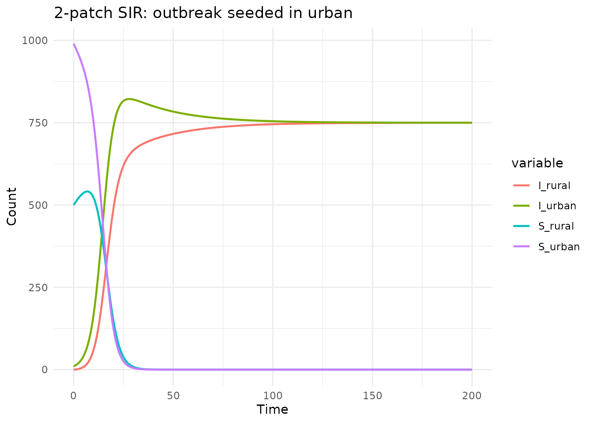
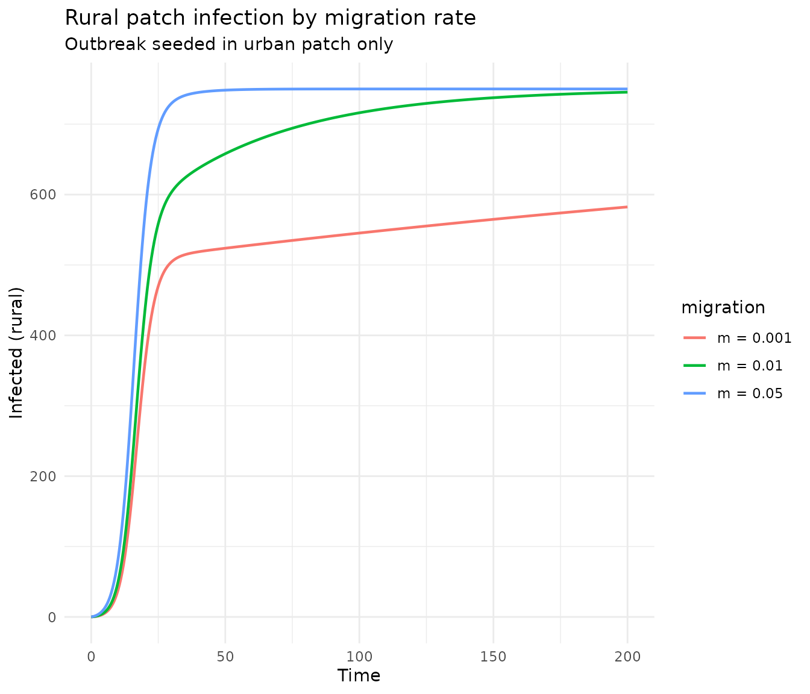
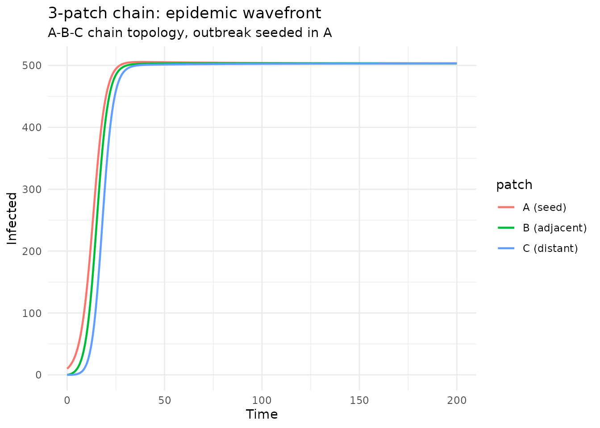

# Spatial multi-patch models

## Introduction

Spatial heterogeneity is important in epidemiological modeling: disease
dynamics can differ between locations due to population density, contact
patterns, and movement between regions. Multi-patch (metapopulation)
models capture this by dividing the population into discrete spatial
units connected by migration.

In `algebraicodin`, spatial patches are modeled as a form of
**stratification** — each patch runs its own disease dynamics, with
migration as cross-strata flows and optional cross-patch transmission
via a contact matrix. The
[`sf_spatial()`](https://catrgory.github.io/algebraicodin/reference/sf_spatial.md)
convenience function wraps this pattern.

``` r
library(algebraicodin)
library(ggplot2)
library(odin2)
library(dust2)
```

## Two-patch SIR with migration

### Define the base model

``` r
sir <- stock_and_flow(
  stocks = c("S", "I", "R"),
  flows = list(
    infection = flow(from = "S", to = "I", rate = beta * S * I / N),
    recovery = flow(from = "I", to = "R", rate = gamma * I)
  ),
  sums = list(N = c("S", "I", "R")),
  params = c("beta", "gamma")
)
```

### Create the spatial model

[`sf_spatial()`](https://catrgory.github.io/algebraicodin/reference/sf_spatial.md)
takes a base model, patch names, and migration specs. The `contact`
parameter adds a contact matrix for cross-patch transmission:

``` r
sir_2patch <- sf_spatial(sir, c("urban", "rural"),
  migration = list(
    mig_ur = list(from = "urban", to = "rural",
                  rate = quote(m_ur * urban), params = "m_ur"),
    mig_ru = list(from = "rural", to = "urban",
                  rate = quote(m_ru * rural), params = "m_ru")
  ),
  contact = "C"
)

cat("Stocks:", paste(sf_snames(sir_2patch), collapse = ", "), "\n")
#> Stocks: S_urban, S_rural, I_urban, I_rural, R_urban, R_rural
cat("Flows:", length(sf_fnames(sir_2patch)), "\n")
#> Flows: 10
cat("Params:", paste(sf_pnames(sir_2patch), collapse = ", "), "\n")
#> Params: C_rural_rural, C_rural_urban, m_ur, m_ru, C_urban_urban, C_urban_rural
```

The model has: - **6 stocks**: S, I, R per patch - **10 flows**: 4
disease (infection + recovery × 2 patches) + 6 migration (S, I, R × 2
directions) - **6 params**: gamma, migration rates, and 4 contact matrix
entries

### Visualize

``` r
plot_stock_flow(sir_2patch)
```

### Generated odin2 code

``` r
cat(sf_to_odin(sir_2patch, type = "ode"))
#> C_rural_rural <- parameter()
#> C_rural_urban <- parameter()
#> m_ur <- parameter()
#> m_ru <- parameter()
#> C_urban_urban <- parameter()
#> C_urban_rural <- parameter()
#> 
#> S_urban0 <- parameter(0)
#> initial(S_urban) <- S_urban0
#> S_rural0 <- parameter(0)
#> initial(S_rural) <- S_rural0
#> I_urban0 <- parameter(0)
#> initial(I_urban) <- I_urban0
#> I_rural0 <- parameter(0)
#> initial(I_rural) <- I_rural0
#> R_urban0 <- parameter(0)
#> initial(R_urban) <- R_urban0
#> R_rural0 <- parameter(0)
#> initial(R_rural) <- R_rural0
#> 
#> N_urban <- S_urban + I_urban + R_urban
#> N_rural <- S_rural + I_rural + R_rural
#> 
#> lambda_infection_urban <- C_urban_urban * I_urban / N_urban + C_urban_rural * I_rural / N_rural
#> lambda_infection_rural <- C_rural_urban * I_urban / N_urban + C_rural_rural * I_rural / N_rural
#> lambda_recovery_urban <- C_urban_urban * R_urban + C_urban_rural * R_rural
#> lambda_recovery_rural <- C_rural_urban * R_urban + C_rural_rural * R_rural
#> 
#> v_infection_id_urban <- lambda_infection_urban * S_urban
#> v_infection_id_rural <- lambda_infection_rural * S_rural
#> v_recovery_id_urban <- lambda_recovery_urban * I_urban
#> v_recovery_id_rural <- lambda_recovery_rural * I_rural
#> v_mig_ur_S <- m_ur * S_urban
#> v_mig_ru_S <- m_ru * S_rural
#> v_mig_ur_I <- m_ur * I_urban
#> v_mig_ru_I <- m_ru * I_rural
#> v_mig_ur_R <- m_ur * R_urban
#> v_mig_ru_R <- m_ru * R_rural
#> 
#> deriv(S_urban) <- - v_infection_id_urban - v_mig_ur_S + v_mig_ru_S
#> deriv(S_rural) <- - v_infection_id_rural + v_mig_ur_S - v_mig_ru_S
#> deriv(I_urban) <- v_infection_id_urban - v_recovery_id_urban - v_mig_ur_I + v_mig_ru_I
#> deriv(I_rural) <- v_infection_id_rural - v_recovery_id_rural + v_mig_ur_I - v_mig_ru_I
#> deriv(R_urban) <- v_recovery_id_urban - v_mig_ur_R + v_mig_ru_R
#> deriv(R_rural) <- v_recovery_id_rural + v_mig_ur_R - v_mig_ru_R
```

### Simulate: outbreak seeded in one patch

Disease starts in the urban patch and spreads to the rural patch via
migration and cross-patch contact:

``` r
gen <- sf_to_odin_system(sir_2patch, type = "ode")
sys <- dust_system_create(gen(), list(
  gamma = 0.1,
  m_ur = 0.02, m_ru = 0.02,
  C_urban_urban = 0.3, C_urban_rural = 0.05,
  C_rural_urban = 0.05, C_rural_rural = 0.25,
  S_urban0 = 990, I_urban0 = 10, R_urban0 = 0,
  S_rural0 = 500, I_rural0 = 0, R_rural0 = 0
))
#> ── R CMD INSTALL ───────────────────────────────────────────────────────────────
#> * installing *source* package ‘odin.system5e0d334b’ ...
#> ** this is package ‘odin.system5e0d334b’ version ‘0.0.1’
#> ** using staged installation
#> ** libs
#> using C++ compiler: ‘g++ (Ubuntu 13.3.0-6ubuntu2~24.04.1) 13.3.0’
#> g++ -std=gnu++17 -I"/opt/R/4.5.3/lib/R/include" -DNDEBUG  -I'/home/runner/work/_temp/Library/cpp11/include' -I'/home/runner/work/_temp/Library/dust2/include' -I'/home/runner/work/_temp/Library/monty/include' -I/usr/local/include   -DHAVE_INLINE -fopenmp  -fpic  -g -O2  -Wall -pedantic -fdiagnostics-color=always  -c cpp11.cpp -o cpp11.o
#> g++ -std=gnu++17 -I"/opt/R/4.5.3/lib/R/include" -DNDEBUG  -I'/home/runner/work/_temp/Library/cpp11/include' -I'/home/runner/work/_temp/Library/dust2/include' -I'/home/runner/work/_temp/Library/monty/include' -I/usr/local/include   -DHAVE_INLINE -fopenmp  -fpic  -g -O2  -Wall -pedantic -fdiagnostics-color=always  -c dust.cpp -o dust.o
#> g++ -std=gnu++17 -shared -L/opt/R/4.5.3/lib/R/lib -L/usr/local/lib -o odin.system5e0d334b.so cpp11.o dust.o -fopenmp -L/opt/R/4.5.3/lib/R/lib -lR
#> installing to /tmp/RtmpQ5Fqtz/devtools_install_37d71b7b1286/00LOCK-dust_37d76b20e64b/00new/odin.system5e0d334b/libs
#> ** checking absolute paths in shared objects and dynamic libraries
#> * DONE (odin.system5e0d334b)
dust_system_set_state_initial(sys)
times <- seq(0, 200, by = 0.5)
res <- dust_system_simulate(sys, times)
state <- dust_unpack_state(sys, res)

df <- data.frame(
  time = rep(times, 4),
  value = c(state$I_urban, state$I_rural,
            state$S_urban, state$S_rural),
  variable = rep(c("I_urban", "I_rural", "S_urban", "S_rural"),
                 each = length(times))
)

ggplot(df, aes(x = time, y = value, colour = variable)) +
  geom_line(linewidth = 0.8) +
  labs(title = "2-patch SIR: outbreak seeded in urban",
       x = "Time", y = "Count") +
  theme_minimal()
```



The urban patch experiences its epidemic first; the rural patch follows
with a delayed, smaller epidemic driven by migration and cross-patch
transmission.

## Effect of migration rate

``` r
run_model <- function(m_rate) {
  sys <- dust_system_create(gen(), list(
    gamma = 0.1, m_ur = m_rate, m_ru = m_rate,
    C_urban_urban = 0.3, C_urban_rural = 0.05,
    C_rural_urban = 0.05, C_rural_rural = 0.25,
    S_urban0 = 990, I_urban0 = 10, R_urban0 = 0,
    S_rural0 = 500, I_rural0 = 0, R_rural0 = 0
  ))
  dust_system_set_state_initial(sys)
  res <- dust_system_simulate(sys, times)
  dust_unpack_state(sys, res)
}

states <- lapply(c(0.001, 0.01, 0.05), run_model)

df_mig <- rbind(
  data.frame(time = times, I = states[[1]]$I_rural,
             migration = "m = 0.001"),
  data.frame(time = times, I = states[[2]]$I_rural,
             migration = "m = 0.01"),
  data.frame(time = times, I = states[[3]]$I_rural,
             migration = "m = 0.05")
)

ggplot(df_mig, aes(x = time, y = I, colour = migration)) +
  geom_line(linewidth = 0.8) +
  labs(title = "Rural patch infection by migration rate",
       subtitle = "Outbreak seeded in urban patch only",
       x = "Time", y = "Infected (rural)") +
  theme_minimal()
```



Higher migration rates produce earlier and larger epidemics in the rural
patch.

## Three-patch chain topology

``` r
sir_3patch <- sf_spatial(sir, c("A", "B", "C"),
  migration = list(
    mig_AB = list(from = "A", to = "B",
                  rate = quote(m * A), params = "m"),
    mig_BA = list(from = "B", to = "A",
                  rate = quote(m * B), params = "m"),
    mig_BC = list(from = "B", to = "C",
                  rate = quote(m * B), params = "m"),
    mig_CB = list(from = "C", to = "B",
                  rate = quote(m * C), params = "m")
  ),
  contact = "C"
)

cat("Stocks:", length(sf_snames(sir_3patch)), "\n")
#> Stocks: 9
cat("Flows:", length(sf_fnames(sir_3patch)), "\n")
#> Flows: 18
```

``` r
gen3 <- sf_to_odin_system(sir_3patch, type = "ode")

# Contact: mostly within-patch, some between adjacent patches
sys3 <- dust_system_create(gen3(), list(
  gamma = 0.1, m = 0.02,
  C_A_A = 0.3, C_A_B = 0.03, C_A_C = 0.0,
  C_B_A = 0.03, C_B_B = 0.3, C_B_C = 0.03,
  C_C_A = 0.0, C_C_B = 0.03, C_C_C = 0.3,
  S_A0 = 500, I_A0 = 10, R_A0 = 0,
  S_B0 = 500, I_B0 = 0, R_B0 = 0,
  S_C0 = 500, I_C0 = 0, R_C0 = 0
))
#> ── R CMD INSTALL ───────────────────────────────────────────────────────────────
#> * installing *source* package ‘odin.systeme36bc279’ ...
#> ** this is package ‘odin.systeme36bc279’ version ‘0.0.1’
#> ** using staged installation
#> ** libs
#> using C++ compiler: ‘g++ (Ubuntu 13.3.0-6ubuntu2~24.04.1) 13.3.0’
#> g++ -std=gnu++17 -I"/opt/R/4.5.3/lib/R/include" -DNDEBUG  -I'/home/runner/work/_temp/Library/cpp11/include' -I'/home/runner/work/_temp/Library/dust2/include' -I'/home/runner/work/_temp/Library/monty/include' -I/usr/local/include   -DHAVE_INLINE -fopenmp  -fpic  -g -O2  -Wall -pedantic -fdiagnostics-color=always  -c cpp11.cpp -o cpp11.o
#> g++ -std=gnu++17 -I"/opt/R/4.5.3/lib/R/include" -DNDEBUG  -I'/home/runner/work/_temp/Library/cpp11/include' -I'/home/runner/work/_temp/Library/dust2/include' -I'/home/runner/work/_temp/Library/monty/include' -I/usr/local/include   -DHAVE_INLINE -fopenmp  -fpic  -g -O2  -Wall -pedantic -fdiagnostics-color=always  -c dust.cpp -o dust.o
#> g++ -std=gnu++17 -shared -L/opt/R/4.5.3/lib/R/lib -L/usr/local/lib -o odin.systeme36bc279.so cpp11.o dust.o -fopenmp -L/opt/R/4.5.3/lib/R/lib -lR
#> installing to /tmp/RtmpQ5Fqtz/devtools_install_37d7fd7e7b4/00LOCK-dust_37d7190692c4/00new/odin.systeme36bc279/libs
#> ** checking absolute paths in shared objects and dynamic libraries
#> * DONE (odin.systeme36bc279)
dust_system_set_state_initial(sys3)
res3 <- dust_system_simulate(sys3, seq(0, 200, by = 0.5))
state3 <- dust_unpack_state(sys3, res3)
t3 <- seq(0, 200, by = 0.5)

df3 <- data.frame(
  time = rep(t3, 3),
  infected = c(state3$I_A, state3$I_B, state3$I_C),
  patch = rep(c("A (seed)", "B (adjacent)", "C (distant)"),
              each = length(t3))
)

ggplot(df3, aes(x = time, y = infected, colour = patch)) +
  geom_line(linewidth = 0.8) +
  labs(title = "3-patch chain: epidemic wavefront",
       subtitle = "A-B-C chain topology, outbreak seeded in A",
       x = "Time", y = "Infected") +
  theme_minimal()
```



The epidemic propagates as a wavefront: A peaks first, then B, then C.

## Without a contact matrix

For simpler models where transmission is purely within-patch, omit the
`contact` parameter:

``` r
sir_simple <- sf_spatial(sir, c("north", "south"),
  migration = list(
    mig_ns = list(from = "north", to = "south",
                  rate = quote(m * north), params = "m"),
    mig_sn = list(from = "south", to = "north",
                  rate = quote(m * south), params = "m")
  )
)

cat("Params:", paste(sf_pnames(sir_simple), collapse = ", "), "\n")
#> Params: beta, gamma, m
```

Here `beta` and `gamma` are shared across patches. Each patch transmits
only within its own population.

## Stochastic spatial model

``` r
stoch_code <- sf_to_odin(sir_2patch, type = "stochastic")
cat(head(strsplit(stoch_code, "\n")[[1]], 10), sep = "\n")
#> C_rural_rural <- parameter()
#> C_rural_urban <- parameter()
#> m_ur <- parameter()
#> m_ru <- parameter()
#> C_urban_urban <- parameter()
#> C_urban_rural <- parameter()
#> 
#> S_urban0 <- parameter(0)
#> initial(S_urban) <- S_urban0
#> S_rural0 <- parameter(0)
cat("...\n")
#> ...
```

## Using `sf_stratify()` directly

[`sf_spatial()`](https://catrgory.github.io/algebraicodin/reference/sf_spatial.md)
is a convenience wrapper. For full control, use
[`sf_stratify()`](https://catrgory.github.io/algebraicodin/reference/sf_stratify.md):

``` r
sir_direct <- sf_stratify(sir, c("p1", "p2"),
  flow_types = c(infection = "disease", recovery = "disease"),
  cross_strata_flows = list(
    list(name = "mig_12", from = "p1", to = "p2",
         rate = quote(m * p1), params = "m"),
    list(name = "mig_21", from = "p2", to = "p1",
         rate = quote(m * p2), params = "m")
  ),
  mixing = list(infection = "C")
)

cat("Equivalent result:", length(sf_fnames(sir_direct)), "flows\n")
#> Equivalent result: 10 flows
```

## Summary

| Function                                                                                                     | Use case                                    |
|--------------------------------------------------------------------------------------------------------------|---------------------------------------------|
| [`sf_spatial()`](https://catrgory.github.io/algebraicodin/reference/sf_spatial.md)                           | Convenience wrapper for multi-patch models  |
| [`sf_stratify()`](https://catrgory.github.io/algebraicodin/reference/sf_stratify.md) with cross-strata flows | Full control over spatial structure         |
| `mixing` / `contact`                                                                                         | Cross-patch transmission via contact matrix |

Key points: - Patches are treated as strata in the stratification
framework - Migration = cross-strata flows (apply to all compartments) -
Contact matrix = cross-patch transmission weighting - Works with any
base model (SIR, SEIR, etc.) - Generates compilable odin2 code (ODE,
stochastic, discrete)
