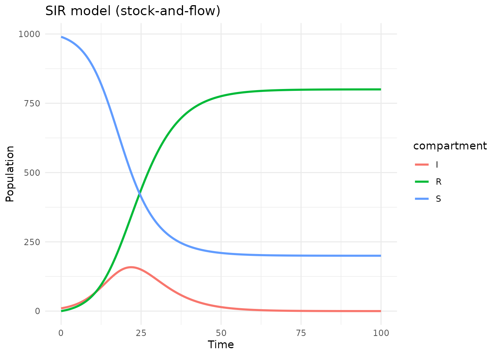
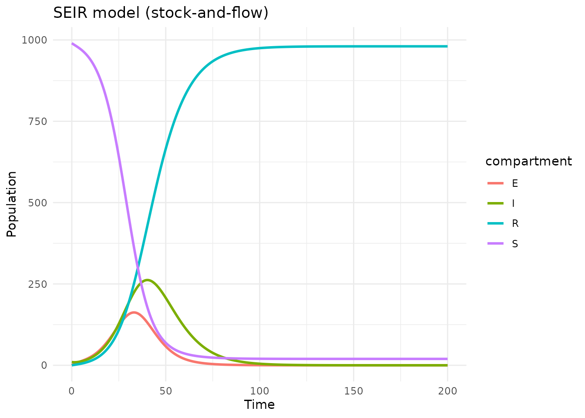
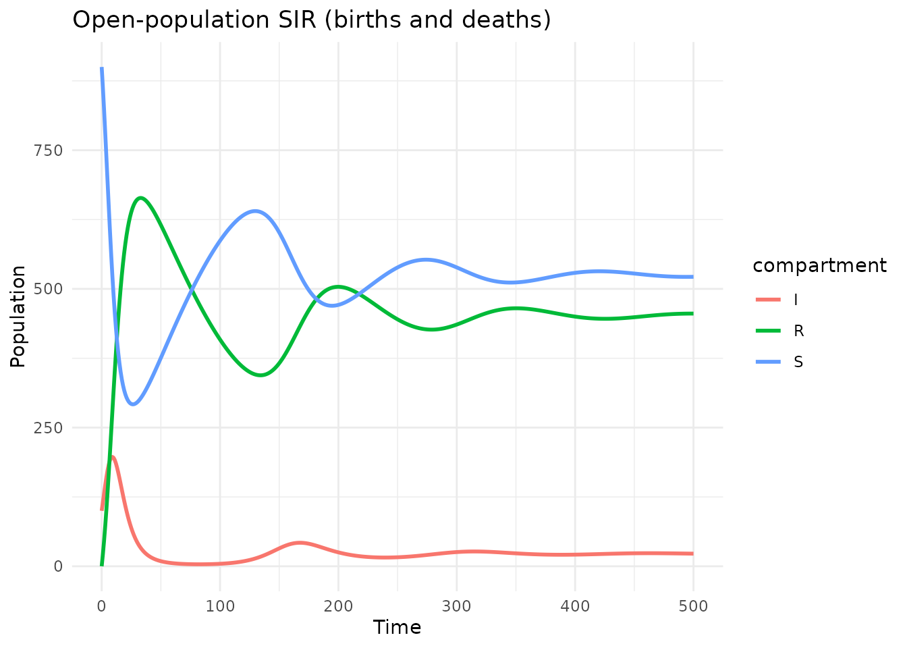
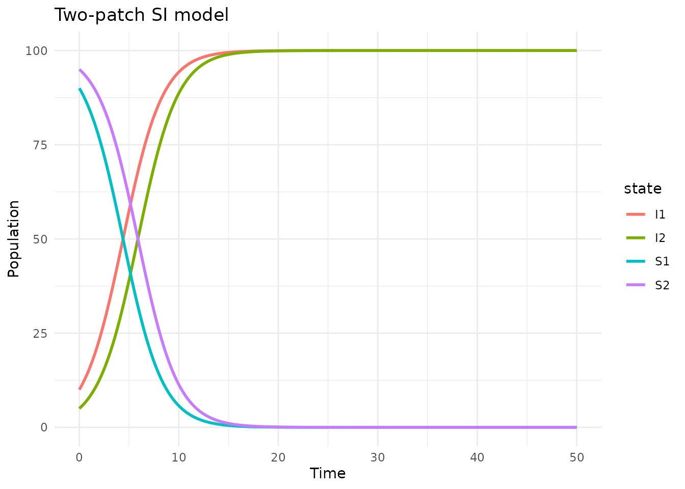

# Stock-and-flow models

## Introduction

Stock-and-flow diagrams are a widely used formalism in system dynamics,
epidemiological modeling, and ecological modeling. They represent
systems with:

- **Stocks** — state variables that accumulate over time (e.g.,
  susceptible, infected, recovered populations)
- **Flows** — rates of change between stocks (e.g., infection rate,
  recovery rate)
- **Auxiliary variables** — intermediate computations used by flows
- **Sum variables** — aggregates of stocks (e.g., total population *N*)
- **Parameters** — external constants (e.g., transmission rate *beta*)

algebraicodin’s stock-flow support is inspired by
[StockFlow.jl](https://github.com/AlgebraicJulia/StockFlow.jl) and uses
the same categorical framework — stock-flow diagrams are ACSets with a
specific schema.

``` r
library(algebraicodin)
#> 
#> Attaching package: 'algebraicodin'
#> The following objects are masked from 'package:base':
#> 
#>     %o%, %x%
library(acsets)
#> 
#> Attaching package: 'acsets'
#> The following object is masked from 'package:graphics':
#> 
#>     arrows
#> The following object is masked from 'package:base':
#> 
#>     objects
library(catlab)
#> 
#> Attaching package: 'catlab'
#> The following object is masked from 'package:algebraicodin':
#> 
#>     typed_product
library(ggplot2)
```

## Building an SIR model

The
[`stock_and_flow()`](https://catrgory.github.io/algebraicodin/reference/stock_and_flow.md)
function provides a declarative interface for building stock-flow
models. Flow rates are specified as **quoted R expressions**:

``` r
sir <- stock_and_flow(
  stocks = c("S", "I", "R"),
  flows = list(
    inf = list(from = "S", to = "I", rate = quote(beta * S * I / N)),
    rec = list(from = "I", to = "R", rate = quote(gamma * I))
  ),
  params = c("beta", "gamma"),
  sums = list(N = c("S", "I", "R"))
)
```

Let’s inspect the model:

``` r
sf_snames(sir)     # Stocks
#> [1] "S" "I" "R"
sf_fnames(sir)     # Flows
#> [1] "inf" "rec"
sf_pnames(sir)     # Parameters
#> [1] "beta"  "gamma"
sf_svnames(sir)    # Sum variables
#> [1] "N"
sf_vnames(sir)     # Auxiliary variables (auto-generated from flows)
#> [1] "v_inf" "v_rec"
```

### Visualizing the diagram

``` r
plot_stock_flow(sir)
```

Blue boxes are stocks, yellow circles are flows, green diamonds are sum
variables. Solid arrows show material flow; dashed lines show
information dependencies.

### Transition matrices

The inflow/outflow structure can be extracted as matrices:

``` r
tm <- sf_transition_matrices(sir)
cat("Inflow matrix (flow × stock):\n")
#> Inflow matrix (flow × stock):
print(tm$inflow)
#>     S I R
#> inf 0 1 0
#> rec 0 0 1
cat("\nOutflow matrix (flow × stock):\n")
#> 
#> Outflow matrix (flow × stock):
print(tm$outflow)
#>     S I R
#> inf 1 0 0
#> rec 0 1 0
cat("\nStoichiometry (stock × flow):\n")
#> 
#> Stoichiometry (stock × flow):
print(tm$stoichiometry)
#>   inf rec
#> S  -1   0
#> I   1  -1
#> R   0   1
```

## Simulating the model

### Using deSolve

The
[`simulate_sf()`](https://catrgory.github.io/algebraicodin/reference/simulate_sf.md)
function provides a convenient wrapper around deSolve:

``` r
result <- simulate_sf(sir,
  initial = c(S = 990, I = 10, R = 0),
  times = seq(0, 100, by = 0.5),
  params = list(beta = 0.4, gamma = 0.2)
)

head(result)
#>   time        S        I        R
#> 1  0.0 990.0000 10.00000 0.000000
#> 2  0.5 987.9221 11.02737 1.050568
#> 3  1.0 985.6362 12.15499 2.208815
#> 4  1.5 983.1233 13.39150 3.485195
#> 5  2.0 980.3629 14.74601 4.891048
#> 6  2.5 977.3332 16.22815 6.438651
```

``` r
df <- tidyr::pivot_longer(result, -time, names_to = "compartment",
                           values_to = "count")
ggplot(df, aes(x = time, y = count, color = compartment)) +
  geom_line(linewidth = 1) +
  labs(title = "SIR model (stock-and-flow)",
       x = "Time", y = "Population") +
  theme_minimal()
```



### Using the vectorfield directly

For more control, extract the vectorfield function (compatible with
deSolve’s [`ode()`](https://rdrr.io/pkg/deSolve/man/ode.html)):

``` r
vf <- sf_vectorfield(sir)
state <- c(S = 990, I = 10, R = 0)
parms <- list(beta = 0.4, gamma = 0.2)
du <- vf(0, state, parms)[[1]]

cat("At (S=990, I=10, R=0):\n")
#> At (S=990, I=10, R=0):
cat("  dS/dt =", du["S"], "\n")
#>   dS/dt = -3.96
cat("  dI/dt =", du["I"], "\n")
#>   dI/dt = 1.96
cat("  dR/dt =", du["R"], "\n")
#>   dR/dt = 2
```

## Generating odin2 code

Stock-flow models can be exported to odin2 for high-performance
simulation via dust2.

### Deterministic (ODE)

``` r
code_ode <- sf_to_odin(sir, type = "ode",
                        initial = c(S = 990, I = 10, R = 0))
cat(code_ode)
#> beta <- parameter()
#> gamma <- parameter()
#> 
#> S0 <- parameter(990)
#> initial(S) <- S0
#> I0 <- parameter(10)
#> initial(I) <- I0
#> R0 <- parameter(0)
#> initial(R) <- R0
#> 
#> N <- S + I + R
#> 
#> v_inf <- beta * S * I/N
#> v_rec <- gamma * I
#> 
#> deriv(S) <- - v_inf
#> deriv(I) <- v_inf - v_rec
#> deriv(R) <- v_rec
```

### Stochastic (discrete-time)

``` r
code_stoch <- sf_to_odin(sir, type = "stochastic",
                          initial = c(S = 990, I = 10, R = 0))
cat(code_stoch)
#> beta <- parameter()
#> gamma <- parameter()
#> 
#> S0 <- parameter(990)
#> initial(S) <- S0
#> I0 <- parameter(10)
#> initial(I) <- I0
#> R0 <- parameter(0)
#> initial(R) <- R0
#> 
#> N <- S + I + R
#> 
#> v_inf <- beta * S * I/N
#> v_rec <- gamma * I
#> 
#> n_inf <- Binomial(S, min(1, v_inf / S * dt))
#> n_rec <- Binomial(I, min(1, v_rec / I * dt))
#> 
#> update(S) <- S - n_inf
#> update(I) <- I + n_inf - n_rec
#> update(R) <- R + n_rec
```

### Discrete (Euler method)

``` r
code_disc <- sf_to_odin(sir, type = "discrete",
                         initial = c(S = 990, I = 10, R = 0))
cat(code_disc)
#> beta <- parameter()
#> gamma <- parameter()
#> 
#> S0 <- parameter(990)
#> initial(S) <- S0
#> I0 <- parameter(10)
#> initial(I) <- I0
#> R0 <- parameter(0)
#> initial(R) <- R0
#> 
#> N <- S + I + R
#> 
#> v_inf <- beta * S * I/N
#> v_rec <- gamma * I
#> 
#> update(S) <- S + (- v_inf) * dt
#> update(I) <- I + (v_inf - v_rec) * dt
#> update(R) <- R + (v_rec) * dt
```

## SEIR model with exposed class

Stock-flow diagrams naturally handle more complex models:

``` r
seir <- stock_and_flow(
  stocks = c("S", "E", "I", "R"),
  flows = list(
    inf = list(from = "S", to = "E", rate = quote(beta * S * I / N)),
    prog = list(from = "E", to = "I", rate = quote(sigma * E)),
    rec = list(from = "I", to = "R", rate = quote(gamma * I))
  ),
  params = c("beta", "sigma", "gamma"),
  sums = list(N = c("S", "E", "I", "R"))
)

result_seir <- simulate_sf(seir,
  initial = c(S = 990, E = 0, I = 10, R = 0),
  times = seq(0, 200, by = 0.5),
  params = list(beta = 0.4, sigma = 0.2, gamma = 0.1)
)

df_seir <- tidyr::pivot_longer(result_seir, -time, names_to = "compartment",
                                values_to = "count")
ggplot(df_seir, aes(x = time, y = count, color = compartment)) +
  geom_line(linewidth = 1) +
  labs(title = "SEIR model (stock-and-flow)",
       x = "Time", y = "Population") +
  theme_minimal()
```



## Open-population model with births and deaths

External inflows (births) and outflows (deaths) are specified with
`from = NULL` or `to = NULL`:

``` r
sir_open <- stock_and_flow(
  stocks = c("S", "I", "R"),
  flows = list(
    birth   = list(from = NULL,  to = "S",  rate = quote(mu * N)),
    inf     = list(from = "S",   to = "I",  rate = quote(beta * S * I / N)),
    rec     = list(from = "I",   to = "R",  rate = quote(gamma * I)),
    death_S = list(from = "S",   to = NULL,  rate = quote(mu * S)),
    death_I = list(from = "I",   to = NULL,  rate = quote(mu * I)),
    death_R = list(from = "R",   to = NULL,  rate = quote(mu * R))
  ),
  params = c("beta", "gamma", "mu"),
  sums = list(N = c("S", "I", "R"))
)

result_open <- simulate_sf(sir_open,
  initial = c(S = 900, I = 100, R = 0),
  times = seq(0, 500, by = 1),
  params = list(beta = 0.4, gamma = 0.2, mu = 0.01)
)

df_open <- tidyr::pivot_longer(result_open, -time, names_to = "compartment",
                                values_to = "count")
ggplot(df_open, aes(x = time, y = count, color = compartment)) +
  geom_line(linewidth = 1) +
  labs(title = "Open-population SIR (births and deaths)",
       x = "Time", y = "Population") +
  theme_minimal()
```



Notice the system reaches an endemic equilibrium, unlike the closed SIR
which always reaches disease-free.

## Diagram visualization

``` r
plot_stock_flow(sir_open)
```

## Comparison with Petri net formulation

A stock-flow model can be converted to a Petri net (and vice versa):

``` r
# Stock-flow -> Petri net
pn <- sf_to_petri(sir)
cat("Petri net: ", acsets::nparts(pn, "S"), "species,",
    acsets::nparts(pn, "T"), "transitions\n")
#> Petri net:  3 species, 2 transitions

# Check dynamics agree (mass-action, no sum variables)
sir_ma <- stock_and_flow(
  stocks = c("S", "I", "R"),
  flows = list(
    inf = list(from = "S", to = "I", rate = quote(beta * S * I)),
    rec = list(from = "I", to = "R", rate = quote(gamma * I))
  ),
  params = c("beta", "gamma")
)

sir_pn <- labelled_petri_net(
  c("S", "I", "R"),
  inf = c("S", "I") %=>% c("I", "I"),
  rec = "I" %=>% "R"
)

state <- c(S = 990, I = 10, R = 0)

# Stock-flow vectorfield
vf_sf <- sf_vectorfield(sir_ma)
du_sf <- vf_sf(0, state, list(beta = 0.0004, gamma = 0.2))[[1]]

# Petri net vectorfield
vf_pn <- vectorfield(sir_pn)
du_pn <- vf_pn(0, state, list(inf = 0.0004, rec = 0.2))[[1]]

cat("Stock-flow: ", du_sf, "\n")
#> Stock-flow:  -3.96 1.96 2
cat("Petri net:  ", du_pn, "\n")
#> Petri net:   -3.96 1.96 2
cat("Max diff:   ", max(abs(du_sf - du_pn)), "\n")
#> Max diff:    0
```

### When to prefer stock-flow over Petri nets

| Feature                               | Petri net    | Stock-flow            |
|---------------------------------------|--------------|-----------------------|
| Mass-action kinetics                  | Yes Built-in | Must specify manually |
| Frequency-dependent transmission (/N) | No           | Yes Natural           |
| External births/deaths                | Awkward      | Yes `from/to = NULL`  |
| Auxiliary variables                   | No           | Yes Explicit          |
| Sum variables (N)                     | No           | Yes Automatic         |
| Composition (oapply)                  | Yes          | Yes                   |
| odin2 code generation                 | Yes          | Yes                   |

## Converting to a ResourceSharer

Stock-flow models can be converted to ResourceSharers for use with
[`oapply_dynam()`](https://catrgory.github.io/algebraicodin/reference/oapply_dynam.md):

``` r
rs <- sf_to_resource_sharer(sir)
rs@nstates
#> [1] 3
rs@system_type
#> [1] "continuous"
rs@state_names
#> [1] "S" "I" "R"

# Evaluate dynamics
du <- rs@dynamics(
  c(S = 990, I = 10, R = 0),
  list(beta = 0.4, gamma = 0.2),
  0
)
cat("du:", du, "\n")
#> du: -3.96 1.96 2
```

This means you can mix stock-flow and ResourceSharer components in a
single UWD composition.

## Multiple sum variables

Models can have multiple independent sums:

``` r
two_patch <- stock_and_flow(
  stocks = c("S1", "I1", "S2", "I2"),
  flows = list(
    inf1 = list(from = "S1", to = "I1",
                rate = quote(beta * S1 * I1 / N1)),
    inf2 = list(from = "S2", to = "I2",
                rate = quote(beta * S2 * I2 / N2))
  ),
  params = c("beta"),
  sums = list(
    N1 = c("S1", "I1"),
    N2 = c("S2", "I2")
  )
)

result_2p <- simulate_sf(two_patch,
  initial = c(S1 = 90, I1 = 10, S2 = 95, I2 = 5),
  times = seq(0, 50, by = 0.1),
  params = list(beta = 0.5)
)

df_2p <- tidyr::pivot_longer(result_2p, -time, names_to = "state",
                              values_to = "count")
ggplot(df_2p, aes(x = time, y = count, color = state)) +
  geom_line(linewidth = 1) +
  labs(title = "Two-patch SI model",
       x = "Time", y = "Population") +
  theme_minimal()
```



## Summary

Stock-and-flow models in algebraicodin provide:

1.  **Declarative construction** —
    [`stock_and_flow()`](https://catrgory.github.io/algebraicodin/reference/stock_and_flow.md)
    with quoted R expressions for rates
2.  **Automatic sum variables** — total population *N* computed on the
    fly
3.  **Three simulation modes** — ODE, stochastic, and discrete via odin2
4.  **Interoperability** — convert to/from Petri nets and
    ResourceSharers
5.  **Visualization** — DiagrammeR diagrams of the stock-flow structure
6.  **Categorical foundation** — ACSets with composition via UWDs
